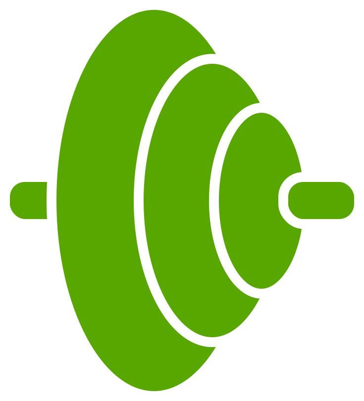

# 🏋️ GymRats - O Duolingo da Musculação

<div align="center">



**Transforme seu treino em uma jornada gamificada. Aprenda, evolua e conquiste seus objetivos fitness.**

[](https://nextjs.org/)
[](https://reactjs.org/)
[](https://www.typescriptlang.org/)
[](https://tailwindcss.com/)
[](https://bun.sh/)
[](https://www.prisma.io/)

</div>

---

## 📋 Índice

- [Sobre o Projeto](#-sobre-o-projeto)
- [Características Principais](#-características-principais)
- [Tecnologias Utilizadas](#-tecnologias-utilizadas)
- [Arquitetura](#-arquitetura)
- [Estrutura do Projeto](#-estrutura-do-projeto)
- [Instalação](#-instalação)
- [Scripts Disponíveis](#-scripts-disponíveis)
- [Funcionalidades](#-funcionalidades)
- [APIs e Endpoints](#-apis-e-endpoints)
- [Modelo de Dados](#-modelo-de-dados)
- [Segurança](#-segurança)
- [Performance](#-performance-e-otimizações)
- [Roadmap](#-roadmap-e-próximos-passos)
- [Contribuindo](#-contribuindo)

---

## 🎯 Sobre o Projeto

O **GymRats** é uma plataforma completa de fitness gamificada, inspirada no Duolingo, que combina educação, treinamento personalizado e gestão de academias. O projeto utiliza tecnologias modernas e uma **arquitetura offline-first robusta** para proporcionar uma experiência de usuário excepcional.

### 💡 Proposta de Valor

1. **Gamificação Total**: Sistema de XP, níveis, conquistas, streaks e rankings
2. **Educação Científica**: Lições sobre anatomia, nutrição e ciência do treinamento
3. **Personalização com IA**: Treinos e dietas gerados por IA baseados no perfil do usuário
4. **Gestão Completa**: Sistema para academias gerenciarem alunos, equipamentos e finanças
5. **Experiência Offline-First**: Funciona perfeitamente mesmo sem internet

### 🎯 Público-Alvo

- **Alunos (Students)**: Pessoas que querem treinar, aprender e evoluir no fitness
- **Academias (Gyms)**: Proprietários e gestores que precisam gerenciar seus negócios

---

## ✨ Características Principais

### 🎮 Sistema de Gamificação

- **Sistema de XP**: Ganhe pontos de experiência completando treinos, dietas e lições
- **Níveis e Progressão**: Suba de nível conforme acumula XP
- **Sequências (Streaks)**: Mantenha sua sequência diária de treinos
- **Conquistas**: Desbloqueie badges e conquistas especiais
- **Rankings**: Compita com amigos em rankings semanais e mensais
- **Desafios**: Participe de desafios comunitários e ganhe recompensas

### 💪 Treinamento

- **Programas Personalizados**: Treinos adaptados ao seu nível e objetivos
- **Múltiplas Modalidades**: 
  - Musculação tradicional
  - Cardio (corrida, natação, ciclismo, etc.)
  - Exercícios funcionais
- **Análise de Postura**: Sistema de análise de forma e correção de exercícios (planejado)
- **Histórico Completo**: Acompanhe todos os seus treinos e progresso
- **Recordes Pessoais**: Registre e acompanhe seus PRs
- **Progresso Parcial**: Salve treinos em andamento

### 🍎 Nutrição

- **Rastreamento de Macros**: Acompanhe calorias, proteínas, carboidratos e gorduras
- **Planos de Dieta**: Dietas personalizadas baseadas em seus objetivos
- **Busca de Alimentos**: Banco de dados extenso de alimentos e valores nutricionais
- **Gerador de Dieta com IA**: Crie planos alimentares personalizados
- **Chat Nutricional**: Assistente de IA para dúvidas (com limite diário)

### 📚 Educação

- **Anatomia Interativa**: Explore músculos, funções e exercícios relacionados
- **Lições Científicas**: Aprenda sobre hipertrofia, nutrição e recuperação
- **Quizzes**: Teste seu conhecimento com quizzes interativos
- **Explorador de Músculos**: Visualize grupos musculares e exercícios

### 🏢 Gestão para Academias

- **Dashboard Completo**: Visão geral em tempo real da academia
- **Gestão de Alunos**: Controle completo de membros, check-ins e frequência
- **Gestão de Equipamentos**: Rastreamento de equipamentos, uso e manutenção
- **Financeiro**: Controle de pagamentos, planos e receitas
- **Estatísticas**: Análises detalhadas de performance e retenção
- **Gamificação para Academias**: Sistema de XP e rankings para academias

### 🗺️ Integração com Academias

- **Mapa de Academias**: Encontre academias parceiras próximas
- **Compra de Diárias**: Sistema de day pass para academias
- **QR Code**: Check-in rápido com QR code
- **Planos de Assinatura**: Gerenciamento de planos mensais, trimestrais e anuais

---

## 🛠️ Tecnologias Utilizadas

### Frontend

#### Core
- **[Next.js 16.0](https://nextjs.org/)** - Framework React com App Router e Server-Side Rendering
- **[React 19.2](https://reactjs.org/)** - Biblioteca UI com as features mais recentes
- **[TypeScript 5.0](https://www.typescriptlang.org/)** - Tipagem estática forte em todo o projeto
- **[Tailwind CSS 4.1](https://tailwindcss.com/)** - Framework CSS utility-first

#### UI Components
- **[shadcn/ui](https://ui.shadcn.com/)** - Componentes UI acessíveis e customizáveis
- **[Radix UI](https://www.radix-ui.com/)** - Primitivos UI acessíveis
- **[Lucide React](https://lucide.dev/)** - Biblioteca de ícones moderna
- **[Recharts](https://recharts.org/)** - Gráficos e visualizações de dados
- **Motion (Framer Motion)** - Animações fluidas e interativas

#### Formulários e Validação
- **[React Hook Form](https://react-hook-form.com/)** - Gerenciamento de formulários performático
- **[Zod](https://zod.dev/)** - Validação de schemas TypeScript-first
- **[@hookform/resolvers](https://github.com/react-hook-form/resolvers)** - Integração entre React Hook Form e Zod

#### State Management
- **[Zustand](https://zustand-demo.pmnd.rs/)** - Gerenciamento de estado global leve e performático
- **[TanStack Query (React Query)](https://tanstack.com/query)** - Gerenciamento de estado assíncrono e cache
- **[nuqs](https://nuqs.47ng.com/)** - Query strings type-safe para Next.js

#### Utilitários
- **[date-fns](https://date-fns.org/)** - Manipulação de datas moderna
- **[clsx](https://github.com/lukeed/clsx)** + **[tailwind-merge](https://github.com/dcastil/tailwind-merge)** - Construção e merge de classes CSS
- **[class-variance-authority](https://cva.style/)** - Variantes de componentes

#### Offline & PWA
- **IndexedDB (via idb)** - Banco de dados local para dados grandes
- **Service Worker** - Sincronização em background e cache
- **localStorage** - Armazenamento de tokens e flags

### Backend

#### Runtime & Framework
- **[Bun](https://bun.sh/)** - Runtime JavaScript/TypeScript ultra-rápido (3x mais rápido que Node.js)
- **[Elysia](https://elysiajs.com/)** - Framework web moderno e performático para Bun
- **[@elysiajs/cors](https://elysiajs.com/plugins/cors.html)** - Plugin de CORS
- **[@elysiajs/swagger](https://elysiajs.com/plugins/swagger.html)** - Documentação automática de API
- **[@elysiajs/bearer](https://elysiajs.com/plugins/bearer.html)** - Autenticação Bearer token

#### Database & ORM
- **[PostgreSQL](https://www.postgresql.org/)** - Banco de dados relacional (via Supabase)
- **[Prisma 6.19](https://www.prisma.io/)** - ORM moderno com type-safety completo
- **[Supabase](https://supabase.com/)** - Backend-as-a-Service (PostgreSQL + Auth + Storage)

#### Autenticação
- **[Better Auth 1.4.5](https://www.better-auth.com/)** - Sistema de autenticação moderno com integração nativa ao Elysia
- **bcryptjs** - Hashing de senhas
- **Google OAuth** - Login social com Google

#### Comunicação
- **[Axios](https://axios-http.com/)** - Cliente HTTP
- **[Nodemailer](https://nodemailer.com/)** - Envio de emails

#### Ferramentas de Desenvolvimento
- **[Biome](https://biomejs.dev/)** - Linter e formatter ultra-rápido (substituto do ESLint + Prettier)
- **[Husky](https://typicode.github.io/husky/)** - Git hooks para qualidade de código

---

## 🏗️ Arquitetura

### Arquitetura Geral

```
┌─────────────────────────────────────────────┐
│           FRONTEND (Next.js)                │
│  - React Components                         │
│  - Zustand Store (State Management)         │
│  - Service Worker (Offline Sync)            │
│  - IndexedDB (Local Storage)                │
└─────────────────────────────────────────────┘
                    ↕ HTTP/REST
┌─────────────────────────────────────────────┐
│           BACKEND (Elysia + Bun)            │
│  - API Routes (REST)                        │
│  - Better Auth (Autenticação)               │
│  - Handlers (Lógica de Negócio)             │
│  - Middleware (Auth, CORS, Logging)         │
└─────────────────────────────────────────────┘
                    ↕ Prisma ORM
┌─────────────────────────────────────────────┐
│      DATABASE (PostgreSQL/Supabase)         │
│  - Usuários, Alunos, Academias              │
│  - Treinos, Exercícios, Nutrição            │
│  - Progresso, Conquistas, Pagamentos        │
└─────────────────────────────────────────────┘
```

### Arquitetura Offline-First

O GymRats implementa uma **arquitetura offline-first completa e robusta**:

#### Camadas do Sistema Offline

```
1. UI (React Components)
   ↓
2. State Management (Zustand)
   ↓
3. Sync Manager (Detecção Online/Offline)
   ↓
4. Persistência Local (IndexedDB)
   ↓
5. Service Worker (Background Sync)
   ↓
6. API Backend (quando online)
```

#### Fluxo de Dados Offline

1. **Usuário interage** → Componente React
2. **Optimistic Update** → UI atualiza instantaneamente
3. **Sync Manager** → Detecta se está online/offline
4. **Se Online** → Envia para API imediatamente
5. **Se Offline** → Salva na fila do IndexedDB
6. **Service Worker** → Sincroniza quando voltar online
7. **Backend processa** → Retorna confirmação
8. **Store atualiza** → Dados finais do servidor

#### Recursos Offline-First

- ✅ **Command Pattern** com versionamento e dependências
- ✅ **Optimistic Updates** para UI instantânea
- ✅ **Retry Exponencial** com jitter para resiliência
- ✅ **Idempotência** garantida (evita duplicatas)
- ✅ **Background Sync** via Service Worker
- ✅ **Cache em múltiplas camadas** (memória, IndexedDB, localStorage)
- ✅ **Observabilidade local** para debug

### Design Patterns

- **Component-Based Architecture**: Componentes React reutilizáveis
- **Server-Side Rendering**: Next.js App Router para SSR
- **Type Safety**: TypeScript em todo o projeto
- **Command Pattern**: Transforma ações em objetos explícitos
- **Repository Pattern**: Abstração de acesso a dados via Prisma
- **Middleware Pattern**: Plugins Elysia para cross-cutting concerns
- **CQRS**: Separação entre comandos (write) e queries (read)

### Princípios Aplicados

- **SOLID**: Princípios de design orientado a objetos
- **Clean Code**: Código limpo e manutenível
- **DRY**: Don't Repeat Yourself
- **Separation of Concerns**: Separação clara de responsabilidades

---

## 📁 Estrutura do Projeto

```
gymrats/
├── app/                          # Next.js App Router
│   ├── api/                      # API Routes (legacy, sendo migrado)
│   ├── auth/                     # Páginas de autenticação
│   │   ├── login/               # Página de login
│   │   └── register/            # Página de registro
│   ├── student/                  # Área do aluno
│   ├── gym/                      # Área da academia
│   │   ├── dashboard/           # Dashboard principal
│   │   ├── students/            # Gestão de alunos
│   │   ├── equipment/           # Gestão de equipamentos
│   │   ├── financial/           # Gestão financeira
│   │   ├── stats/               # Estatísticas
│   │   └── settings/            # Configurações
│   ├── workout/                  # Páginas de treino
│   ├── lesson/                   # Lições educacionais
│   ├── onboarding/               # Onboarding inicial
│   ├── welcome/                  # Página de boas-vindas
│   ├── layout.tsx                # Layout raiz
│   └── page.tsx                  # Página inicial
│
├── server/                       # Backend Elysia
│   ├── index.ts                  # Entry point
│   ├── app.ts                    # Configuração do app
│   ├── custom-server.ts          # Servidor customizado
│   ├── plugins/                  # Plugins Elysia
│   │   ├── auth.ts               # Better Auth
│   │   ├── auth-macro.ts         # Macros de auth
│   │   ├── auth-roles.ts         # Macros de roles
│   │   ├── cors.ts               # CORS
│   │   ├── db.ts                 # Prisma
│   │   └── request-logger.ts    # Logging
│   ├── routes/                   # Rotas por domínio
│   │   ├── auth.ts
│   │   ├── students.ts
│   │   ├── gyms.ts
│   │   ├── workouts.ts
│   │   ├── nutrition.ts
│   │   ├── foods.ts
│   │   └── ...
│   ├── handlers/                 # Handlers de negócio
│   └── utils/                    # Utilitários
│
├── components/                   # Componentes React
│   ├── ui/                       # Componentes base (shadcn/ui)
│   ├── achievement-card.tsx
│   ├── ai-workout-generator.tsx
│   ├── ai-diet-generator.tsx
│   ├── app-header.tsx
│   ├── app-bottom-nav.tsx
│   ├── cardio-tracker.tsx
│   ├── diet-page.tsx
│   ├── educational-lessons.tsx
│   ├── gym-map.tsx
│   ├── learning-path.tsx
│   ├── muscle-explorer.tsx
│   ├── nutrition-tracker.tsx
│   ├── profile-page.tsx
│   └── ...
│
├── lib/                          # Bibliotecas e utilitários
│   ├── types.ts                  # Tipos TypeScript
│   ├── db.ts                     # Prisma Client
│   ├── auth-config.ts            # Configuração Better Auth
│   ├── offline/                  # Sistema offline-first
│   │   ├── sync-manager.ts       # Gerenciador de sync
│   │   ├── command-pattern.ts    # Command pattern
│   │   ├── indexeddb-storage.ts  # Storage IndexedDB
│   │   └── ...
│   ├── mock-data.ts              # Dados mockados
│   ├── gym-mock-data.ts          # Dados mockados de academias
│   ├── educational-data.ts       # Dados educacionais
│   ├── functional-exercises-data.ts
│   ├── calorie-calculator.ts
│   ├── posture-analysis.ts
│   ├── social-data.ts
│   └── utils.ts                  # Funções utilitárias
│
├── stores/                       # Zustand stores
│   ├── student-unified.store.ts  # Store unificado do aluno
│   ├── gym.store.ts              # Store da academia
│   └── ...
│
├── hooks/                        # Custom hooks
│   ├── use-mobile.ts
│   ├── use-toast.ts
│   ├── use-student-initializer.ts
│   └── ...
│
├── contexts/                     # React contexts
│
├── prisma/                       # Prisma ORM
│   ├── schema.prisma             # Schema do banco
│   └── migrations/               # Migrações
│
├── public/                       # Arquivos estáticos
│   ├── sw.js                     # Service Worker
│   ├── icon.svg                  # Logo
│   └── ...
│
├── docs/                         # Documentação
│   ├── ANALISE_COMPLETA_PROJETO.md
│   ├── ARQUITETURA_COMPLETA_SISTEMA.md
│   ├── plan.md
│   └── ...
│
├── styles/                       # Estilos globais
│   └── globals.css
│
├── .env                          # Variáveis de ambiente
├── components.json               # Configuração do shadcn/ui
├── next.config.mjs               # Configuração do Next.js
├── tsconfig.json                 # Configuração do TypeScript
├── tailwind.config.ts            # Configuração do Tailwind
├── biome.json                    # Configuração do Biome
├── package.json                  # Dependências e scripts
└── README.md                     # Este arquivo
```

---

## 🚀 Instalação

### Pré-requisitos

- **Bun** 1.0+ (recomendado) ou **Node.js** 18+
- **PostgreSQL** (ou conta Supabase)

### Passos

1. **Clone o repositório**
   ```bash
   git clone <url-do-repositorio>
   cd gymrats
   ```

2. **Instale as dependências**
   ```bash
   bun install
   # ou
   npm install
   ```

3. **Configure as variáveis de ambiente**
   ```bash
   # Copie o arquivo de exemplo
   cp .env.example .env
   
   # Edite o arquivo .env com suas credenciais
   ```

   Variáveis necessárias:
   ```env
   # Database
   DATABASE_URL=postgresql://...
   DIRECT_URL=postgresql://...
   
   # Supabase
   NEXT_PUBLIC_SUPABASE_URL=https://...
   NEXT_PUBLIC_SUPABASE_ANON_KEY=...
   
   # App
   NEXT_PUBLIC_APP_URL=http://localhost:3000
   BETTER_AUTH_URL=http://localhost:3000
   BETTER_AUTH_SECRET=...
   
   # OAuth (opcional)
   GOOGLE_CLIENT_ID=...
   GOOGLE_CLIENT_SECRET=...
   
   # Email (opcional)
   EMAIL_USER=...
   EMAIL_PASSWORD=...
   
   # IA (opcional)
   DEEPSEEK_API_KEY=...
   ```

4. **Execute as migrações do banco de dados**
   ```bash
   bun prisma migrate dev
   # ou
   npx prisma migrate dev
   ```

5. **Popule o banco com dados de exemplo (opcional)**
   ```bash
   bun prisma db seed
   # ou
   npx prisma db seed
   ```

6. **Execute o servidor de desenvolvimento**
   ```bash
   bun run dev
   # ou
   npm run dev
   ```

7. **Acesse a aplicação**
   ```
   http://localhost:3000
   ```

---

## 📜 Scripts Disponíveis

```bash
# Desenvolvimento
bun run dev          # Inicia servidor de desenvolvimento (Next.js + Elysia)

# Build
bun run build        # Cria build de produção

# Produção
bun run start        # Inicia servidor de produção

# Linting e Formatação
bun run lint         # Executa Biome (linting)
bun run format       # Formata código com Biome

# Database
bun prisma migrate dev      # Executa migrações em desenvolvimento
bun prisma migrate deploy   # Executa migrações em produção
bun prisma studio           # Abre Prisma Studio (GUI do banco)
bun prisma db seed          # Popula banco com dados de exemplo
bun prisma generate         # Gera Prisma Client
```

---

## 🐳 Docker

O GymRats suporta deployment via Docker com Next.js + Elysia rodando no Bun. O container executa o servidor customizado em `server/custom-server.ts` e injeta o backend na rota `/api`.

### Pré-requisitos

- **Docker Desktop** instalado e rodando
- Arquivo `.env` configurado (mesmas variáveis usadas localmente)

### Variáveis de Ambiente Mínimas

```env
# Database
DATABASE_URL=postgresql://...
DIRECT_URL=postgresql://...

# Auth
BETTER_AUTH_SECRET=...
BETTER_AUTH_URL=http://localhost:3000

# OAuth
GOOGLE_CLIENT_ID=...
GOOGLE_CLIENT_SECRET=...

# Server
PORT=3000              # Porta do servidor (default: 3000)
HOST=0.0.0.0          # Host do servidor (default: 0.0.0.0 no Docker)
```

### Produção (Docker Compose)

Execute a aplicação em modo produção com PostgreSQL local:

```bash
docker compose up -d --build
```

**Serviços incluídos:**
- `app`: Next.js + Elysia (aplicação principal)
- `db`: PostgreSQL local (opcional, para desenvolvimento)

### Desenvolvimento (Docker Compose)

Execute a aplicação em modo desenvolvimento com hot reload:

```bash
docker compose -f docker-compose.dev.yml up --build
```

### Build Manual do Container

Para buildar a imagem Docker manualmente:

```bash
docker build -t gymrats-app:local .
```

### Logs e Monitoramento

Visualize o status e logs dos containers:

```bash
# Ver status dos serviços
docker compose ps

# Ver logs em tempo real
docker compose logs -f app

# Ver logs do banco de dados
docker compose logs -f db
```

### Health Check

O container inclui um endpoint de health check:

```
GET /health
```

Retorna o status da aplicação e pode ser usado para monitoramento.

### Observações Importantes

- **Variáveis de ambiente**: Se o build falhar por variáveis ausentes, revise o arquivo `.env` antes de buildar
- **Banco de dados externo**: Para usar banco externo (Supabase, Neon, etc.), remova o serviço `db` do `docker-compose.yml` e configure apenas `DATABASE_URL` no serviço `app`
- **Produção real**: Em ambientes de produção, use secrets/variáveis do seu orchestrator (Kubernetes, Docker Swarm, etc.)
- **Volumes**: Os dados do PostgreSQL local são persistidos em um volume Docker

### Comandos Úteis

```bash
# Parar todos os containers
docker compose down

# Parar e remover volumes (limpa banco de dados)
docker compose down -v

# Rebuild sem cache
docker compose build --no-cache

# Ver uso de recursos
docker stats
```

Para mais detalhes, consulte o arquivo [`docs/DOCKER.md`](docs/DOCKER.md).

---

## 🎨 Funcionalidades Detalhadas

### Para Alunos

#### 🏠 Dashboard Principal
- Visão geral do progresso diário
- Sequência atual e XP ganho hoje
- Acesso rápido a treinos, cardio e dieta
- Personalização com IA

#### 💪 Treinamento
- **Learning Path**: Caminho de aprendizado gamificado
- **Unidades e Lições**: Estrutura similar ao Duolingo
- **Exercícios Detalhados**: Séries, repetições, descanso
- **Análise de Forma**: Feedback em tempo real (planejado)
- **Histórico**: Todos os treinos realizados
- **Recordes Pessoais**: Acompanhamento de PRs
- **Progresso Parcial**: Salvar treino em andamento

#### ❤️ Cardio e Funcional
- Rastreamento de atividades cardiovasculares
- Exercícios funcionais categorizados
- Cálculo de calorias queimadas
- Histórico de sessões

#### 🍎 Nutrição
- Rastreamento diário de macros
- Planos de dieta personalizados
- Busca de alimentos
- Gerador de dieta com IA
- Chat nutricional com IA (limite diário)
- Histórico nutricional

#### 📚 Educação
- **Explorador de Músculos**: Anatomia interativa
- **Lições Científicas**: Conteúdo educacional
- **Quizzes**: Testes de conhecimento
- Sistema de XP por lições completadas

#### 🗺️ Academias
- Mapa de academias parceiras
- Compra de diárias (day pass)
- QR code para check-in
- Histórico de visitas

#### 💳 Pagamentos
- Gestão de assinaturas
- Histórico de pagamentos
- Métodos de pagamento
- Renovação automática

#### 👤 Perfil
- Informações pessoais
- Objetivos e preferências
- Estatísticas detalhadas
- Fotos de progresso
- Conquistas desbloqueadas

### Para Academias

#### 📊 Dashboard
- Métricas em tempo real
- Check-ins do dia
- Alunos ativos
- Equipamentos em uso
- Novos membros

#### 👥 Gestão de Alunos
- Lista completa de alunos
- Perfil detalhado de cada aluno
- Histórico de treinos
- Frequência e retenção
- Atribuição de treinadores

#### 🏋️ Gestão de Equipamentos
- Inventário completo
- Status em tempo real (disponível, em uso, manutenção)
- Histórico de uso
- Agendamento de manutenção
- QR codes para rastreamento

#### 💰 Financeiro
- Receitas e despesas
- Pagamentos pendentes
- Planos de assinatura
- Relatórios financeiros
- Cupons e descontos

#### 📈 Estatísticas
- Análises detalhadas
- Taxa de retenção
- Crescimento de membros
- Utilização de equipamentos
- Horários de pico

#### ⚙️ Configurações
- Perfil da academia
- Planos e preços
- Configurações de gamificação
- Integrações

---

## 🔌 APIs e Endpoints

### Estrutura Modular

O backend foi migrado de Next.js API Routes para **Elysia + Bun** com rotas modulares:

```
/api
├── /auth              → Autenticação (Better Auth)
├── /users             → Gerenciamento de usuários
├── /students          → Dados de alunos
├── /gyms              → Dados de academias
├── /workouts          → Treinos e exercícios
├── /nutrition         → Nutrição e dietas
├── /foods             → Banco de dados de alimentos
├── /exercises         → Exercícios educacionais
├── /subscriptions     → Assinaturas de alunos
├── /gym-subscriptions → Assinaturas de academias
├── /payments          → Pagamentos
├── /payment-methods   → Métodos de pagamento
└── /memberships       → Assinaturas de academias
```

### Principais Endpoints

#### Autenticação (`/api/auth`)

- `POST /sign-up` - Criar conta
- `POST /sign-in` - Login
- `POST /sign-out` - Logout
- `GET /session` - Verificar sessão
- `POST /update-role` - Atualizar role do usuário

#### Alunos (`/api/students`)

- `GET /student` - Dados do aluno
- `GET /progress` - Progresso (XP, streaks)
- `GET /profile` - Perfil detalhado
- `PUT /profile` - Atualizar perfil
- `GET /weight` - Histórico de peso
- `POST /weight` - Adicionar peso
- `GET /personal-records` - Recordes pessoais
- `GET /day-passes` - Passes diários
- `GET /friends` - Amigos

#### Academias (`/api/gyms`)

- `GET /locations` - Academias próximas
- `GET /:id` - Detalhes da academia
- `GET /:id/students` - Alunos da academia
- `GET /:id/equipment` - Equipamentos
- `GET /:id/stats` - Estatísticas

#### Treinos (`/api/workouts`)

- `GET /units` - Unidades de treino
- `GET /history` - Histórico de treinos
- `POST /complete` - Completar treino
- `GET /progress/:workoutId` - Progresso parcial
- `PUT /progress/:workoutId` - Atualizar progresso

#### Nutrição (`/api/nutrition`)

- `GET /daily` - Nutrição do dia
- `POST /daily` - Registrar refeição
- `PUT /water` - Atualizar água

#### Alimentos (`/api/foods`)

- `GET /search` - Buscar alimentos
- `GET /:id` - Detalhes do alimento

### Autenticação e Autorização

#### Better Auth Integration

O projeto usa **Better Auth** com integração nativa ao Elysia:

```typescript
// Montar handler do Better Auth
app.mount(auth.handler)

// Middleware via macros (type-safe)
app.get('/profile', ({ user, studentId }) => {
  // user e studentId já disponíveis
}, {
  requireStudent: true // Macro de autenticação
})
```

#### Macros de Autenticação

- **requireAuth** - Requer usuário autenticado
- **requireStudent** - Requer role STUDENT ou ADMIN
- **requireGym** - Requer role GYM ou ADMIN
- **requireAdmin** - Requer role ADMIN

### Documentação Swagger

Acesse a documentação interativa em:
- **Swagger UI**: `http://localhost:3000/api-docs`
- **OpenAPI JSON**: `http://localhost:3000/api/swagger`

---

## 📊 Modelo de Dados

### Entidades Principais

#### Autenticação e Usuários
- **User**: Informações básicas, role (STUDENT, GYM, ADMIN)
- **Account**: Integração com Google OAuth
- **Session**: Tokens de autenticação

#### Alunos
- **Student**: Perfil do aluno
- **StudentProgress**: XP, nível, streaks
- **StudentProfile**: Medidas, objetivos, preferências
- **WeightHistory**: Histórico de peso

#### Academias
- **Gym**: Informações da academia
- **GymProfile**: Estatísticas e gamificação
- **GymStats**: Métricas em tempo real

#### Treinos
- **Unit**: Unidades de treino (agrupamento)
- **Workout**: Treino individual
- **WorkoutExercise**: Exercícios do treino
- **WorkoutProgress**: Progresso parcial
- **WorkoutHistory**: Histórico de treinos
- **PersonalRecord**: Recordes pessoais

#### Nutrição
- **DietPlan**: Plano de dieta
- **Meal**: Refeição
- **DailyNutrition**: Rastreamento diário
- **FoodItem**: Banco de dados de alimentos
- **NutritionChatUsage**: Controle de uso do chat com IA

#### Gamificação
- **Achievement**: Conquistas
- **AchievementUnlock**: Conquistas desbloqueadas

#### Gestão de Academias
- **GymMembership**: Assinatura de academia
- **MembershipPlan**: Planos de assinatura
- **DayPass**: Passes diários
- **CheckIn**: Registro de check-in
- **Equipment**: Equipamentos

#### Financeiro
- **Subscription**: Assinatura do aluno
- **GymSubscription**: Assinatura da academia
- **Payment**: Histórico de pagamentos
- **PaymentMethod**: Métodos de pagamento
- **Expense**: Despesas da academia

#### Social
- **Friendship**: Conexões entre alunos

Para mais detalhes, consulte o arquivo `prisma/schema.prisma`.

---

## 🔐 Segurança

### Autenticação

- **Better Auth** com sessões seguras
- **Hashing de senhas** com bcryptjs
- **OAuth Google** para login social
- **Tokens JWT** para API
- **Cookies HTTP-only** para sessões

### Autorização

- **Role-Based Access Control (RBAC)**
  - STUDENT: Acesso a features de aluno
  - GYM: Acesso a gestão de academia
  - ADMIN: Acesso total

### Proteção de Dados

- **Validação de entrada** com Zod em todas as APIs
- **Sanitização** de dados do usuário
- **CORS** configurado corretamente
- **Rate limiting** (planejado)
- **Idempotência** para evitar duplicatas

### Privacidade

- **LGPD Compliance** (planejado)
- **Dados sensíveis** criptografados
- **Logs de auditoria** (planejado)

---

## 🚀 Performance e Otimizações

### Frontend

- **Code Splitting** automático do Next.js
- **Lazy Loading** de componentes
- **Image Optimization** com Next.js Image
- **Memoization** com React.memo e useMemo
- **Virtual Scrolling** para listas grandes (planejado)

### Backend

- **Bun Runtime** - 3x mais rápido que Node.js
- **Elysia Framework** - Performance otimizada
- **Connection Pooling** do Prisma
- **Query Optimization** com índices no banco
- **Caching** em múltiplas camadas

### Offline-First

- **IndexedDB** para dados grandes
- **Service Worker** para cache inteligente
- **Background Sync** para sincronização
- **Optimistic Updates** para UI instantânea

### Métricas Esperadas

- **Time to Interactive**: < 2s
- **First Contentful Paint**: < 1s
- **API Response Time**: < 100ms (média)
- **Offline Capability**: 100% funcional

---

## 🎨 Design System

O projeto utiliza um design system baseado no Duolingo, com:

### Paleta de Cores

- **Verde Principal**: `#58CC02` - Ações positivas, progresso
- **Azul**: `#1CB0F6` - Informações, links
- **Laranja**: `#FF9600` - Alertas, atenção
- **Vermelho**: `#FF4B4B` - Erros, ações destrutivas
- **Amarelo**: `#FFC800` - Destaques, conquistas
- **Roxo**: `#CE82FF` - Premium, especial

### Tipografia

- **DM Sans** - Corpo de texto
- **Space Grotesk** - Títulos e destaques

### Componentes UI

Todos os componentes são baseados no **shadcn/ui** com customizações:
- Buttons, Cards, Dialogs, Dropdowns
- Forms (Input, Select, Checkbox, Radio)
- Navigation (Tabs, Menu, Breadcrumb)
- Feedback (Toast, Alert, Progress)
- Data Display (Table, Badge, Avatar)
- Overlays (Modal, Popover, Tooltip)

### Responsividade

- 📱 **Mobile First**: Design otimizado para mobile (320px+)
- 📱 **Tablet**: 768px+
- 💻 **Desktop**: 1024px+
- 🖥️ **Large Desktop**: 1440px+

---

## 📈 Roadmap e Próximos Passos

### ✅ Implementado

- Interface completa de aluno
- Interface completa de academia
- Sistema de gamificação básico
- Componentes UI completos
- Estrutura de rotas
- Tipagem TypeScript completa
- Dados mockados para desenvolvimento
- Arquitetura offline-first completa
- Sistema de autenticação com Better Auth
- Migração para Bun + Elysia

### 🚧 Em Desenvolvimento

- Integração com IA (DeepSeek)
- Análise de postura com IA
- Sistema de pagamentos (Stripe)

### 📋 Planejado

- Notificações push
- Modo offline completo (PWA)
- App mobile nativo (React Native)
- Integração com wearables
- Marketplace de treinos
- Live classes
- Comunidade e fóruns
- Certificações e badges NFT

---

## 💡 Diferenciais Técnicos

### 1. Arquitetura Offline-First de Nível Empresarial

- Command Pattern com versionamento
- Retry exponencial com jitter
- Idempotência garantida
- Background Sync via Service Worker
- Observabilidade local para debug

### 2. Performance Excepcional

- Bun (3x mais rápido que Node.js)
- Elysia (framework otimizado)
- IndexedDB para dados grandes
- Carregamento prioritizado dinâmico
- Deduplicação de requisições

### 3. Type Safety Completo

- TypeScript em 100% do código
- Prisma para type-safe database
- Zod para validação runtime
- Better Auth type-safe

### 4. Developer Experience

- Biome (linting ultra-rápido)
- Hot reload instantâneo
- Swagger automático
- Git hooks para qualidade

### 5. Escalabilidade

- Arquitetura modular
- Rotas específicas (não monolíticas)
- Cache em múltiplas camadas
- Connection pooling
- Preparado para microservices

---

## 🤝 Contribuindo

Contribuições são bem-vindas! Para contribuir:

1. Faça um fork do projeto
2. Crie uma branch para sua feature (`git checkout -b feature/AmazingFeature`)
3. Commit suas mudanças (`git commit -m 'feat: add some AmazingFeature'`)
4. Push para a branch (`git push origin feature/AmazingFeature`)
5. Abra um Pull Request

### Padrões de Código

- Use TypeScript com tipagem forte
- Siga os princípios SOLID e Clean Code
- Mantenha componentes pequenos e focados
- Use componentes do shadcn/ui quando possível
- Documente funções complexas
- Escreva código testável

### Convenção de Commits

Seguir [Conventional Commits](https://www.conventionalcommits.org/):

```
feat: adiciona nova funcionalidade
fix: corrige bug
docs: atualiza documentação
style: formatação de código
refactor: refatoração sem mudança de comportamento
test: adiciona ou corrige testes
chore: tarefas de manutenção
```

---

## 📚 Recursos e Referências

### Documentação Oficial

- [Next.js](https://nextjs.org/docs)
- [React](https://react.dev)
- [Elysia](https://elysiajs.com)
- [Bun](https://bun.sh)
- [Prisma](https://www.prisma.io/docs)
- [Better Auth](https://www.better-auth.com)
- [Tailwind CSS](https://tailwindcss.com)
- [shadcn/ui](https://ui.shadcn.com)

### Inspirações

- **Duolingo** - Gamificação e learning path
- **MyFitnessPal** - Rastreamento nutricional
- **Strong** - App de treino
- **Strava** - Social fitness

---

## 📄 Licença

Este projeto é privado e proprietário.

---

## 👨‍💻 Desenvolvido com

- ❤️ React & Next.js
- 🎨 Tailwind CSS & shadcn/ui
- 📘 TypeScript
- ⚡ Bun & Elysia
- 🗄️ Prisma & PostgreSQL
- 🔐 Better Auth
- 🚀 Vercel (deploy recomendado)

---

## 📞 Contato

Para dúvidas ou sugestões, entre em contato através do repositório.

---

<div align="center">

**Feito com 💚 para transformar vidas através do fitness**

⭐ Se este projeto foi útil para você, considere dar uma estrela!

</div>