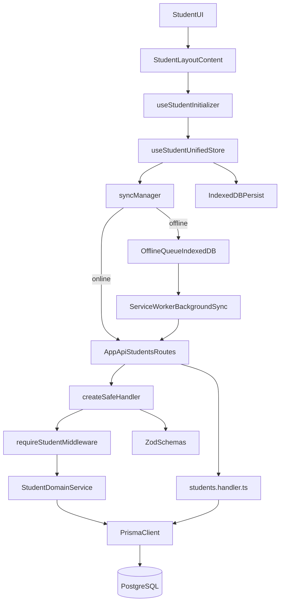

# Documentacao Canonica do Modulo Student (As-Is)

## 1) Objetivo e Escopo

Este documento descreve, de ponta a ponta, o funcionamento real (as-is) do ecossistema `student` no projeto, cobrindo:

- Frontend (`app/student`, componentes, renderizacao, navegacao e onboarding)
- Estado e sincronizacao (`Zustand`, `IndexedDB`, fila offline, `Command Pattern`)
- API (`app/api/students`, handlers legados, wrappers, middlewares)
- Dominio e servicos (`StudentDomainService` e servicos especializados)
- Persistencia e modelo de dados (`Prisma`/PostgreSQL)
- Tipos, contratos e fluxos E2E
- Riscos, limites atuais e playbook de replicacao para outro contexto

---

## 2) Mapa de Arquitetura (Alto Nivel)

### 2.1 Camadas e responsabilidade

- **UI/App Router**: experiência do aluno e orquestracao de telas (`app/student`)
- **Store/Offline**: fonte de verdade no cliente com estrategia offline-first (`stores/student-unified-store.ts`)
- **API**: borda HTTP com auth/validacao/tratamento de erro (`app/api/students`, `lib/api/*`)
- **Dominio**: regras e agregacao de dados (`lib/services/student-domain.service.ts`)
- **Persistencia**: acesso transacional e relacional (`prisma/schema.prisma`, `lib/db.ts`)

---

## 3) Estrutura de Codigo Relevante

## 3.1 Frontend Student

- `app/student/layout.tsx`: Server Component wrapper do modulo
- `app/student/layout-content.tsx`: Client layout, tabs e inicializacao
- `app/student/page-content.tsx`: home e composicao de tabs
- `app/student/onboarding/*`: fluxo de cadastro inicial
- `app/student/profile/*`: tela de perfil e historico
- `app/student/actions.ts`: server actions do modulo
- `app/student/actions-unified.ts`: server action unificada delegando para dominio

## 3.2 Estado/Offline

- `stores/student-unified-store.ts`: store unificado com persist em IndexedDB
- `hooks/use-student.ts`: facade modular para dados/actions/loaders
- `hooks/use-student-initializer.ts`: bootstrap automatico baseado em sessao
- `hooks/use-load-prioritized.ts`: priorizacao de seções por contexto
- `lib/offline/sync-manager.ts`: online/offline, fila e idempotencia
- `lib/offline/offline-queue.ts`: queue `IndexedDB` para requests
- `lib/offline/command-pattern.ts`: comandos versionados
- `lib/offline/command-logger.ts`: observabilidade local de comandos
- `lib/offline/command-migrations.ts`: adaptacao de versao de comandos
- `lib/offline/indexeddb-storage.ts`: adapter persist do Zustand
- `public/sw.js`: `Background Sync` + retry exponencial no SW

## 3.3 API/Seguranca/Contrato

- `app/api/students/*`: endpoints do dominio student no App Router
- `lib/api/utils/api-wrapper.ts`: `createSafeHandler`
- `lib/api/middleware/auth.middleware.ts`: `requireAuth`, `requireStudent`
- `lib/api/schemas/students.schemas.ts`: contratos Zod
- `lib/api/handlers/students.handler.ts`: handlers HTTP legados (ainda ativos em varias rotas)

## 3.4 Dominio e Dados

- `lib/services/student-domain.service.ts`: agregacao e regras centrais
- `lib/services/student/student-*.service.ts`: servicos especializados
- `lib/types/student-unified.ts`: tipos de store/dominio do cliente
- `prisma/schema.prisma`: modelos relacionais do modulo

---

## 4) Fluxos E2E Reais (Ponta a Ponta)

## 4.1 Bootstrap da area Student

1. Usuario entra em `/student`.
2. `app/student/layout.tsx` (server) busca:
   - `getStudentProfile()`
   - `getStudentProgress()`
3. `StudentLayoutContent` recebe `hasProfile` + progresso inicial.
4. No cliente, `useStudentInitializer({ autoLoad: true })` valida sessao/role.
5. `loadAll()` no `useStudentUnifiedStore` inicia carga incremental.
6. Store chama rotas especificas por secao (e nao apenas `/api/students/all`):
   - ex.: `/api/students/progress`, `/api/workouts/units`, `/api/students/profile`, etc.
7. Cada secao atualiza o store assim que chega (render progressivo).
8. Estado persiste em `IndexedDB` (`student-unified-storage`).

Resultado: UX com dados parciais rapidamente, com fonte local e sincronizacao posterior.

## 4.2 Atualizacao de progresso com Command + Idempotencia

1. UI chama `useStudent("actions").updateProgress(updates)`.
2. Store aplica **optimistic update** imediatamente.
3. Cria comando `UPDATE_PROGRESS` com `createCommand`.
4. Comando e migrado (`migrateCommand`) e logado (`logCommand`).
5. Conversao para request com metadados:
   - `X-Idempotency-Key`
   - `X-Command-Id`, `X-Command-Type`, `X-Command-Version`
6. `syncManager` decide:
   - **Online**: chama API agora.
   - **Offline**: grava na fila (`offline-queue`) e registra background sync.
7. API processa em `PUT /api/students/progress`.
8. Dominio persiste com `StudentDomainService.updateProgress` (`upsert`).

## 4.3 Offline Queue e reprocessamento

1. Requisicoes mutaveis offline vao para `IndexedDB` (`offline-queue`).
2. `public/sw.js` escuta evento `sync` (`sync-queue`).
3. SW ordena por prioridade + timestamp.
4. Aplica retry com **backoff exponencial + jitter** no SW.
5. Sucesso remove item da fila; falha excessiva move para store `failed`.
6. SW notifica clientes (`SYNC_COMPLETE`) e atualiza command logs quando possivel.

## 4.4 Onboarding

1. Tela `app/student/onboarding/page.tsx` coleta dados em 3 etapas consolidadas.
2. Validacao por `Zod` (`onboarding/schemas.ts`).
3. `submitOnboarding`:
   - normaliza defaults
   - valida payload
   - resolve contexto de aluno (`getStudentContext`)
   - `upsert` em `student`
   - salva perfil via `StudentProfileService.saveOnboardingData`
   - cria peso inicial em `weightHistory` (best effort)
   - garante `studentProgress` e inicializa trial
4. Redireciona para `/student` apos sucesso.

---

## 5) Renderizacao, Componentes e Runtimes

## 5.1 Server vs Client Components

- **Server Components**
  - `app/student/layout.tsx`
  - `app/student/page.tsx`
  - server actions em `app/student/actions.ts` e `actions-unified.ts`
- **Client Components**
  - `layout-content.tsx`, `page-content.tsx`, `profile-content.tsx`
  - onboarding steps
  - cards e organicos da home/profile/diet/learn

Padrao aplicado:

- Server entrega shell + dados iniciais minimos.
- Client assume estado principal via store unificado.
- Priorizacao incremental evita tela bloqueada por carga total.

## 5.2 Roteamento por tabs e bloqueios

- Tab ativa por query param (`nuqs`), ex.: `?tab=learn`.
- Tabs bloqueadas para nao-admin em trechos da UI (`cardio`, `gyms`, `payments`).
- `AdminOnly` protege componentes sensiveis no cliente.

---

## 6) Store Unificado (`Zustand`) e Modelo de Estado

## 6.1 Estado canônico de cliente

Tipo principal: `StudentData` em `lib/types/student-unified.ts`.

Blocos relevantes:

- `user`, `student`, `progress`, `profile`
- `weightHistory`, `units`, `workoutHistory`, `personalRecords`
- `dailyNutrition`, `subscription`, `memberships`, `payments`, `paymentMethods`, `dayPasses`
- `friends`, `activeWorkout`
- `metadata`: `lastSync`, `isLoading`, `isInitialized`, `errors`, `pendingActions`

## 6.2 Persistencia e hidratacao

- Persist do Zustand usa `createIndexedDBStorage()`.
- Em SSR, adapter retorna no-op seguro.
- Ha migracao automatica de `localStorage` para `IndexedDB`.
- Chave de persistencia: `student-unified-storage`.

## 6.3 Carregamento incremental e priorizado

- `loadAll`: carrega secoes em lote, atualizando store por secao.
- `loadAllPrioritized`: primeiro prioridades de contexto, resto opcional.
- `use-load-prioritized` evita refetch agressivo e deduplica chamadas.

---

## 7) API e Contratos

## 7.1 Endpoints Student (App Router)

- `GET /api/students/all` -> agregador via `StudentDomainService.getAllData`
- `GET /api/students/profile`
- `POST /api/students/profile`
- `GET /api/students/progress`
- `PUT /api/students/progress`
- `GET /api/students/weight`
- `POST /api/students/weight`
- `GET /api/students/weight-history`
- `GET /api/students/student`
- `GET /api/students/personal-records`
- `GET /api/students/day-passes`
- `GET /api/students/friends`

## 7.2 Duas formas de implementacao de rota coexistindo

1. **Wrapper moderno** com `createSafeHandler`:
   - aplicado em `all`, `profile`, `progress`
   - centraliza auth + zod + tratamento padrao
2. **Delegacao para handlers legados**:
   - aplicado em `weight`, `weight-history`, `student`, `day-passes`, `friends`, `personal-records`
   - depende de `lib/api/handlers/students.handler.ts`

Este ponto e importante para replicacao: ha um modelo hibrido.

## 7.3 Middlewares e wrappers

- `requireAuth`: tenta Better Auth, depois fallback por token legacy.
- `requireStudent`:
  - exige `STUDENT` ou `ADMIN`
  - para `ADMIN`, garante criacao/resolucao de `studentId`
- `createSafeHandler`:
  - auth strategy (`student`, `gym`, `none`)
  - validacao Zod de body/query
  - erro padrao para `ZodError` e excecoes de runtime

## 7.4 Schemas Zod Student

`lib/api/schemas/students.schemas.ts`:

- `updateStudentProfileSchema`
- `updateStudentProgressSchema`
- `addWeightSchema`
- `weightHistoryQuerySchema`
- `studentSectionsQuerySchema`

---

## 8) Dominio e Servicos

## 8.1 `StudentDomainService` (nucleo atual)

Responsabilidades:

- `getProgress`, `updateProgress`
- `upsertProfile`, `updateFullProfile`
- `getAllData` (agregador por seções)
- composicao de dados de workouts, pesos, pagamentos, assinaturas, social
- calculos de streak e weekly XP

## 8.2 Servicos especializados (coexistentes)

- `student-profile.service.ts`
- `student-progress.service.ts`
- `student-workout.service.ts`

Eles sao usados em algumas actions e telas (ex.: perfil/onboarding), coexistindo com `StudentDomainService`.

---

## 9) Banco de Dados e Entidades Prisma

Modelos centrais para o modulo:

- `Student`
- `StudentProgress`
- `StudentProfile`
- `WeightHistory`
- `DayPass`
- `Payment`
- `PaymentMethod`
- `Friendship`
- `Subscription`
- relacionamentos com `Unit`, `WorkoutHistory`, `PersonalRecord`, `DailyNutrition`

Caracteristicas importantes:

- relacoes 1:1 (`Student` -> `StudentProgress`/`StudentProfile`/`Subscription`)
- historicos 1:N (`WeightHistory`, `WorkoutHistory`, `Payment`, `DayPass`)
- varios campos JSON serializados em string no perfil (objetivos, limitacoes etc.)

---

## 10) Idempotencia, Command Pattern e Garantias de Escrita

## 10.1 Idempotencia no cliente

- `syncManager` sempre propaga `X-Idempotency-Key`.
- Para metodos mutaveis (`POST`, `PUT`, `PATCH`, `DELETE`) gera chave se ausente.
- `Command Pattern` tambem carrega key por comando.

## 10.2 Command Pattern

- Tipos de comando para progresso, perfil, peso, nutricao e CRUD de workouts/units/exercises.
- Metadados:
  - `version`
  - `dependsOn`
  - `idempotencyKey`
  - status (`pending`, `syncing`, `synced`, `failed`)
- Conversao para envio HTTP padronizado por `commandToSyncManager`.

## 10.3 Logs e migracoes de comando

- `command-logger` guarda ultimos comandos em IndexedDB (`command-logs`).
- `command-migrations` esta preparado para evolucao de versao, mas hoje com migracoes baseline.

---

## 11) Offline-First e IndexedDB

## 11.1 Estrategia aplicada

- UI atualiza primeiro (optimistic).
- Rede indisponivel nao bloqueia fluxo.
- Requisicoes pendentes vao para fila local.
- SW sincroniza quando conectividade retorna.

## 11.2 Bancos locais usados

- `zustand-storage`: snapshot do estado de dominio do aluno
- `offline-queue`: fila de requests + falhas
- `command-logs`: observabilidade de comandos
- `reminders-db`: notificacoes/lembretes no SW

## 11.3 Verificacoes de rede e fallback

- `navigator.onLine` para heuristica de online/offline.
- fallback de background sync para mensagem manual (`SYNC_NOW`) via SW.
- fallback de storage para `localStorage` quando IndexedDB falha.

---

## 12) Fluxo de Dados por Feature (Resumo Operacional)

## 12.1 Home (`tab=home`)

- Prioridades: `progress`, `workoutHistory`, `profile`, `units`, `dailyNutrition`
- Mostra streak, XP, nivel, treino recente e status nutricional.

## 12.2 Learn (`tab=learn`)

- Prioridades: `units`, `progress`, `workoutHistory`
- Workouts e exercicios com atualizacao otimista de CRUD.

## 12.3 Profile (`tab=profile`)

- Prioridades: `profile`, `weightHistory`, `progress`, `personalRecords`
- Exibe evolucao, records, historico recente e dados de conta.

## 12.4 Diet (`tab=diet`)

- Prioridades: `dailyNutrition`, `progress`
- Atualiza refeicoes/hidratacao com sync offline/online.

## 12.5 Payments/Gyms

- Mantidos com bloqueio para nao-admin em pontos de UI.
- Dados existentes no store e endpoints disponiveis para contexto administrativo.

---

## 13) Divergencias e Gaps (As-Is)

## 13.1 Divergencias entre documentacao legada e implementacao atual

- `docs/04-domain/students/DADOS_STUDENT_COMPLETO.md` declara completude total historica.
- `docs/06-releases/STUDENT_RELEASE_CHECKLIST.md` lista riscos/pendencias relevantes.
- READMEs de APIs descrevem visao superficial; contratos reais estao no codigo.

## 13.2 Pontos tecnicos de atencao

- Coexistencia de duas abordagens de endpoint (wrapper moderno e handler legado).
- Parte da idempotencia esta forte no cliente; no backend nao ha camada dedicada universal para deduplicacao de request por key.
- Campo `pendingActions` no store depende de politicas de limpeza e reconciliacao.
- `syncPendingActions` no store e simplificado (limpeza por idade), enquanto a sincronizacao efetiva pesada esta no SW/fila.
- Alguns calculos e defaults repetidos entre servicos e handlers.

---

## 14) Observabilidade, Erros e Resiliencia

- Logs explicitos no cliente e no servidor em pontos criticos.
- `createSafeHandler` padroniza erros de validacao e runtime na camada moderna.
- SW publica eventos para clientes apos sync.
- `command-logs` permite auditoria local de comandos offline.

Riscos operacionais:

- Se SW nao estiver registrado/ativo, cai para mecanismo manual e pode degradar UX.
- Se payloads mudarem sem migracao de comando adequada, replay pode quebrar.
- Se modelos Prisma evoluirem sem alinhar parsers JSON/string de perfil, inconsistencias podem surgir.

---

## 15) Pagamentos e Assinaturas (AbacatePay)

## 15.1 Visao geral do fluxo atual

O projeto possui fluxo de assinatura com AbacatePay para Student e Gym, com pontos principais:

- **Criacao de checkout (server action):**
  - `lib/actions/abacate-pay.ts` -> `createAbacateBilling(planId, billingPeriod)`
  - cria billing na AbacatePay, persiste `abacatePayBillingId` e `abacatePayCustomerId`
  - status local inicial: `pending_payment`
- **Cliente de integracao AbacatePay:**
  - `lib/api/abacatepay.ts`
  - encapsula create/list/get billing, create customer, pix qrcode e verificacao de assinatura de webhook
- **Handlers de subscription:**
  - `lib/api/handlers/subscriptions.handler.ts`
  - rotas:
    - `POST /api/subscriptions/create`
    - `POST /api/subscriptions/start-trial`
    - `POST /api/subscriptions/cancel`
    - `GET /api/subscriptions/current`
- **Webhook de confirmacao de pagamento:**
  - `app/api/webhooks/abacatepay/route.ts`
  - processa `billing.paid`, ativa assinatura e grava `subscriptionPayment`

## 15.2 Ciclo de vida da assinatura Student

1. Usuario escolhe plano na UI (`app/student/payments/student-payments-page.tsx`).
2. UI chama `createAbacateBilling` (server action).
3. Billing e criado na AbacatePay com metadata (`studentId`, `planId`, `billingPeriod`).
4. Sistema persiste IDs externos na tabela `subscriptions`.
5. Usuario paga no checkout.
6. Webhook `billing.paid` atualiza assinatura para `active` e grava pagamento.

## 15.3 Rotas temporarias e riscos

Existe rota de atalho para desenvolvimento:

- `app/api/subscriptions/activate-premium/route.ts`
  - ativa premium sem checkout real
  - marcada no proprio arquivo como temporaria

Implicacao: documentar e manter fora de producao para evitar bypass de faturamento.

## 15.4 Pontos de consistencia/seguranca do billing

- Webhook faz dupla verificacao:
  - HMAC (`x-webhook-signature`)
  - secret por query (`webhookSecret`)
- Em fluxo normal de pagamento, fonte de verdade final da ativacao deve ser webhook.
- Ha tambem `confirmAbacatePayment()` (server action) para reconciliar retorno do checkout.

---

## 16) Analise da Tab Diet e Requisicoes de Rede

## 16.1 Comportamento esperado no contexto `diet`

A tab dieta chama `useLoadPrioritized({ context: "diet" })`, cujas prioridades sao:

- `dailyNutrition` (`/api/nutrition/daily`)
- `progress` (`/api/students/progress`)

Depois, a tela carrega adicionalmente:

- `foodDatabase` via `loadFoodDatabase()` se vazio
- endpoint: `/api/foods/search?limit=1000`

## 16.2 Por que aparecem chamadas alem de `daily` e `progress`

No estado atual, varios subsistemas disparam chamadas em paralelo:

1. **Bootstrap global do layout (`useStudentInitializer`)**
   - chama `loadAll()`
   - isso inclui secoes como `profile`, `units`, `workoutHistory`, etc.
2. **Priorizacao local da pagina (`useLoadPrioritized`)**
   - refetch de prioridades por contexto de tela
3. **Session hook em multiplos componentes (`useUserSession`)**
   - cada instancia chama `/api/auth/session` sem cache compartilhado de request
4. **Carregamento opcional de base de alimentos**
   - `DietPage` chama `loadFoodDatabase()` quando `foodDatabase` esta vazio
   - gera `GET /api/foods/search?limit=1000`
5. **Navegacao App Router**
   - requisicoes `student?_rsc=...` sao fetches internos do Next para payload RSC

Por isso, ao abrir `?tab=diet`, e normal aparecer combinacao como:

- `daily`, `progress` (prioridade diet)
- `profile`, `units`, `history` (carga global ou hydration de secoes)
- `session` (hooks de sessao em pontos diferentes)
- `search?limit=1000` (food database)
- `_rsc` (navegacao/render do Next)

## 16.3 Causa-raiz da latencia alta observada (3s+)

Quando `loadAll()` e `useLoadPrioritized()` competem no mesmo intervalo:

- ocorre contencao de requests de secoes
- aumenta o tempo percebido ate estabilizar o estado
- parte das chamadas pode ser repetida (mesmo com protecoes de deduplicacao por secao)

No seu trace, isso explica "burst" inicial maior, seguido de chamadas menores subsequentes.

## 16.4 Plano de otimizacao recomendado (ordem pratica)

1. **Reduzir concorrencia entre bootstrap global e prioridade local**
   - no `context: diet`, usar gate para evitar refetch de secoes ja carregadas recentemente
   - elevar TTL minimo por contexto para evitar retrigger curto
2. **Single-flight para sessao (`/api/auth/session`)**
   - criar cache/memo de request no hook `useUserSession` (ou provider global)
3. **Lazy load real de `foodDatabase`**
   - carregar `/api/foods/search?limit=1000` apenas ao abrir modal de busca, nao no mount da tab
4. **Separar "essential bootstrap" de "full bootstrap"**
   - iniciar app com secoes minimas para shell
   - mover cargas volumosas para idle/background
5. **Instrumentacao de performance**
   - registrar tempo por secao no store (`loadSection`)
   - medir p95 por endpoint e por tab para tuning continuo

## 16.5 Meta de rede por tab (target operacional)

Para `tab=diet`, alvo recomendado:

- inicial critico: `daily` + `progress` (+ no maximo 1 `session`)
- adiar: `profile`, `units`, `history`, `foodDatabase`
- evitar requests duplicadas em janela < 5s para mesmas secoes

---

## 17) Tipos e Contratos Chave para Reuso

Tipos fundamentais para transporte/replicacao:

- `StudentData` (shape canônico de cliente)
- `Command` e `CommandType` (contrato offline)
- `SyncManagerOptions` (contrato de orquestracao de request)
- Schemas Zod de profile/progress/weight (validação de borda)

Recomendacao para portabilidade:

- Tratar schemas Zod e tipos TS como contrato formal.
- Manter mapeamento entre DTO API e shape de store em camada dedicada.

---

## 18) Playbook de Replicacao para Outro Contexto

## 18.1 Objetivo do playbook

Replicar a arquitetura (offline-first + command + sync + store unificado) para outro dominio sem copiar acoplamentos desnecessarios do modulo Student.

## 18.2 Sequencia recomendada

1. **Definir agregado principal** do novo dominio.
2. **Modelar tipo canônico de estado** (equivalente ao `StudentData`).
3. **Criar store unificado** com:
   - persist em IndexedDB
   - metadata de sync/erro
   - carga incremental por secao
4. **Implementar `syncManager` do dominio**:
   - idempotency key
   - fila offline
   - prioridades
5. **Aplicar `Command Pattern`**:
   - comandos por caso de uso de escrita
   - versionamento de payload
   - logs de comando
6. **Construir API de borda** com wrapper:
   - auth
   - validacao
   - tratamento de erro padronizado
7. **Centralizar regras de negocio** em service de dominio.
8. **Integrar SW com Background Sync** e fallback manual.
9. **Fechar observabilidade e reconciliacao** (logs, failed queue, reprocessamento).
10. **Executar testes de caos** (offline intermitente, retry, duplicidade, race).

## 18.3 Checklist tecnico de replicacao

- [ ] Contrato de estado canônico definido
- [ ] Schemas de entrada/saida por endpoint
- [ ] Estrategia de idempotencia fim a fim (cliente + servidor)
- [ ] Fila offline com retry/backoff/jitter
- [ ] SW ativo com sync e notificacao de resultado
- [ ] Mapeadores DTO <-> Store documentados
- [ ] Fluxo de bootstrap com priorizacao de secoes
- [ ] Politica de fallback segura (sem dados ficticios em producao)
- [ ] Trilha de auditoria de comandos
- [ ] Plano de migracao de versao de comando

## 18.4 Anti-patterns a evitar na replicacao

- Misturar regra de negocio em hooks/UI.
- Deixar idempotencia apenas no cliente.
- Acoplar store a detalhes de tela ao inves de semantica de dominio.
- Manter duas camadas de endpoint sem estrategia clara de convergencia.

---

## 19) Decisoes Arquiteturais Recomendadas para Evolucao

- Convergir endpoints para um unico estilo (`createSafeHandler`) gradualmente.
- Criar middleware/servico server-side de idempotencia persistente por `X-Idempotency-Key`.
- Formalizar reconciliacao de `pendingActions` com resultados da fila.
- Extrair mapeamentos JSON-string de perfil para camada de adaptadores.
- Definir ADR para politica de fallback e neutral data por contexto.

---

## 20) Referencias de Codigo (Fontes de Verdade)

- Frontend modulo: `app/student`
- Store e hooks: `stores/student-unified-store.ts`, `hooks/use-student.ts`, `hooks/use-student-initializer.ts`, `hooks/use-load-prioritized.ts`
- Offline e sync: `lib/offline/sync-manager.ts`, `lib/offline/command-pattern.ts`, `lib/offline/offline-queue.ts`, `lib/offline/indexeddb-storage.ts`, `public/sw.js`
- API borda: `app/api/students`, `lib/api/utils/api-wrapper.ts`, `lib/api/middleware/auth.middleware.ts`, `lib/api/handlers/students.handler.ts`
- Dominio: `lib/services/student-domain.service.ts`, `lib/services/student/*`
- Tipos e schema: `lib/types/student-unified.ts`, `lib/api/schemas/students.schemas.ts`, `prisma/schema.prisma`

---

## 21) Conclusao

O modulo Student atual implementa uma base robusta de offline-first com store unificado, comando versionado e sincronizacao por fila. O design e suficientemente forte para ser reaplicado em outro dominio, desde que a replicacao preserve:

- separacao de responsabilidade por camada
- contratos fortes de entrada/saida
- idempotencia ponta a ponta
- estrategia clara de reconciliacao e observabilidade

Este documento e a referencia canonica para manutencao e replicacao futura.

