# GymRats Application Graph

Documento arquitetural derivado do código atual do repositório. Ele mapeia papéis, fluxos, superfícies web, famílias de rotas, entidades centrais, fluxo de dados e integrações externas.

## Indice Navegavel

### Por role

- [Role PENDING](#role-pending)
- [Role STUDENT](#role-student)
- [Role GYM](#role-gym)
- [Role PERSONAL](#role-personal)
- [Role ADMIN](#role-admin)

### Por dominio

- [Domínio auth](#dominio-auth)
- [Domínio students](#dominio-students)
- [Domínio workouts](#dominio-workouts)
- [Domínio nutrition](#dominio-nutrition)
- [Domínio gyms](#dominio-gyms)
- [Domínio gym-students-id](#dominio-gym-students-id)
- [Domínio personals](#dominio-personals)
- [Domínio personals-students-id](#dominio-personals-students-id)
- [Domínio subscriptions](#dominio-subscriptions)
- [Domínio boost-campaigns](#dominio-boost-campaigns)
- [Domínio integrations-access](#dominio-integrations-access)
- [Domínio observability](#dominio-observability)

### Por superficie

- [Superfície pública e auth](#superficie-publica-e-auth)
- [Superfície student](#superficie-student)
- [Superfície gym](#superficie-gym)
- [Superfície personal](#superficie-personal)
- [Superfície admin](#superficie-admin)

### Por integracao

- [Google OAuth](#integracoes-externas)
- [AbacatePay e PIX](#integracoes-externas)
- [DeepSeek](#integracoes-externas)
- [Access control e devices](#integracoes-externas)
- [Observabilidade interna](#integracoes-externas)

### Por runtime

- [Topologia do sistema](#topologia-do-sistema-anchor)
- [Background processing e operação](#background-processing-e-operacao)
- [Mobile companion](#mobile-companion)
- [Mobile parity e divergência](#mobile-parity-e-divergencia)

## Escopo

- Frontend principal: `apps/web`
- API principal: `apps/api`
- Worker assíncrono: `apps/worker`
- Jobs agendados: `apps/cron`
- Runtime de bridge: `apps/bridge`
- App mobile: `apps/mobile`
- Modelagem de dados: `packages/db/prisma/schema.prisma`
- Estado do frontend: stores unificados com Zustand
- Controle de acesso: guards de rota no web e middlewares de autenticação na API

<a id="topologia-do-sistema-anchor"></a>
## Topologia do Sistema

### Runtimes identificados

| Runtime | Pasta | Responsabilidade |
| --- | --- | --- |
| Web | `apps/web` | App Router, SSR, páginas protegidas, bootstraps, UI e analytics |
| API | `apps/api` | Route handlers, autenticação, domínio, leitura/escrita de dados, integração com filas |
| Worker | `apps/worker` | processamento assíncrono de filas BullMQ |
| Cron | `apps/cron` | reset semanal e billing recorrente |
| Bridge | `apps/bridge` | runtime de ponte para hardware/adapters de acesso |
| Mobile | `apps/mobile` | app Expo/React Native com navegação própria |

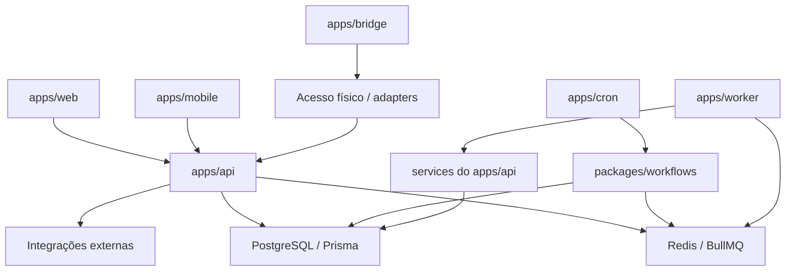

### Pacotes centrais

| Package | Papel |
| --- | --- |
| `packages/db` | Prisma schema e acesso a dados |
| `packages/domain` | lógica compartilhada, logger, IA, utilitários |
| `packages/auth` | autenticação compartilhada |
| `packages/cache` | Redis, filas e DLQ |
| `packages/workflows` | billing e week reset |
| `packages/api` | clientes de integração, como AbacatePay |
| `packages/types` | contratos de tipos compartilhados |
| `packages/access-control` | domínio de acesso físico |
| `packages/config`, `packages/env`, `packages/schemas`, `packages/catalog` | suporte estrutural e validação |

## Leituras-base

- `apps/web/lib/utils/role.ts`
- `apps/web/lib/auth/route-access.ts`
- `apps/web/hooks/use-user-session.ts`
- `apps/web/hooks/use-student.ts`
- `apps/web/hooks/use-gym.ts`
- `apps/web/hooks/use-personal.ts`
- `apps/web/stores/student-unified-store.ts`
- `apps/web/stores/gym-unified-store.ts`
- `apps/web/stores/personal-unified-store.ts`
- `apps/web/app/student/page-content.tsx`
- `apps/web/app/gym/page-content.tsx`
- `apps/web/app/personal/page-content.tsx`
- `apps/api/src/lib/api/middleware/auth.middleware.ts`
- `apps/api/src/routes/**`
- `apps/worker/src/**`
- `apps/cron/src/**`
- `apps/bridge/src/**`
- `apps/mobile/package.json`
- `packages/api/src/abacatepay.ts`
- `packages/cache/src/redis.ts`
- `packages/workflows/src/**`
- `packages/db/prisma/schema.prisma`

## Notas importantes sobre o estado atual

- Existe um papel transitório `PENDING`, usado para onboarding e escolha de tipo de usuário.
- `ADMIN` tem acesso administrativo explícito em `/admin/*` e também herda acesso aos domínios protegidos de `student`, `gym` e `personal`.
- O código atual referencia **DeepSeek** como provedor de IA em `packages/domain/src/ai/client.ts`. Se houver plano para Anthropic/Claude, isso ainda não é o fluxo ativo deste repositório.
- O app web expõe uma tela admin explícita em `/admin/observability`. O restante do poder de admin aparece mais como herança de guards e acesso a rotas do que como um dashboard administrativo único.
- Na API, `requireStudent()` aceita `ADMIN` e também `GYM` quando existe perfil de aluno vinculado. Isso é uma nuance de middleware, não uma regra de navegação do App Router.
- A superficie publica validada hoje e Google-first: `/auth/login` redireciona para `/welcome`, e a UX principal exposta no web nao mostra formulario publico de e-mail/senha.
- O mobile existe como runtime real, mas hoje atua majoritariamente como mobile companion baseado em `WebView` sobre `config.webUrl`, com poucos fluxos nativos dedicados.
- Os lifecycles de subscription em runtime incluem estados de pre-ativacao nao refletidos nas versoes anteriores deste documento: `pending_payment` para student/personal e `pending` ou `pending_payment` em gym, dependendo do fluxo.

---

## 1. Roles e Permissões

### Resumo por role

| Role | Natureza | Pode acessar no web | Pode operar na API |
| --- | --- | --- | --- |
| `PENDING` | transitório | onboarding e escolha de tipo | criação de conta, escolha de role |
| `STUDENT` | usuário final | `/student/*` | rotas de aluno, treinos, nutrição, pagamentos, gyms, personals |
| `GYM` | operação de academia | `/gym/*` | rotas de gym, alunos, equipamentos, financeiro, acesso físico |
| `PERSONAL` | operação de personal trainer | `/personal/*` | rotas de personal, alunos, finanças, campanhas, afiliações |
| `ADMIN` | superusuário | `/admin/*`, `/student/*`, `/gym/*`, `/personal/*` | guards administrativos e herança de acesso nos domínios |

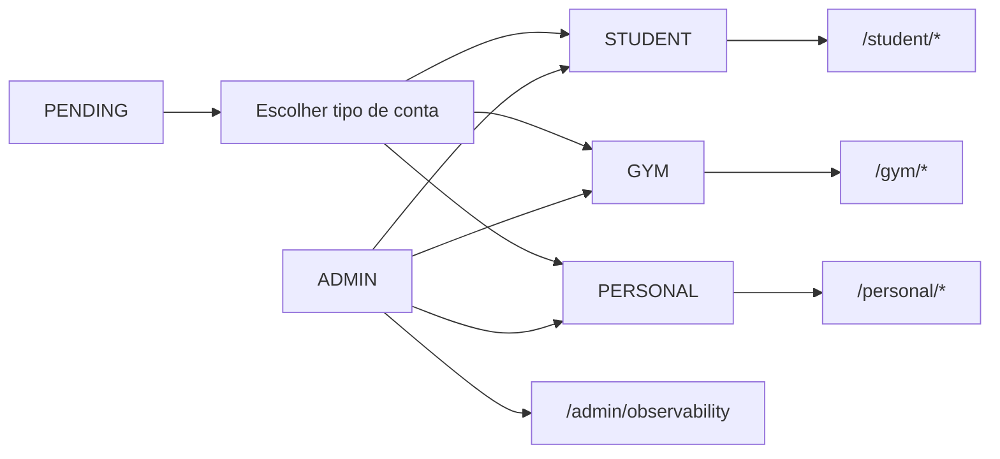

### Regras de acesso do App Router

- `/student/*`: `STUDENT`, `ADMIN`, ou `PENDING` apenas no onboarding.
- `/gym/*`: `GYM`, `ADMIN`, ou `PENDING` apenas no onboarding.
- `/personal/*`: `PERSONAL`, `ADMIN`, ou `PENDING` apenas no onboarding.
- `/admin/*`: apenas `ADMIN`.

---

## 2. Fluxo de Autenticação

### Resumo

- Entrada pública principal: `/welcome`
- Login social e superficie publica principal: Google OAuth em `/welcome`
- `/auth/login`: rota publica de compatibilidade; hoje redireciona para `/welcome`
- Endpoints de credenciais continuam existindo na API (`/api/auth/sign-in`, `/api/auth/sign-up`), mas nao aparecem como fluxo primario da UX publica
- Escolha de tipo de conta: `/auth/register/user-type`
- Resolução de sessão: `/api/auth/session`
- Atualização de role: `/api/auth/update-role` e `/api/users/update-role`
- Recuperação: `verify-reset-code`

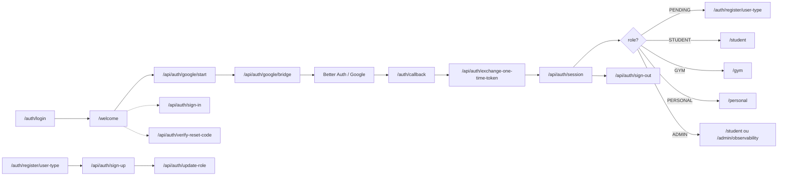

- Validacao de UX: `/auth/login` nao renderiza formulario proprio; a experiencia publica atual exposta no web e Google-first.

### Redirecionamento por role

| Role resolvido | Rota padrão |
| --- | --- |
| `PENDING` | `/auth/register/user-type` |
| `GYM` | `/gym` |
| `PERSONAL` | `/personal` |
| `STUDENT` | `/student` |
| `ADMIN` | `/student` por padrão de helper legado; também pode acessar `/admin/observability` |

---

## 3. Grafo do STUDENT

### Onde vive no web

- Superfície principal: `/student`
- Tabs principais: `home`, `learn`, `cardio`, `diet`, `payments`, `personals`, `gyms`, `education`, `profile`, `more`
- Onboarding: `/student/onboarding`

### Com o que opera

- Store principal: `useStudentUnifiedStore`
- Hook de seleção: `useStudent(...)`
- Entidades mais fortes: `Student`, `StudentProfile`, `StudentProgress`, `WeeklyPlan`, `Workout`, `WorkoutHistory`, `NutritionPlan`, `DailyNutrition`, `GymMembership`, `DayPass`, `Subscription`, `Referral`, `Friendship`

```mermaid
flowchart TD
  ST["STUDENT"] --> HOME["Home"]
  ST --> LEARN["Learn"]
  ST --> CARDIO["Cardio"]
  ST --> DIET["Diet"]
  ST --> PAY["Payments"]
  ST --> PERS["Personals"]
  ST --> GYMS["Gyms"]
  ST --> EDU["Education"]
  ST --> PROFILE["Profile"]
  ST --> MORE["More"]

  HOME --> H1["Progressão, XP, streak"]
  HOME --> H2["Resumo de treino semanal"]
  HOME --> H3["Status nutricional"]
  HOME --> H4["Campanhas boost próximas"]

  LEARN --> L1["Learning path gamificado"]
  CARDIO --> C1["Cardio funcional"]
  DIET --> D1["Plano alimentar e rotina diária"]

  PAY --> P1["Assinatura premium do aluno"]
  PAY --> P2["Mensalidades de academias"]
  PAY --> P3["Pagamentos para personals"]
  PAY --> P4["Referral e saque por PIX"]

  PERS --> PE1["Explorar personal no mapa"]
  PERS --> PE2["Ver perfil"]
  PERS --> PE3["Contratar plano via PIX"]
  PERS --> PE4["Cancelar vínculo"]

  GYMS --> G1["Explorar academias no mapa"]
  GYMS --> G2["Ver perfil de academia"]
  GYMS --> G3["Comprar day pass"]
  GYMS --> G4["Entrar em plano de academia"]
  GYMS --> G5["Trocar ou cancelar plano"]

  EDU --> E1["Muscle explorer"]
  EDU --> E2["Lições educativas"]
  EDU --> E3["Conteúdo por exercício"]

  PROFILE --> PR1["Atualizar perfil físico"]
  PROFILE --> PR2["Peso e histórico"]
  PROFILE --> PR3["Metas e limitações"]
```

### Como o student conversa com a API

| Área | Famílias de rota principais |
| --- | --- |
| bootstrap | `/api/students/bootstrap`, `/api/students/all` |
| perfil e progresso | `/api/students/profile`, `/api/students/progress`, `/api/students/weight`, `/api/students/weight-history`, `/api/students/personal-records` |
| treinos | `/api/workouts/*`, `/api/students/week-reset`, `/api/workouts/weekly-plan`, `/api/workouts/library`, `/api/workouts/chat`, `/api/workouts/chat-stream` |
| nutrição | `/api/nutrition/*`, `/api/students/subscription`, `/api/nutrition/chat`, `/api/nutrition/chat-stream` |
| gyms | `/api/students/gyms`, `/api/students/memberships`, `/api/students/day-passes` |
| personals | `/api/students/personals` |
| pagamentos | `/api/students/payments`, `/api/payment-methods`, `/api/subscriptions/*` |
| social | `/api/students/friends` |
| referral | `/api/students/referrals` |

### Matriz funcional do student

| O que faz | Onde no produto | Quando acontece | Com quê | Como acontece |
| --- | --- | --- | --- | --- |
| completar onboarding | `/student/onboarding` | primeiro acesso pós role | `StudentProfile`, `StudentProgress` | action server + bootstrap posterior |
| treinar | `/student?tab=home`, `learn`, `cardio` | uso diário | `WeeklyPlan`, `Workout`, `WorkoutHistory`, `WorkoutProgress` | `useStudent` + `/api/workouts/*` |
| consumir IA de treino | chat de workouts | durante criação/importação/ajuste | provedor DeepSeek, parser de treino | `/api/workouts/chat*` |
| gerir nutrição | `diet` e `education` | uso diário | `NutritionPlan`, `DailyNutrition`, `FoodItem` | `/api/nutrition/*` |
| consumir IA de nutrição | chat nutricional | quando precisa ajustar dieta | DeepSeek + parser nutricional | `/api/nutrition/chat*` |
| descobrir academias | `gyms` | busca ou contratação | `GymLocation`, `GymMembership`, `DayPass`, `BoostCampaign` | mapas, bootstrap e `/api/students/gyms*` |
| descobrir personals | `personals` | busca ou contratação | `StudentPersonalAssignment`, `PersonalStudentPayment` | mapas, perfil e `/api/students/personals` |
| pagar | `payments` | ao assinar, trocar plano ou quitar pendência | `Subscription`, `Payment`, `PaymentMethod`, `Referral` | PIX via AbacatePay |
| acompanhar evolução | `home`, `profile` | recorrente | `WeightHistory`, `PersonalRecord`, `StudentProgress` | bootstrap incremental + stores |
| socializar | store/social e telas do aluno | recorrente | `Friendship`, `AchievementUnlock`, XP | `/api/students/friends` e progressão |

### Jornada típica do student

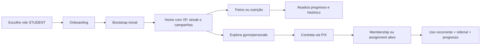

### Quando o student entra em fluxos relevantes

- Após onboarding: criação de perfil, metas, dados físicos e primeiro redirecionamento para `/student`.
- Durante uso recorrente: bootstrap carrega progresso, histórico, nutrição, memberships e localização de gyms.
- Durante monetização: pagamentos via PIX para assinatura, gym membership e personal plan.
- Durante descoberta: campanhas boost, mapas de gyms e personals, e conteúdo educacional.

---

## 4. Grafo do GYM

### Onde vive no web

- Superfície principal: `/gym`
- Tabs principais: `dashboard`, `students`, `equipment`, `financial`, `stats`, `settings`, `catracas`, `more`
- Tab admin-only dentro da superfície gym: `gamification`
- Onboarding: `/gym/onboarding`

### Com o que opera

- Store principal: `useGymUnifiedStore`
- Hook de seleção: `useGym(...)`
- Entidades mais fortes: `Gym`, `GymProfile`, `GymStats`, `GymMembership`, `MembershipPlan`, `Payment`, `Expense`, `Equipment`, `MaintenanceRecord`, `GymCoupon`, `GymSubscription`, `GymWithdraw`, `AccessDevice`, `AccessEvent`, `PresenceSession`, `BoostCampaign`

```mermaid
flowchart TD
  GYM["GYM"] --> DASH["Dashboard"]
  GYM --> STUDENTS["Students"]
  GYM --> EQUIP["Equipment"]
  GYM --> FIN["Financial"]
  GYM --> STATS["Stats"]
  GYM --> SETTINGS["Settings"]
  GYM --> ACCESS["Catracas / Access"]
  GYM --> MORE["More"]

  DASH --> D1["Perfil da academia"]
  DASH --> D2["KPIs e check-ins recentes"]
  DASH --> D3["Resumo de assinatura"]

  STUDENTS --> S1["Listar membros"]
  STUDENTS --> S2["Ver detalhe do aluno"]
  STUDENTS --> S3["Atribuir personal"]
  STUDENTS --> S4["Criar treinos semanais"]
  STUDENTS --> S5["Criar planos nutricionais"]
  STUDENTS --> S6["Chat IA para workout e nutrition"]

  EQUIP --> E1["Cadastrar equipamento"]
  EQUIP --> E2["Atualizar status"]
  EQUIP --> E3["Registrar manutenção"]

  FIN --> F0["Overview"]
  FIN --> F1["Payments"]
  FIN --> F2["Coupons"]
  FIN --> F3["Expenses"]
  FIN --> F4["Subscription"]
  FIN --> F5["Ads / Boost"]
  FIN --> F6["Withdraws e saldo"]
  FIN --> F7["Membership plans"]

  STATS --> T1["Volume de check-ins"]
  STATS --> T2["Retenção e crescimento"]
  STATS --> T3["Utilização de equipamentos"]

  SETTINGS --> SE1["Perfil"]
  SETTINGS --> SE2["Planos de membership"]
  SETTINGS --> SE3["Preferências operacionais"]

  ACCESS --> A1["Dispositivos e heartbeat"]
  ACCESS --> A2["Eventos de acesso"]
  ACCESS --> A3["Presença em tempo real"]
  ACCESS --> A4["Operação manual"]
```

### Como a gym conversa com a API

| Área | Famílias de rota principais |
| --- | --- |
| bootstrap | `/api/gyms/bootstrap`, `/api/gyms/list`, `/api/gyms/set-active`, `/api/gyms/create` |
| perfil e stats | `/api/gyms/profile`, `/api/gyms/stats`, `/api/gyms/locations` |
| membros | `/api/gyms/members`, `/api/gyms/students`, `/api/gym/students/[id]/*` |
| financeiro | `/api/gyms/financial-summary`, `/api/gyms/payments`, `/api/gyms/expenses`, `/api/gyms/coupons`, `/api/gym-subscriptions/*`, `/api/gyms/withdraws` |
| planos | `/api/gyms/plans` |
| equipamentos | `/api/gyms/equipment` |
| acesso físico | `/api/gyms/access`, `/api/gyms/checkin`, `/api/gyms/checkout`, integrações em `/api/integrations/access-*/*` |
| boost | `/api/gyms/boost-campaigns`, além de consumo público em `/api/boost-campaigns/*` |

### Multi-academia

Mesmo sem uma aba dedicada constante no `page-content`, o domínio suporta multi-gym:

- listar gyms do mesmo usuário: `/api/gyms/list`
- criar academia adicional: `/gym/onboarding?mode=new` e `/api/gyms/create`
- trocar contexto ativo: `/api/gyms/set-active`

### Matriz funcional da gym

| O que faz | Onde no produto | Quando acontece | Com quê | Como acontece |
| --- | --- | --- | --- | --- |
| fazer onboarding de academia | `/gym/onboarding` | primeira criação ou nova unidade | `Gym`, `GymProfile` | form multi-step + action |
| trocar academia ativa | superfície gym | quando usuário gerencia várias unidades | `User.activeGymId`, lista de gyms | `/api/gyms/set-active` |
| gerir alunos | `students` | operação diária | `GymMembership`, `StudentData`, `StudentPersonalAssignment` | `/api/gyms/students`, `/api/gym/students/[id]/*` |
| gerir treinos de alunos | detalhe do aluno | coaching diário | `WeeklyPlan`, `Workout` | rotas `/api/gym/students/[id]/weekly-plan` e workouts |
| gerir nutrição de alunos | detalhe do aluno | coaching diário | `NutritionPlan`, `DailyNutrition` | `/api/gym/students/[id]/nutrition/*` |
| gerir equipamentos | `equipment` | operação física | `Equipment`, `MaintenanceRecord` | store da gym + `/api/gyms/equipment` |
| gerir caixa | `financial` | recorrente | `Payment`, `Expense`, `GymWithdraw`, `GymSubscription` | `/api/gyms/payments`, `expenses`, `withdraws`, `gym-subscriptions` |
| vender memberships | `financial`, `settings` | monetização | `MembershipPlan`, `GymCoupon`, `GymMembership` | rotas de planos, cupons e pagamentos |
| promover campanhas | `financial&subTab=ads` | aquisição | `BoostCampaign`, analytics de clique/impressão | `/api/gyms/boost-campaigns` + `/api/boost-campaigns/*` |
| controlar presença física | `catracas` | operação de acesso | `AccessDevice`, `AccessEvent`, `PresenceSession`, `AccessAuthorizationAttempt` | web + integrações de hardware |

---

## 5. Grafo do PERSONAL TRAINER

### Onde vive no web

- Superfície principal: `/personal`
- Tabs principais: `dashboard`, `students`, `gyms`, `financial`, `settings`, `stats`, `more`
- Onboarding: `/personal/onboarding`

### Com o que opera

- Store principal: `usePersonalUnifiedStore`
- Hook de seleção: `usePersonal(...)`
- Entidades mais fortes: `Personal`, `PersonalSubscription`, `GymPersonalAffiliation`, `StudentPersonalAssignment`, `PersonalMembershipPlan`, `PersonalCoupon`, `PersonalExpense`, `PersonalStudentPayment`, `BoostCampaign`

```mermaid
flowchart TD
  PT["PERSONAL"] --> DASH["Dashboard"]
  PT --> STUDENTS["Students"]
  PT --> GYMS["Gyms"]
  PT --> FIN["Financial"]
  PT --> SETTINGS["Settings"]
  PT --> STATS["Stats"]
  PT --> MORE["More"]

  DASH --> D1["Perfil e assinatura"]
  DASH --> D2["Resumo financeiro"]
  DASH --> D3["Afiliações e alunos"]

  STUDENTS --> S1["Diretório de alunos"]
  STUDENTS --> S2["Atribuir ou remover aluno"]
  STUDENTS --> S3["Ver detalhe do aluno"]
  STUDENTS --> S4["Criar plano semanal"]
  STUDENTS --> S5["Criar plano nutricional"]
  STUDENTS --> S6["Chat IA nutricional"]

  GYMS --> G1["Ver afiliações"]
  GYMS --> G2["Vincular e desvincular gym"]
  GYMS --> G3["Navegar contexto da academia"]

  FIN --> F0["Overview"]
  FIN --> F1["Payments"]
  FIN --> F2["Coupons"]
  FIN --> F3["Expenses"]
  FIN --> F4["Subscription"]
  FIN --> F5["Ads / Boost"]
  FIN --> F6["Membership plans para alunos"]

  SETTINGS --> SE1["Perfil profissional"]
  SETTINGS --> SE2["Modalidades presencial/remoto"]
  SETTINGS --> SE3["PIX e dados de atendimento"]

  STATS --> T1["Volume de alunos"]
  STATS --> T2["Alunos por gym"]
  STATS --> T3["Independentes vs afiliados"]
```

### Como o personal conversa com a API

| Área | Famílias de rota principais |
| --- | --- |
| bootstrap | `/api/personals/bootstrap` |
| perfil e afiliações | `/api/personals/gyms`, `/api/personals/affiliations`, `/api/personals/onboarding` |
| alunos | `/api/personals/students`, `/api/personals/students/assign`, `/api/personals/students/search`, `/api/personals/students/[id]/*` |
| financeiro | `/api/personals/financial-summary`, `/api/personals/payments`, `/api/personals/expenses`, `/api/personals/coupons`, `/api/personals/subscription` |
| planos | `/api/personals/membership-plans` |
| boost | `/api/personals/boost-campaigns`, além de consumo público em `/api/boost-campaigns/*` |

### Matriz funcional do personal

| O que faz | Onde no produto | Quando acontece | Com quê | Como acontece |
| --- | --- | --- | --- | --- |
| fazer onboarding | `/personal/onboarding` | primeiro acesso | `Personal` | form de 2 passos + action |
| gerir perfil profissional | `settings` | setup e manutenção | `PersonalProfile`, chave PIX, modalidades | `usePersonal` + mutações |
| afiliar-se a academias | `gyms` | expansão de atuação | `GymPersonalAffiliation` | `/api/personals/affiliations` |
| gerir carteira de alunos | `students` | rotina principal | `StudentPersonalAssignment`, `StudentData` | `/api/personals/students*` |
| criar plano semanal | detalhe do aluno | prescrição de treino | `WeeklyPlan`, `Workout` | `/api/personals/students/[id]/weekly-plan` |
| criar plano nutricional | detalhe do aluno | prescrição de dieta | `NutritionPlan`, `DailyNutrition` | `/api/personals/students/[id]/nutrition/*` |
| receber por alunos | `financial` | monetização | `PersonalMembershipPlan`, `PersonalStudentPayment` | PIX + rotas de pagamentos |
| gerir cupom e campanha | `financial` | aquisição | `PersonalCoupon`, `BoostCampaign` | rotas de cupons e boost |
| gerir assinatura própria | `financial&subTab=subscription` | recorrente | `PersonalSubscription` | `/api/personals/subscription` |

---

## 6. Grafo do ADMIN

### Onde aparece hoje

- Superfície explícita: `/admin/observability`
- Herança de acesso: `student`, `gym` e `personal`
- Controle de role: `/api/auth/update-role` e `/api/users/update-role`

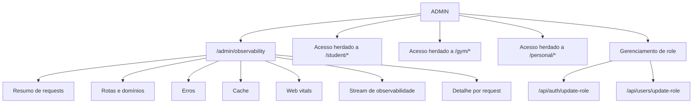

### Rotas administrativas identificadas

- `/api/admin/observability/summary`
- `/api/admin/observability/recent`
- `/api/admin/observability/requests`
- `/api/admin/observability/requests/[requestId]`
- `/api/admin/observability/routes`
- `/api/admin/observability/domains`
- `/api/admin/observability/errors`
- `/api/admin/observability/cache`
- `/api/admin/observability/web-vitals`
- `/api/admin/observability/stream`

### Matriz funcional do admin

| O que faz | Onde | Com quê | Como |
| --- | --- | --- | --- |
| observar requests | `/admin/observability` | `TelemetryEvent`, métricas por rota | rotas admin de observabilidade |
| inspecionar erros | `/admin/observability` | erros agregados e requests específicos | `errors`, `requests/[requestId]` |
| inspecionar cache | `/admin/observability` | métricas de cache | rota `cache` |
| inspecionar domínios e rotas | `/admin/observability` | agrupamento por domínio funcional | rotas `domains`, `routes`, `summary` |
| administrar roles | API | `User.role` | `/api/auth/update-role`, `/api/users/update-role` |
| atuar como superusuário | web e API | herança de guards | acesso herdado a student/gym/personal |

---

## 7. Mapa de Entidades

### ER simplificado

```mermaid
erDiagram
  USER ||--o| STUDENT : has
  USER ||--o{ GYM : owns
  USER ||--o| PERSONAL : has
  USER ||--o{ SESSION : authenticates
  USER ||--o{ PAYMENT_METHOD : saves

  STUDENT ||--o| STUDENT_PROFILE : profiles
  STUDENT ||--o| STUDENT_PROGRESS : progresses
  STUDENT ||--o| SUBSCRIPTION : upgrades
  STUDENT ||--o{ WEIGHT_HISTORY : tracks
  STUDENT ||--o{ WORKOUT_HISTORY : completes
  STUDENT ||--o{ WEEKLY_PLAN : owns
  STUDENT ||--o{ NUTRITION_PLAN : owns
  STUDENT ||--o{ DAILY_NUTRITION : tracks
  STUDENT ||--o{ GYM_MEMBERSHIP : joins
  STUDENT ||--o{ DAY_PASS : buys
  STUDENT ||--o{ FRIENDSHIP : socializes
  STUDENT ||--o{ REFERRAL : refers
  STUDENT ||--o{ STUDENT_WITHDRAW : withdraws
  STUDENT ||--o{ STUDENT_PERSONAL_ASSIGNMENT : receives
  STUDENT ||--o{ PERSONAL_STUDENT_PAYMENT : pays

  WEEKLY_PLAN ||--o{ PLAN_SLOT : organizes
  PLAN_SLOT }o--|| WORKOUT : points_to
  WORKOUT ||--o{ WORKOUT_EXERCISE : contains

  NUTRITION_PLAN ||--o{ NUTRITION_PLAN_MEAL : contains
  NUTRITION_PLAN_MEAL ||--o{ NUTRITION_PLAN_FOOD_ITEM : contains
  DAILY_NUTRITION ||--o{ NUTRITION_MEAL : groups
  NUTRITION_MEAL ||--o{ NUTRITION_FOOD_ITEM : contains

  GYM ||--o| GYM_PROFILE : profiles
  GYM ||--o| GYM_STATS : measures
  GYM ||--o| GYM_SUBSCRIPTION : subscribes
  GYM ||--o{ MEMBERSHIP_PLAN : offers
  GYM ||--o{ PAYMENT : charges
  GYM ||--o{ EXPENSE : spends
  GYM ||--o{ EQUIPMENT : manages
  GYM ||--o{ GYM_COUPON : discounts
  GYM ||--o{ GYM_WITHDRAW : withdraws
  GYM ||--o{ ACCESS_DEVICE : controls
  GYM ||--o{ ACCESS_EVENT : records
  GYM ||--o{ PRESENCE_SESSION : tracks
  GYM ||--o{ BOOST_CAMPAIGN : promotes

  MEMBERSHIP_PLAN ||--o{ GYM_MEMBERSHIP : prices
  MEMBERSHIP_PLAN ||--o{ PAYMENT : bills

  PERSONAL ||--o| PERSONAL_SUBSCRIPTION : subscribes
  PERSONAL ||--o{ GYM_PERSONAL_AFFILIATION : affiliates
  PERSONAL ||--o{ STUDENT_PERSONAL_ASSIGNMENT : coaches
  PERSONAL ||--o{ PERSONAL_MEMBERSHIP_PLAN : offers
  PERSONAL ||--o{ PERSONAL_STUDENT_PAYMENT : bills
  PERSONAL ||--o{ PERSONAL_COUPON : discounts
  PERSONAL ||--o{ PERSONAL_EXPENSE : spends
  PERSONAL ||--o{ BOOST_CAMPAIGN : promotes

  ACCESS_DEVICE ||--o{ ACCESS_RAW_EVENT : ingests
  ACCESS_RAW_EVENT ||--o{ ACCESS_EVENT : normalizes
  BOOST_CAMPAIGN ||--o{ BOOST_CAMPAIGN_ENGAGEMENT : measures
```

### Entidades de maior peso por domínio

| Domínio | Entidades-chave |
| --- | --- |
| identidade | `User`, `Account`, `Session`, `Verification`, `MobileInstallation` |
| student | `Student`, `StudentProfile`, `StudentProgress`, `WeightHistory`, `PersonalRecord` |
| workouts | `WeeklyPlan`, `PlanSlot`, `Unit`, `Workout`, `WorkoutExercise`, `WorkoutHistory`, `WorkoutProgress` |
| nutrition | `NutritionPlan`, `NutritionPlanMeal`, `DailyNutrition`, `NutritionMeal`, `NutritionFoodItem` |
| gym | `Gym`, `GymProfile`, `GymStats`, `GymMembership`, `MembershipPlan`, `DayPass`, `Equipment` |
| access control | `AccessDevice`, `AccessCredentialBinding`, `AccessRawEvent`, `AccessEvent`, `PresenceSession`, `AccessEligibilitySnapshot`, `AccessAuthorizationAttempt` |
| personal | `Personal`, `PersonalSubscription`, `GymPersonalAffiliation`, `StudentPersonalAssignment`, `PersonalMembershipPlan`, `PersonalStudentPayment` |
| monetização | `Subscription`, `GymSubscription`, `SubscriptionPayment`, `Payment`, `Expense`, `PaymentMethod`, `GymCoupon`, `PersonalCoupon`, `GymWithdraw`, `StudentWithdraw`, `Referral`, `BoostCampaign` |
| observabilidade | `TelemetryEvent`, `TelemetryRollupMinute` |

---

## 8. Mapa de Rotas por Role

### Grafo de roteamento

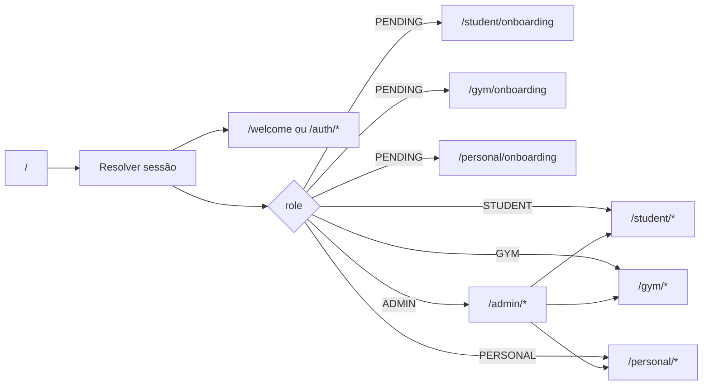

### Prefixos principais do web

| Prefixo | Proteção | Finalidade |
| --- | --- | --- |
| `/welcome` | público | entrada pública e CTA Google-first |
| `/auth/login` | público | redirect / compatibilidade para `/welcome` |
| `/auth/callback` | público | callback OAuth |
| `/auth/register/user-type` | público / `PENDING` | seleção de tipo |
| `/student` | `STUDENT` / `ADMIN` | superfície do aluno |
| `/student/onboarding` | `PENDING` / `STUDENT` | onboarding de aluno |
| `/gym` | `GYM` / `ADMIN` | superfície da academia |
| `/gym/onboarding` | `PENDING` / `GYM` | onboarding de academia |
| `/personal` | `PERSONAL` / `ADMIN` | superfície do personal |
| `/personal/onboarding` | `PENDING` / `PERSONAL` | onboarding do personal |
| `/admin/observability` | `ADMIN` | observabilidade e análise operacional |

### Catálogo de superfícies web

| Superfície | Páginas, tabs e áreas identificadas |
| --- | --- |
| público | `/welcome`, `/auth/login`, `/auth/callback`, `/auth/register/user-type` |
| student | `home`, `learn`, `cardio`, `diet`, `payments`, `personals`, `gyms`, `education`, `profile`, `more`, onboarding |
| gym | `dashboard`, `students`, `equipment`, `financial`, `stats`, `settings`, `catracas`, `more`, onboarding, detalhe de aluno em `_students/[id]` |
| personal | `dashboard`, `students`, `gyms`, `financial`, `settings`, `stats`, `more`, onboarding, detalhe de aluno em `_students/[id]` |
| admin | `observability` |

### Subtabs financeiras identificadas

| Domínio | Subtabs |
| --- | --- |
| gym | `overview`, `payments`, `coupons`, `expenses`, `subscription`, `ads` |
| personal | `overview`, `payments`, `coupons`, `expenses`, `subscription`, `ads` |
| student payments | assinatura, memberships por gym, payments por gym, referral |

### Prefixos principais da API

| Prefixo | Domínio |
| --- | --- |
| `/api/auth/*` | autenticação, sessão, OAuth, reset, role |
| `/api/students/*` | bootstrap, perfil, progresso, referrals, memberships, payments |
| `/api/workouts/*` | treino, weekly plan, chat IA, histórico |
| `/api/nutrition/*` | plano alimentar, diário, chat IA |
| `/api/gyms/*` | academia, members, plans, payments, stats, access |
| `/api/gym/*` | operações de gym sobre alunos específicos |
| `/api/personals/*` | personals, students, finances, affiliations |
| `/api/subscriptions/*` | assinatura do aluno |
| `/api/gym-subscriptions/*` | assinatura da academia |
| `/api/boost-campaigns/*` | discovery pública e analytics de campanhas |
| `/api/integrations/access-*/*` | entrada de hardware e automação de acesso |
| `/api/webhooks/abacatepay` | webhook de PIX/pagamentos |
| `/api/observability/events` | ingestão de telemetria do app |
| `/api/admin/observability/*` | leitura analítica admin |

---

## 9. Fluxo de Dados

### Fluxo principal

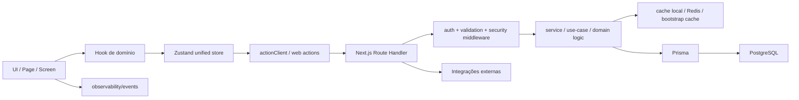

### Fluxo por domínio no frontend

| Domínio | Hook | Store | Bootstrap |
| --- | --- | --- | --- |
| student | `useStudent()` | `useStudentUnifiedStore` | `getStudentBootstrapAction` |
| gym | `useGym()` | `useGymUnifiedStore` | `getGymBootstrapAction` |
| personal | `usePersonal()` | `usePersonalUnifiedStore` | `getPersonalBootstrapAction` |
| sessão | `useUserSession()` | boundary/sessão | `getAuthSessionAction` |

### Cache, invalidação e revalidação

| Camada | Mecanismo |
| --- | --- |
| SSR/App Router | `next/cache`, tags e `revalidateTag` / `updateTag` |
| leitura web | `readCachedApi`, bootstrap readers e perfis de cache |
| stores cliente | Zustand unificado por domínio |
| runtime | Redis compartilhado e warmup no `apps/api` |
| jobs | BullMQ sobre Redis |

### Fluxo de eventos assíncronos

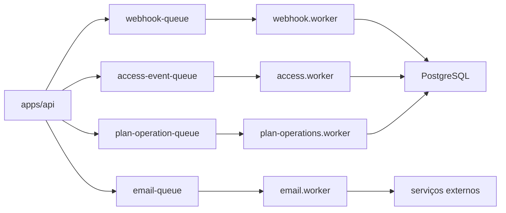

### Filas e jobs identificados

| Queue | Worker | Finalidade |
| --- | --- | --- |
| `webhook-queue` | `webhook.worker.ts` | processar eventos de pagamento da AbacatePay |
| `email-queue` | `email.worker.ts` | envio de welcome email e reset password |
| `access-event-queue` | `access.worker.ts` | processar eventos brutos de acesso físico |
| `plan-operation-queue` | `plan-operations.worker.ts` | ativar planos de treino/nutrição da biblioteca |

### Fluxo de escrita típico

1. Usuário interage com uma página ou modal.
2. O componente chama um hook de domínio.
3. O hook expõe `actions` e `loaders` do store unificado.
4. O store usa `actionClient` para fazer leitura ou mutação.
5. A request cai em um Route Handler do `apps/api`.
6. Middlewares validam autenticação, input, segurança e contexto.
7. Services e handlers consultam cache, regras de negócio e Prisma.
8. O resultado volta ao store, que reidrata a UI.

---

<a id="integracoes-externas"></a>
## 10. Integrações Externas

### Mapa atual

```mermaid
flowchart TD
  APP["GymRats"] --> GOOGLE["Google OAuth"]
  APP --> ABACATE["AbacatePay / PIX"]
  APP --> AI["DeepSeek API"]
  APP --> ACCESS["Dispositivos de acesso"]
  APP --> VERCEL["Vercel Analytics"]
  APP --> OBS["Observabilidade interna"]

  GOOGLE --> G1["/api/auth/google/start"]
  GOOGLE --> G2["/api/auth/google/bridge"]
  GOOGLE --> G3["/auth/callback"]

  ABACATE --> A1["PIX para subscriptions"]
  ABACATE --> A2["PIX para payments"]
  ABACATE --> A3["Webhooks em /api/webhooks/abacatepay"]
  ABACATE --> A4["Withdraws gym e student"]

  AI --> I1["Workout chat"]
  AI --> I2["Workout chat-stream"]
  AI --> I3["Nutrition chat"]
  AI --> I4["Nutrition chat-stream"]

  ACCESS --> X1["/api/integrations/access-events/[ingestionKey]"]
  ACCESS --> X2["/api/integrations/access-authorizations/[ingestionKey]"]
  ACCESS --> X3["/api/integrations/access-heartbeats/[ingestionKey]"]

  VERCEL --> V1["Analytics no RootLayout"]
  OBS --> O1["/api/observability/events"]
  OBS --> O2["/api/admin/observability/*"]
```

### Detalhe por integração

| Integração | Como aparece no código | Para quê |
| --- | --- | --- |
| Google OAuth | `apps/web/app/welcome/page.tsx`, `/api/auth/google/start`, `/api/auth/google/bridge` | login social e entrada principal |
| AbacatePay | `/api/webhooks/abacatepay`, entidades `Payment`, `SubscriptionPayment`, `GymWithdraw`, `StudentWithdraw` | PIX, billing, saques e webhooks |
| DeepSeek API | `packages/domain/src/ai/client.ts` | chat de treino, chat de nutrição, geração assistida |
| Dispositivos de acesso | `/api/integrations/access-events/*`, `/api/integrations/access-authorizations/*`, `/api/integrations/access-heartbeats/*` | catracas, RFID/QR, presença e autorização |
| Vercel Analytics | `apps/web/app/layout.tsx` com `<Analytics />` | analytics do frontend |
| Observabilidade interna | `/api/observability/events`, `/api/admin/observability/*`, `TelemetryEvent` | telemetria operacional, erros, requests, cache, web vitals |

---

<a id="background-processing-e-operacao"></a>
## 11. Background Processing e Operação

### Cron jobs

| Job | Origem | Efeito |
| --- | --- | --- |
| reset semanal | `apps/cron` + `packages/workflows/src/cron/week-reset.ts` | reseta override semanal do aluno |
| membership billing | `apps/cron` + `packages/workflows/src/cron/membership-billing.ts` | executa cobrança recorrente |

### Runtime bridge

O runtime `apps/bridge` existe para representar adaptação de hardware de acesso. Hoje o `NoopAdapter` é placeholder, mas a presença do runtime indica uma arquitetura preparada para:

- autorização de passagem;
- heartbeat de dispositivos;
- integração externa desacoplada do web app.

Validacao atual:

- o runtime esta em estado de scaffold;
- o unico adapter versionado neste repositorio hoje e o `NoopAdapter`;
- nao ha adaptadores reais de hardware versionados no repo ate esta leitura.

### Runtime worker

O runtime `apps/worker` sobe quatro workers em paralelo:

- access;
- email;
- webhook;
- plan operations.

Isso torna o processamento não bloqueante para:

- webhooks de pagamento;
- operações de acesso físico;
- e-mails;
- ativações pesadas de planos.

---

<a id="mobile-companion"></a>
## 12. Mobile Companion

### Presença do app mobile

Existe um app Expo em `apps/mobile` com:

- `expo-router`;
- `expo-notifications`;
- `expo-location`;
- `expo-secure-store`;
- `zustand`.
- entrada nativa atual redirecionando para `/web`;
- shell principal abrindo `config.webUrl` via `WebView`.

### Papel arquitetural do mobile

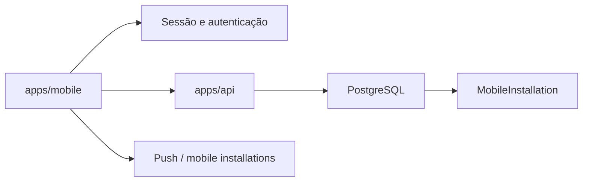

### O que isso sinaliza no domínio

- a aplicacao nao e apenas web, mas o mobile atual e fortemente web-first;
- há persistência de instalações móveis no schema (`MobileInstallation`);
- o backend já foi modelado para tokens de push, capacidades do dispositivo, locale e timezone;
- a superficie mobile atual combina capacidades nativas (push, location, secure storage) com forte reutilizacao da experiencia web.

---

## Catálogo Consolidado por Superfície

### Student

- Objetivo: treinar, aprender, acompanhar progresso, descobrir gyms/personals e pagar por planos.
- Onde: `/student` e subfluxos de onboarding, profile, maps, payments e education.
- Como: `useStudent` + `useStudentUnifiedStore` + bootstrap de aluno + famílias `/api/students`, `/api/workouts`, `/api/nutrition`.

### Gym

- Objetivo: operar academia, monetizar membership, acompanhar alunos, controlar equipamentos e acesso físico.
- Onde: `/gym` com tabs de operação, financeiro, equipamentos, stats, settings e catracas.
- Como: `useGym` + `useGymUnifiedStore` + bootstrap de gym + famílias `/api/gyms`, `/api/gym/students`, `/api/gym-subscriptions`, integrações de acesso.

### Personal

- Objetivo: atender alunos, afiliar-se a gyms, vender planos, gerenciar campanhas e assinatura própria.
- Onde: `/personal` com tabs de dashboard, students, gyms, financial, settings e stats.
- Como: `usePersonal` + `usePersonalUnifiedStore` + bootstrap de personal + famílias `/api/personals/*`.

### Admin

- Objetivo: observar o sistema e operar com privilégio máximo.
- Onde: `/admin/observability` e herança de acesso aos demais domínios.
- Como: route guards admin + famílias `/api/admin/observability/*`, `/api/auth/update-role`, `/api/users/update-role`.

### Infraestrutura operacional

- Objetivo: sustentar jobs, billing, acesso físico e integrações assíncronas.
- Onde: `apps/worker`, `apps/cron`, `apps/bridge`, `packages/cache`, `packages/workflows`.
- Como: BullMQ sobre Redis, workflows agendados e runtimes dedicados.

---

## Checklist de Verificação

- Todos os roles principais aparecem: `PENDING`, `STUDENT`, `GYM`, `PERSONAL`, `ADMIN`.
- Os fluxos de auth cobrem login, sessão, OAuth, callback, sign-up, update-role e sign-out.
- As superfícies `student`, `gym`, `personal` e `admin` estão refletidas com tabs e objetivos.
- O mapa de entidades cobre autenticação, treinos, nutrição, gym, personal, monetização, social, access control e observabilidade.
- O fluxo de dados UI → hook → store → client → route → middleware → service → Prisma → PostgreSQL está explicitado.
- As integrações atuais do código estão documentadas como Google OAuth, AbacatePay, DeepSeek, acesso físico, Vercel Analytics e observabilidade interna.

---

## 13. Capability Matrix Operacional por Role

As matrizes abaixo complementam as matrizes sintéticas anteriores. Aqui cada linha representa uma capacidade concreta, com superfície, precondições, entidades, rotas, side effects e integrações.

<a id="role-pending"></a>
### Role PENDING

| Role | Domínio | Capacidade | Surface | Page/Tab/SubTab | Precondições | Ação do usuário | Entidades envolvidas | Rotas/API | Side effects | Async jobs / integrações | Observações |
| --- | --- | --- | --- | --- | --- | --- | --- | --- | --- | --- | --- |
| `PENDING` | auth | iniciar sessão | público | `/welcome` (`/auth/login` redireciona para ca) | conta criada ou OAuth disponível | clicar em login Google, usar callback OAuth ou acionar endpoints de credenciais | `User`, `Session`, `Account` | `/api/auth/google/start`, `/api/auth/sign-in`, `/api/auth/sign-up` | cria sessão e viewer | Google OAuth, email de boas-vindas quando aplicável | fluxo público atual e Google-first |
| `PENDING` | onboarding | escolher tipo de conta | público | `/auth/register/user-type` | sessão válida e role ainda transitória | selecionar `STUDENT`, `GYM` ou `PERSONAL` | `User.role`, `User.activeGymId` | `/api/auth/update-role`, `/api/users/update-role` | redireciona para onboarding específico | nenhuma obrigatória | `ADMIN` também consegue alterar role por rotas dedicadas |
| `PENDING` | onboarding | concluir onboarding de aluno | web | `/student/onboarding` | role `PENDING` ou `STUDENT` recém-criado | preencher perfil, metas e dados físicos | `Student`, `StudentProfile`, `StudentProgress` | `/api/students/onboarding` | habilita bootstrap de aluno e primeira home | nenhuma; pode encadear referral | se houver referral, pode redirecionar para `payments/subscription` |
| `PENDING` | onboarding | concluir onboarding de academia | web | `/gym/onboarding` | role `PENDING` ou `GYM` recém-criado | cadastrar academia e plano inicial | `Gym`, `GymProfile`, `User.activeGymId` | `/api/gyms/onboarding`, `/api/gyms/create` | ativa contexto de gym | integração posterior com billing | `mode=new` adiciona nova unidade |
| `PENDING` | onboarding | concluir onboarding de personal | web | `/personal/onboarding` | role `PENDING` ou `PERSONAL` recém-criado | preencher perfil profissional | `Personal`, `PersonalSubscription` | `/api/personals/onboarding` | ativa bootstrap de personal | nenhuma obrigatória | prepara afiliações e catálogo financeiro |
| `PENDING` | recuperação | recuperar acesso | público | login / callback | e-mail conhecido | solicitar e validar código de reset | `User`, `Verification` | `/api/auth/verify-reset-code` | libera nova autenticação | `email-queue` para reset | depende de SMTP configurado |

<a id="role-student"></a>
### Role STUDENT

| Role | Domínio | Capacidade | Surface | Page/Tab/SubTab | Precondições | Ação do usuário | Entidades envolvidas | Rotas/API | Side effects | Async jobs / integrações | Observações |
| --- | --- | --- | --- | --- | --- | --- | --- | --- | --- | --- | --- |
| `STUDENT` | bootstrap | carregar contexto unificado | web | `/student` | sessão válida e registro de aluno | abrir a área do aluno | `Student`, `StudentProfile`, `StudentProgress`, `Subscription` | `/api/students/bootstrap` | hidrata Zustand e cache local | Redis bootstrap cache | base de quase todas as telas |
| `STUDENT` | perfil | manter perfil físico e progresso | web | `profile`, `home` | onboarding concluído | editar dados, metas, peso, limites | `StudentProfile`, `StudentProgress`, `WeightHistory` | `/api/students/profile`, `/api/students/progress`, `/api/students/weight`, `/api/students/weight-history`, `/api/students/personal-records` | atualiza cards, gráficos e bootstrap | nenhuma | usado por cards de evolução e recomendações |
| `STUDENT` | treino | executar treino e registrar progresso | web | `home`, `learn`, `cardio` | weekly plan ou workout disponível | abrir treino, marcar exercícios, concluir sessão | `WeeklyPlan`, `Workout`, `WorkoutProgress`, `WorkoutHistory` | `/api/workouts/manage*`, `/api/workouts/exercises*`, `/api/workouts/[id]/progress*`, `/api/workouts/[id]/complete`, `/api/workouts/history*` | persiste histórico, XP e cards recentes | nenhuma | coração do uso diário do aluno |
| `STUDENT` | treino | gerir plano semanal próprio | web | `learn` | aluno autenticado | criar, editar ou ajustar plano semanal | `WeeklyPlan`, `PlanSlot`, `Workout` | `/api/workouts/weekly-plan`, `/api/workouts/library*` | atualiza agenda semanal e bootstrap | nenhuma | templates de biblioteca convivem com plano ativo |
| `STUDENT` | treino | ativar plano de treino da biblioteca | web | `learn` / modal de biblioteca | plano template pertence ao aluno | selecionar template e ativar | `WeeklyPlan` template, `WeeklyPlan` ativo | `/api/workouts/weekly-plan/activate`, `/api/jobs/[id]` | retorna `202`, mostra status e depois reflete no store | `plan-operation-queue` → `plan-operations.worker.ts` | ativação é assíncrona por desenho |
| `STUDENT` | treino + IA | gerar ou ajustar treinos com IA | web | `learn`, modais, chats | assinatura/feature adequada quando aplicável | enviar prompt de treino ou ajuste | `Workout`, `WorkoutExercise`, telemetria de IA | `/api/workouts/chat`, `/api/workouts/chat-stream`, `/api/workouts/generate`, `/api/workouts/process` | gera sugestões e possível persistência posterior | DeepSeek | parte é streaming, parte é processamento server-side |
| `STUDENT` | nutrição | gerir plano alimentar e diário | web | `diet` | aluno autenticado | editar plano ativo, refeições e alimentos consumidos | `NutritionPlan`, `DailyNutrition`, `NutritionMeal`, `NutritionFoodItem` | `/api/nutrition/active`, `/api/nutrition/daily`, `/api/nutrition/library*` | atualiza resumo diário e status nutricional | nenhuma | integra biblioteca, plano ativo e diário |
| `STUDENT` | nutrição | ativar plano nutricional da biblioteca | web | `diet` / modal de biblioteca | template existente e pertencente ao aluno | ativar plano alimentar salvo | `NutritionPlan` template, `NutritionPlan` ativo | `/api/nutrition/activate`, `/api/jobs/[id]` | resposta `202` e refresh posterior do domínio | `plan-operation-queue` → `plan-operations.worker.ts` | mesma estratégia assíncrona do treino |
| `STUDENT` | nutrição + IA | conversar com IA nutricional | web | `diet` | plano, objetivos e input do usuário | enviar prompt e receber resposta | `NutritionPlan`, `DailyNutrition`, `NutritionChatUsage` | `/api/nutrition/chat`, `/api/nutrition/chat-stream` | ajusta recomendações e telemetria | DeepSeek | fluxo orientado a chat |
| `STUDENT` | descoberta | descobrir academias | web | `gyms` | sessão válida; localização opcional | abrir mapa, lista e perfil de gyms | `Gym`, `GymProfile`, `GymMembership`, `BoostCampaign` | `/api/students/gyms/[gymId]/plans`, `/api/students/gyms/[gymId]/profile`, `/api/boost-campaigns/nearby` | atualiza mapas, campanhas e CTA de contratação | geolocalização e campanhas boost | discovery mistura dados pagos e proximidade |
| `STUDENT` | monetização gym | comprar day pass ou aderir a plano de academia | web | `gyms`, `payments` | gym escolhida e plano/day pass disponível | comprar, gerar PIX, pagar, alterar ou cancelar | `DayPass`, `GymMembership`, `Payment`, `PaymentMethod` | `/api/students/gyms/[gymId]/join`, `/api/students/day-passes`, `/api/students/memberships*`, `/api/students/payments/[paymentId]/pay-now`, `/api/students/payments/[paymentId]/simulate-pix` | cria cobrança, muda vínculo e recarrega bootstrap | AbacatePay PIX | membership e day pass têm lifecycles diferentes |
| `STUDENT` | descoberta personal | descobrir personals e ver perfil | web | `personals` | sessão válida; localização opcional | navegar mapa/lista, abrir perfil | `Personal`, `GymPersonalAffiliation`, `BoostCampaign` | `/api/students/personals`, `/api/students/personals/nearby`, `/api/students/personals/[personalId]/profile`, `/api/boost-campaigns/[campaignId]/impression` | atualiza vitrine e analytics | campanhas boost | mesma superfície suporta mapa e página de perfil |
| `STUDENT` | monetização personal | contratar personal e cancelar vínculo | web | `personals`, `payments` | personal escolhido e plano disponível | assinar plano, pagar PIX e, se necessário, cancelar assignment | `PersonalStudentPayment`, `StudentPersonalAssignment` | `/api/students/personals/[personalId]/subscribe`, `/api/students/personals/payments/[paymentId]`, `/api/students/personals/payments/[paymentId]/simulate-pix`, `/api/students/personals/assignments/[assignmentId]/cancel` | gera cobrança, cria vínculo após pagamento e remove vínculo no cancelamento | AbacatePay PIX | assignment surge como efeito do pagamento liquidado |
| `STUDENT` | assinatura própria | gerir assinatura do aluno | web | `payments` / subscription | conta ativa | iniciar trial, criar assinatura, cancelar, aplicar referral | `Subscription`, `SubscriptionPayment`, `Referral` | `/api/subscriptions/current`, `/api/subscriptions/start-trial`, `/api/subscriptions/create`, `/api/subscriptions/cancel`, `/api/subscriptions/apply-referral`, `/api/subscriptions/simulate-pix` | altera acesso a features premium | AbacatePay PIX | a UX expoe `PREMIUM` e `PRO`, mas o checkout atual ainda consolida cobranca premium-centered; fonte pode ser `OWN` ou assistida por gym enterprise |
| `STUDENT` | social | gerir amigos, referral e saque | web | `home`, `payments`, `more` | aluno ativo | consultar referral, configurar PIX, sacar saldo, ver amigos | `Friendship`, `Referral`, `StudentWithdraw`, `PaymentMethod` | `/api/students/friends`, `/api/students/referrals`, `/api/students/referrals/pix-key`, `/api/students/referrals/withdraw` | atualiza saldo, vínculos sociais e histórico financeiro | AbacatePay para saque | referral muda de `PENDING` para `CONVERTED` e `PAID` |

<a id="role-gym"></a>
### Role GYM

| Role | Domínio | Capacidade | Surface | Page/Tab/SubTab | Precondições | Ação do usuário | Entidades envolvidas | Rotas/API | Side effects | Async jobs / integrações | Observações |
| --- | --- | --- | --- | --- | --- | --- | --- | --- | --- | --- | --- |
| `GYM` | bootstrap | carregar gym ativa e trocar contexto | web | `/gym`, `more` | sessão de gym e pelo menos uma unidade | abrir dashboard ou trocar unidade ativa | `Gym`, `GymProfile`, `User.activeGymId` | `/api/gyms/bootstrap`, `/api/gyms/list`, `/api/gyms/set-active`, `/api/gyms/create` | rehidrata tudo para a unidade escolhida | Redis bootstrap cache | base do suporte multi-academia |
| `GYM` | onboarding | cadastrar unidade principal ou adicional | web | `/gym/onboarding` | role `GYM` ou `PENDING` | preencher dados da academia | `Gym`, `GymProfile`, `GymSubscription` | `/api/gyms/onboarding`, `/api/gyms/create` | cria contexto de operação e possibilidade de cobrança | integração posterior com billing | `mode=new` adiciona nova unidade |
| `GYM` | perfil | manter perfil e estatísticas | web | `dashboard`, `stats`, `settings` | gym ativa | editar perfil e consultar indicadores | `GymProfile`, `GymStats`, `GymSubscription` | `/api/gyms/profile`, `/api/gyms/stats`, `/api/gyms/financial-summary` | atualiza cards, settings e relatórios | nenhuma | stats dependem do contexto ativo |
| `GYM` | alunos | listar, buscar e detalhar alunos | web | `students`, `_students/[id]` | gym ativa | abrir lista, buscar e abrir detalhe | `GymMembership`, `Student`, `StudentProgress`, `StudentProfile` | `/api/gyms/students`, `/api/gyms/students/[id]`, `/api/gyms/students/search`, `/api/gyms/members` | atualiza diretório, tabelas e cards do detalhe | nenhuma | `members` e `students` convivem como visões operacionais distintas |
| `GYM` | coaching | atribuir ou remover personal do aluno | web | detalhe do aluno | aluno presente no contexto da gym | vincular ou remover personal | `StudentPersonalAssignment`, `GymPersonalAffiliation` | `/api/gym/students/[id]/assign-personal` | muda responsabilidade do atendimento | nenhuma | interação crítica gym ↔ personal ↔ student |
| `GYM` | treino delegado | criar ou editar treino do aluno | web | detalhe do aluno | aluno acessível para a gym | montar weekly plan, exercícios e processamentos | `WeeklyPlan`, `Workout`, `WorkoutExercise` | `/api/gym/students/[id]/weekly-plan`, `/api/gym/students/[id]/workouts/manage*`, `/api/gym/students/[id]/workouts/exercises*`, `/api/gym/students/[id]/workouts/process`, `/api/gym/students/[id]/workouts/chat-stream` | atualiza plano do aluno e histórico futuro | DeepSeek no chat-stream quando aplicável | mesma lógica central de workout, mas operada pela gym |
| `GYM` | nutrição delegada | criar, editar e ativar nutrição do aluno | web | detalhe do aluno | aluno acessível para a gym | editar plano, biblioteca, ativo e chat | `NutritionPlan`, `DailyNutrition` | `/api/gym/students/[id]/nutrition*`, `/api/gym/students/[id]/nutrition/activate`, `/api/gym/students/[id]/nutrition/chat-stream` | atualiza dieta do aluno e pode retornar `202` | `plan-operation-queue`, DeepSeek | ativação de biblioteca também é assíncrona |
| `GYM` | monetização | vender memberships, cupons e registrar pagamentos | web | `financial/payments`, `financial/coupons`, `settings` | gym ativa e catálogo configurado | criar plano, cupom, cobrança, liquidar pagamento | `MembershipPlan`, `GymCoupon`, `Payment`, `GymMembership` | `/api/gyms/plans*`, `/api/gyms/coupons`, `/api/gyms/payments*`, `/api/gyms/payments/[paymentId]/settle` | altera cobrança e elegibilidade do aluno | AbacatePay em fluxos PIX | pagamentos podem nascer no student-side e serem observados aqui |
| `GYM` | caixa | gerir despesas, resumo financeiro e saques | web | `financial/overview`, `financial/expenses`, `financial/subscription` | gym ativa | lançar despesa, consultar saldo e solicitar saque | `Expense`, `GymWithdraw`, `GymSubscription` | `/api/gyms/expenses`, `/api/gyms/financial-summary`, `/api/gyms/withdraws`, `/api/gym-subscriptions/*` | muda saldo disponível e plano da academia | AbacatePay para PIX e withdraw | saque depende de chave PIX e saldo |
| `GYM` | equipamentos | gerir inventário e manutenção | web | `equipment` | gym ativa | criar equipamento, alterar status, registrar manutenção | `Equipment`, `MaintenanceRecord` | `/api/gyms/equipment*`, `/api/gyms/equipment/[equipId]/maintenance` | atualiza disponibilidade operacional | nenhuma | suporta estados como `available`, `in-use`, `maintenance`, `broken` |
| `GYM` | acesso físico | operar devices, feed, presença e reconciliação | web | `catracas` | gym ativa e devices/ingestion configurados | cadastrar device, ver feed, criar evento manual, reconciliar, abrir overview | `AccessDevice`, `AccessRawEvent`, `AccessEvent`, `PresenceSession`, `AccessAuthorizationAttempt`, `AccessCredentialBinding` | `/api/gyms/access/overview`, `/api/gyms/access/feed`, `/api/gyms/access/pending`, `/api/gyms/access/presence`, `/api/gyms/access/manual-events`, `/api/gyms/access/events/[eventId]/reconcile`, `/api/gyms/access/devices*`, `/api/gyms/access/bindings*`, `/api/gyms/checkin`, `/api/gyms/checkout` | altera presença, autorizações e elegibilidade de entrada | device ingestion + `access-event-queue` | mistura eventos automáticos e manuais |
| `GYM` | growth | criar campanhas boost | web | `financial/ads` | gym ativa, criativo e orçamento definidos | criar, pagar PIX, acompanhar campanha e apagar | `BoostCampaign`, `BoostCampaignEngagement`, `GymCoupon`, `MembershipPlan` | `/api/gyms/boost-campaigns`, `/api/gyms/boost-campaigns/[campaignId]/pix`, `/api/boost-campaigns/nearby` | ativa vitrine pública geolocalizada | AbacatePay PIX | discovery público consome a campanha do owner |

<a id="role-personal"></a>
### Role PERSONAL

| Role | Domínio | Capacidade | Surface | Page/Tab/SubTab | Precondições | Ação do usuário | Entidades envolvidas | Rotas/API | Side effects | Async jobs / integrações | Observações |
| --- | --- | --- | --- | --- | --- | --- | --- | --- | --- | --- | --- |
| `PERSONAL` | bootstrap | carregar contexto do personal | web | `/personal` | sessão válida e registro de personal | abrir dashboard | `Personal`, `PersonalSubscription`, `GymPersonalAffiliation` | `/api/personals/bootstrap`, `/api/personals`, `/api/personals/[id]` | hidrata store pessoal e finanças | Redis bootstrap cache | base de dashboard, stats e financial |
| `PERSONAL` | onboarding | concluir perfil profissional | web | `/personal/onboarding`, `settings` | role `PERSONAL` ou `PENDING` | preencher dados profissionais e ajustar perfil | `Personal`, `PersonalSubscription` | `/api/personals/onboarding`, `/api/personals`, `/api/personals/[id]` | habilita students, gyms e financial | nenhuma obrigatória | settings complementa onboarding inicial |
| `PERSONAL` | afiliações | vincular ou desvincular gym | web | `gyms` | personal autenticado | criar ou remover afiliação | `GymPersonalAffiliation`, `GymSubscription` | `/api/personals/affiliations`, `/api/personals/gyms/[gymId]/profile` | altera desconto de assinatura e acesso ao ecossistema da gym | nenhuma | afiliação pode nascer `pending`, `active` ou `canceled` |
| `PERSONAL` | operação na gym | navegar contexto de gym afiliada e access overview | web | `gyms` / access | afiliação válida ou acesso permitido | abrir perfil da gym e monitorar acesso | `Gym`, `AccessEvent`, `PresenceSession` | `/api/personals/gyms/[gymId]/profile`, `/api/personals/gyms/[gymId]/access/overview`, `/api/personals/gyms/[gymId]/access/feed`, `/api/personals/gyms/[gymId]/access/manual-events` | dá visibilidade operacional fora da própria superfície da gym | integração de devices indireta | personal consegue lançar evento manual em contexto de gym |
| `PERSONAL` | alunos | listar, buscar, atribuir e remover alunos | web | `students`, `_students/[id]` | personal ativo; aluno encontrado ou já vinculado | pesquisar, atribuir ou remover aluno | `StudentPersonalAssignment`, `Student`, `GymPersonalAffiliation` | `/api/personals/students`, `/api/personals/students/search`, `/api/personals/students/assign`, `/api/personals/students/[id]`, `/api/personals/students/[id]/student-data` | muda carteira de alunos e cards de dashboard | nenhuma | assignment pode ser próprio ou via gym |
| `PERSONAL` | treino delegado | criar plano semanal do aluno | web | detalhe do aluno | aluno vinculado ao personal | editar weekly plan e workouts | `WeeklyPlan`, `Workout` | `/api/personals/students/[id]/weekly-plan` | atualiza agenda do aluno | nenhuma | mesma família conceitual usada por gym |
| `PERSONAL` | nutrição delegada | gerir nutrição e IA do aluno | web | detalhe do aluno | aluno vinculado ao personal | editar plano, biblioteca, ativo e chat stream | `NutritionPlan`, `DailyNutrition`, `NutritionChatUsage` | `/api/personals/students/[id]/nutrition*`, `/api/personals/students/[id]/nutrition/activate`, `/api/personals/students/[id]/nutrition/chat-stream` | altera dieta do aluno e pode retornar `202` | `plan-operation-queue`, DeepSeek | personal tem superfície dedicada para isso |
| `PERSONAL` | monetização | vender planos próprios, cupons e receber pagamentos | web | `financial/payments`, `financial/coupons` | personal ativo | criar membership plan, cupom, acompanhar cobranças | `PersonalMembershipPlan`, `PersonalCoupon`, `PersonalStudentPayment` | `/api/personals/membership-plans*`, `/api/personals/coupons`, `/api/personals/payments`, `/api/students/personals/[personalId]/subscribe` | gera cobrança para aluno e futura assignment | AbacatePay PIX | cobrança é paga pelo student-side, mas administrada aqui |
| `PERSONAL` | caixa | gerir resumo financeiro, despesas e assinatura própria | web | `financial/overview`, `financial/expenses`, `financial/subscription` | personal ativo | ver resumo, lançar despesa, contratar ou cancelar assinatura | `PersonalExpense`, `PersonalSubscription`, `SubscriptionPayment` | `/api/personals/financial-summary`, `/api/personals/expenses`, `/api/personals/subscription`, `/api/personals/subscription/cancel`, `/api/personals/subscription/simulate-pix` | altera saldo, plano e acesso a recursos premium | AbacatePay PIX | assinatura própria do personal é separada dos pagamentos de alunos |
| `PERSONAL` | growth | criar campanhas boost | web | `financial/ads` | personal ativo, criativo e orçamento definidos | criar campanha, gerar PIX, consultar detalhes e apagar | `BoostCampaign`, `BoostCampaignEngagement` | `/api/personals/boost-campaigns`, `/api/personals/boost-campaigns/[campaignId]`, `/api/personals/boost-campaigns/[campaignId]/pix`, `/api/personals/boost-campaigns/[campaignId]/simulate-pix`, `/api/boost-campaigns/nearby` | expõe o personal na descoberta pública | AbacatePay PIX | simétrico ao fluxo de gym |

<a id="role-admin"></a>
### Role ADMIN

| Role | Domínio | Capacidade | Surface | Page/Tab/SubTab | Precondições | Ação do usuário | Entidades envolvidas | Rotas/API | Side effects | Async jobs / integrações | Observações |
| --- | --- | --- | --- | --- | --- | --- | --- | --- | --- | --- | --- |
| `ADMIN` | observability | abrir painel administrativo | web | `/admin/observability` | sessão admin | abrir dashboard de observabilidade | `TelemetryEvent`, `TelemetryRollupMinute` | `/api/admin/observability/summary`, `/routes`, `/domains`, `/recent`, `/stream` | renderiza painéis e filtros operacionais | nenhuma | superfície administrativa explícita do repo |
| `ADMIN` | debugging | inspecionar request, erro, cache e web vitals | web | `/admin/observability` | requestId ou interesse analítico | abrir detalhes de requests e erros | `TelemetryEvent`, dados agregados de cache | `/api/admin/observability/requests`, `/requests/[requestId]`, `/errors`, `/cache`, `/web-vitals` | acelera investigação e RCA | nenhuma | foco operacional, não produto final |
| `ADMIN` | governança | alterar role de usuários | web/API | ações administrativas | privilégio admin | promover ou rebaixar role | `User.role`, perfis derivados | `/api/auth/update-role`, `/api/users/update-role` | muda roteamento, guards e onboarding | nenhuma | impacto transversal em toda a aplicação |
| `ADMIN` | herança | navegar como student, gym ou personal | web | `/student`, `/gym`, `/personal` | sessão admin | abrir superfícies protegidas | todas as entidades dos domínios herdados | guards de rota e middlewares `require*` | permite suporte e auditoria funcional | nenhuma | herança existe no helper de role e middlewares |
| `ADMIN` | catálogo | operar uploads e rotas sensíveis | web/API | fluxos internos e suporte | privilégio admin | subir dados ou rodar rotas reservadas | `FoodItem` e outros catálogos internos | `/api/foods/upload` | atualiza catálogo compartilhado | nenhuma | não há UI pública clara para tudo isso |
| `ADMIN` | auditoria | observar domínios e feature flags do release | web | `/admin/observability` + superfícies herdadas | privilégio admin | comparar domínios, releaseId e flags ativas | `TelemetryEvent`, dados de rota | `/api/admin/observability/domains`, `/summary` | ajuda a validar rollout e regressão | observabilidade interna | útil para incidentes e lançamentos |

---

## 14. Catalogo Fino de Superficies

Este bloco quebra a navegação real por rota, tab, subtab, view interna e componente principal.

<a id="superficie-publica-e-auth"></a>
### Superficie pública e auth

| Route | Tab | SubTab | View interna | Componente/screen principal | Domínio funcional | Role permitido |
| --- | --- | --- | --- | --- | --- | --- |
| `/welcome` | n/a | n/a | landing pública | `apps/web/app/welcome/page.tsx` | aquisição e entrada | público |
| `/auth/login` | n/a | n/a | redirect para `/welcome` | `apps/web/app/auth/login/page.tsx` | autenticação / compatibilidade | público |
| `/auth/callback` | n/a | n/a | OAuth callback | `apps/web/app/auth/callback/page.tsx` | autenticação | público |
| `/auth/register/user-type` | n/a | n/a | escolha de role | `apps/web/app/auth/register/user-type/page.tsx` | onboarding | público / `PENDING` |
| `/student/onboarding` | n/a | n/a | onboarding student | `apps/web/app/student/onboarding/page.tsx` | onboarding | `PENDING`, `STUDENT`, `ADMIN` |
| `/gym/onboarding` | n/a | n/a | onboarding gym | `apps/web/app/gym/onboarding/page.tsx` | onboarding | `PENDING`, `GYM`, `ADMIN` |
| `/personal/onboarding` | n/a | n/a | onboarding personal | `apps/web/app/personal/onboarding/page.tsx` | onboarding | `PENDING`, `PERSONAL`, `ADMIN` |

<a id="superficie-student"></a>
### Superficie student

| Route | Tab | SubTab | View interna | Componente/screen principal | Domínio funcional | Role permitido |
| --- | --- | --- | --- | --- | --- | --- |
| `/student` | `home` | n/a | dashboard do aluno | `StudentHomeScreen` | progresso, streak, campanhas, resumo | `STUDENT`, `ADMIN` |
| `/student` | `learn` | n/a | learning path | `LearningPath` | treino guiado e progressão | `STUDENT`, `ADMIN` |
| `/student` | `cardio` | n/a | cardio funcional | `CardioFunctionalPage` | treino complementar | `STUDENT`, `ADMIN` |
| `/student` | `diet` | n/a | plano alimentar | `DietPage` | nutrição e diário alimentar | `STUDENT`, `ADMIN` |
| `/student` | `payments` | assinatura, memberships, payments, referral | financeiro do aluno | `StudentPaymentsPage` | monetização e cobranças | `STUDENT`, `ADMIN` |
| `/student` | `personals` | n/a | mapa/lista de personals | `PersonalMapWithLeaflet` | discovery de personal | `STUDENT`, `ADMIN` |
| `/student` | `personals` | n/a | perfil de personal | `PersonalProfileView` | contratação de personal | `STUDENT`, `ADMIN` |
| `/student` | `gyms` | n/a | mapa/lista de gyms | `GymMapWithLeaflet` | discovery de academias | `STUDENT`, `ADMIN` |
| `/student` | `gyms` | n/a | perfil de gym | `GymProfileView` | contratação de gym | `STUDENT`, `ADMIN` |
| `/student` | `education` | n/a | menu educacional | `EducationPage` | educação fitness | `STUDENT`, `ADMIN` |
| `/student` | `education` | n/a | explorer anatômico | `MuscleExplorer` | músculos e exercícios | `STUDENT`, `ADMIN` |
| `/student` | `education` | n/a | lessons | `EducationalLessons` | lições e conteúdo | `STUDENT`, `ADMIN` |
| `/student` | `profile` | n/a | perfil do aluno | `ProfilePage` | dados físicos e metas | `STUDENT`, `ADMIN` |
| `/student` | `more` | n/a | menu secundário | `StudentMoreMenu` | navegação auxiliar | `STUDENT`, `ADMIN` |

<a id="superficie-gym"></a>
### Superficie gym

| Route | Tab | SubTab | View interna | Componente/screen principal | Domínio funcional | Role permitido |
| --- | --- | --- | --- | --- | --- | --- |
| `/gym` | `dashboard` | n/a | overview operacional | `GymDashboardPage` | operação diária da academia | `GYM`, `ADMIN` |
| `/gym` | `students` | n/a | diretório de alunos | `GymStudentsPage` | CRM e gestão de members | `GYM`, `ADMIN` |
| `/gym/_students/[id]` | n/a | treino, nutrição, dados | detalhe do aluno | tela de detalhe em `_students/[id]` | coaching e acompanhamento | `GYM`, `ADMIN` |
| `/gym` | `equipment` | n/a | gestão de equipamentos | `GymEquipmentPage` | operação física | `GYM`, `ADMIN` |
| `/gym` | `financial` | `overview` | visão financeira | `GymFinancialPage` | receita, saldo, KPIs | `GYM`, `ADMIN` |
| `/gym` | `financial` | `payments` | cobranças e recebimentos | `GymFinancialPage` | pagamentos de alunos | `GYM`, `ADMIN` |
| `/gym` | `financial` | `coupons` | cupons promocionais | `GymFinancialPage` | aquisição e descontos | `GYM`, `ADMIN` |
| `/gym` | `financial` | `expenses` | despesas | `GymFinancialPage` | caixa e custos | `GYM`, `ADMIN` |
| `/gym` | `financial` | `subscription` | assinatura da academia | `GymFinancialPage` | billing B2B da gym | `GYM`, `ADMIN` |
| `/gym` | `financial` | `ads` | campanhas boost | `GymFinancialPage` | growth pago | `GYM`, `ADMIN` |
| `/gym` | `stats` | n/a | analytics da unidade | `GymStatsPage` | relatórios e performance | `GYM`, `ADMIN` |
| `/gym` | `settings` | n/a | configuração da gym | `GymSettingsPage` | perfil, planos e ajustes | `GYM`, `ADMIN` |
| `/gym` | `catracas` | n/a | access control | `GymAccessPage` | devices, feed, presença e reconciliação | `GYM`, `ADMIN` |
| `/gym` | `gamification` | n/a | gamification da gym | `GymGamificationPage` | ranking e conquistas | `ADMIN` e superfícies privilegiadas |
| `/gym` | `more` | stats, catracas, settings, subscription | atalhos secundários | `GymMoreMenu` | navegação secundária | `GYM`, `ADMIN` |

<a id="superficie-personal"></a>
### Superficie personal

| Route | Tab | SubTab | View interna | Componente/screen principal | Domínio funcional | Role permitido |
| --- | --- | --- | --- | --- | --- | --- |
| `/personal` | `dashboard` | n/a | overview do personal | `PersonalDashboardPageContent` | perfil, resumo financeiro e carteira | `PERSONAL`, `ADMIN` |
| `/personal` | `students` | n/a | diretório de alunos | `PersonalStudentsPageContent` | carteira e alocação | `PERSONAL`, `ADMIN` |
| `/personal/_students/[id]` | n/a | treino, nutrição, student-data | detalhe do aluno | tela de detalhe em `_students/[id]` | coaching delegado | `PERSONAL`, `ADMIN` |
| `/personal` | `gyms` | n/a | afiliações e gyms | `PersonalGymsPageContent` | parceria com academias | `PERSONAL`, `ADMIN` |
| `/personal` | `financial` | `overview` | visão financeira | `PersonalFinancialPageContent` | KPIs financeiros | `PERSONAL`, `ADMIN` |
| `/personal` | `financial` | `payments` | cobranças dos alunos | `PersonalFinancialPageContent` | pagamentos recebíveis | `PERSONAL`, `ADMIN` |
| `/personal` | `financial` | `coupons` | cupons | `PersonalFinancialPageContent` | descontos comerciais | `PERSONAL`, `ADMIN` |
| `/personal` | `financial` | `expenses` | despesas | `PersonalFinancialPageContent` | caixa e custos | `PERSONAL`, `ADMIN` |
| `/personal` | `financial` | `subscription` | assinatura do personal | `PersonalFinancialPageContent` | plano premium do personal | `PERSONAL`, `ADMIN` |
| `/personal` | `financial` | `ads` | campanhas boost | `PersonalFinancialPageContent` | growth pago | `PERSONAL`, `ADMIN` |
| `/personal` | `settings` | n/a | ajustes do personal | `PersonalSettingsPageContent` | perfil e preferências | `PERSONAL`, `ADMIN` |
| `/personal` | `stats` | n/a | analytics | `PersonalStatsPageContent` | afilições, alunos e métricas | `PERSONAL`, `ADMIN` |
| `/personal` | `more` | stats, settings, financial | atalhos secundários | `PersonalMoreMenu` | navegação secundária | `PERSONAL`, `ADMIN` |

<a id="superficie-admin"></a>
### Superficie admin

| Route | Tab | SubTab | View interna | Componente/screen principal | Domínio funcional | Role permitido |
| --- | --- | --- | --- | --- | --- | --- |
| `/admin/observability` | n/a | summary, requests, routes, errors, cache, web-vitals | dashboard administrativo | tela de observabilidade admin | operação, debugging e auditoria | `ADMIN` |
| `/student`, `/gym`, `/personal` | herdado | herdado | superfícies herdadas | mesmas telas das roles finais | suporte e auditoria funcional | `ADMIN` |

---

## 15. Inventario HTTP por Dominio

Cada linha abaixo representa um conjunto operacional de rotas reais presentes em `apps/api/src/routes`.

<a id="dominio-auth"></a>
### Dominio auth

| Método | Path | Roles / Guard | Leitura ou mutação | Entidades lidas | Entidades alteradas | Queue / integração | Superfície consumidora |
| --- | --- | --- | --- | --- | --- | --- | --- |
| `GET` | `/api/auth/session` | sessão atual | leitura | `Session`, `User`, perfis associados | nenhuma | nenhuma | `AuthSessionBoundary`, guards do web |
| `GET` | `/api/auth/google/start`, `/api/auth/google/bridge` | público | leitura + redirect | OAuth config, estado da sessão | nenhuma direta | Google OAuth | `/welcome`, `/auth/callback` |
| `POST` | `/api/auth/sign-up`, `/api/auth/sign-in`, `/api/auth/sign-out` | público / autenticado | mutação | `User`, `Account`, `Session` | cria ou encerra sessão | `email-queue` em fluxos de boas-vindas | login, welcome, logout |
| `POST` | `/api/auth/exchange-one-time-token`, `/api/auth/verify-reset-code` | público | mutação | `Verification`, sessão temporária | sessão ou validação de reset | `email-queue` para reset | login e recuperação |
| `POST` | `/api/auth/update-role`, `/api/users/update-role` | `ADMIN` | mutação | `User` | altera `User.role` | nenhuma | governança e onboarding forçado |

<a id="dominio-students"></a>
### Dominio students

| Método | Path | Roles / Guard | Leitura ou mutação | Entidades lidas | Entidades alteradas | Queue / integração | Superfície consumidora |
| --- | --- | --- | --- | --- | --- | --- | --- |
| `GET` | `/api/students/bootstrap` | `requireStudent` | leitura | `Student`, `StudentProfile`, `StudentProgress`, `Subscription`, memberships, personais | nenhuma | Redis bootstrap cache | layout e tabs do aluno |
| `POST` | `/api/students/onboarding` | autenticado com perfil em criação | mutação | `User` | `Student`, `StudentProfile`, `StudentProgress` | nenhuma | onboarding student |
| `GET`, `POST`, `PUT` | `/api/students/profile`, `/api/students/progress`, `/api/students/weight`, `/api/students/weight-history`, `/api/students/personal-records` | `requireStudent` | leitura + mutação | perfil e métricas do aluno | progresso, peso, perfil | nenhuma | `home`, `profile` |
| `GET` | `/api/students/subscription` | `requireStudent` | leitura | `Subscription` | nenhuma | nenhuma | `payments` |
| `GET`, `POST` | `/api/students/gyms/[gymId]/plans`, `/profile`, `/join`, `/memberships*`, `/day-passes` | `requireStudent` em rotas protegidas; algumas públicas de catálogo | leitura + mutação | `Gym`, `MembershipPlan`, `GymMembership`, `DayPass` | memberships e day passes | AbacatePay via pagamentos associados | `gyms`, `payments` |
| `GET`, `POST` | `/api/students/personals`, `/nearby`, `/[personalId]/profile`, `/[personalId]/subscribe`, `/assignments/[assignmentId]/cancel` | `requireStudent` | leitura + mutação | `Personal`, `StudentPersonalAssignment`, `PersonalStudentPayment` | cobrança e vínculo | AbacatePay PIX | `personals`, `payments` |
| `GET`, `POST` | `/api/students/payments/[paymentId]/pay-now`, `/simulate-pix`, `/students/personals/payments/[paymentId]*` | `requireStudent` | mutação | `Payment`, `PersonalStudentPayment` | status de cobrança e cache do PIX | AbacatePay PIX | `payments` |
| `GET`, `POST` | `/api/students/referrals`, `/pix-key`, `/withdraw` | `requireStudent` | leitura + mutação | `Referral`, `StudentWithdraw`, `PaymentMethod` | chave PIX e saque | AbacatePay withdraw | `payments`, `more` |
| `GET`, `PATCH` | `/api/students/friends`, `/api/students/student`, `/api/students/week-reset` | `requireStudent` em rotas protegidas | leitura + mutação pontual | `Friendship`, `Student` | override semanal | nenhuma | home, more, flows internos |

<a id="dominio-workouts"></a>
### Dominio workouts

| Método | Path | Roles / Guard | Leitura ou mutação | Entidades lidas | Entidades alteradas | Queue / integração | Superfície consumidora |
| --- | --- | --- | --- | --- | --- | --- | --- |
| `GET`, `POST`, `PUT`, `DELETE` | `/api/workouts/units`, `/units/[id]` | `requireStudent` | leitura + mutação | `Unit` | unidades do aluno | nenhuma | `learn` |
| `POST`, `PUT`, `DELETE` | `/api/workouts/manage`, `/manage/[id]`, `/exercises`, `/exercises/[id]` | `requireStudent` | mutação | `Workout`, `WorkoutExercise` | estrutura dos treinos | nenhuma | `learn`, modais de treino |
| `GET`, `POST`, `PATCH` | `/api/workouts/weekly-plan` | `requireStudent` | leitura + mutação | `WeeklyPlan`, `PlanSlot` | plano semanal | nenhuma | `learn` |
| `POST` | `/api/workouts/weekly-plan/activate` | `requireStudent` | mutação assíncrona | `WeeklyPlan` template | ativa plano por cópia/processamento | `plan-operation-queue` | biblioteca de treino |
| `GET`, `POST`, `PUT`, `PATCH`, `DELETE` | `/api/workouts/library`, `/library/[id]` | `requireStudent` | leitura + mutação | templates de treino | biblioteca do aluno | nenhuma | `learn` |
| `GET`, `POST`, `PATCH`, `DELETE` | `/api/workouts/[id]/progress*`, `/complete`, `/history*` | `requireStudent` | leitura + mutação | `WorkoutProgress`, `WorkoutHistory` | progresso e histórico | nenhuma | treino em execução, cards e histórico |
| `POST`, `PATCH` | `/api/workouts/chat`, `/chat-stream`, `/generate`, `/process`, `/populate-educational-data` | `requireStudent` ou handlers específicos | mutação/computação | dados de treino e prompts | payload gerado, às vezes persistência posterior | DeepSeek | chat e geração assistida |

<a id="dominio-nutrition"></a>
### Dominio nutrition

| Método | Path | Roles / Guard | Leitura ou mutação | Entidades lidas | Entidades alteradas | Queue / integração | Superfície consumidora |
| --- | --- | --- | --- | --- | --- | --- | --- |
| `GET` | `/api/nutrition/active` | `requireStudent` | leitura | `NutritionPlan` ativo | nenhuma | nenhuma | `diet` |
| `GET`, `POST`, `PUT`, `PATCH` | `/api/nutrition/daily` | `requireStudent` | leitura + mutação | `DailyNutrition`, refeições e itens | diário nutricional | nenhuma | `diet` |
| `GET`, `POST`, `PATCH`, `DELETE` | `/api/nutrition/library`, `/library/[id]` | `requireStudent` | leitura + mutação | templates de nutrição | biblioteca do aluno | nenhuma | `diet` |
| `POST` | `/api/nutrition/activate` | `requireStudent` | mutação assíncrona | template de nutrição | plano ativo por processamento | `plan-operation-queue` | modal de biblioteca |
| `POST` | `/api/nutrition/chat`, `/chat-stream` | `requireStudent` | computação | contexto nutricional do aluno | resposta e possível telemetria | DeepSeek | chat nutricional |
| `GET`, `POST` | `/api/foods/search`, `/foods/[id]`, `/foods/upload` | leitura pública / upload admin | leitura + mutação de catálogo | `FoodItem` | catálogo de alimentos | nenhuma | busca de alimentos e operação admin |

<a id="dominio-gyms"></a>
### Dominio gyms

| Método | Path | Roles / Guard | Leitura ou mutação | Entidades lidas | Entidades alteradas | Queue / integração | Superfície consumidora |
| --- | --- | --- | --- | --- | --- | --- | --- |
| `GET` | `/api/gyms/bootstrap`, `/list` | `auth: "gym"` | leitura | `Gym`, `GymProfile`, `GymStats`, finanças e catálogo | nenhuma | Redis bootstrap cache | layout e troca de contexto da gym |
| `POST` | `/api/gyms/onboarding`, `/create`, `/set-active` | autenticado / `auth: "gym"` | mutação | `User`, gyms existentes | cria gym ou troca contexto ativo | nenhuma | onboarding e multi-gym |
| `GET`, `PATCH` | `/api/gyms/profile`, `/stats`, `/locations` | `auth: "gym"` e público em `locations` | leitura + mutação | `GymProfile`, `GymStats`, `Gym` | perfil da gym | nenhuma | dashboard, settings, discovery |
| `GET`, `POST`, `PATCH`, `DELETE` | `/api/gyms/students*`, `/members*` | `auth: "gym"` | leitura + mutação | members, students e joins | memberships operacionais | nenhuma | `students`, detalhe do aluno |
| `GET`, `POST`, `PATCH`, `DELETE` | `/api/gyms/plans*` | `auth: "gym"` | leitura + mutação | `MembershipPlan` | catálogo comercial da gym | nenhuma | `settings`, `financial` |
| `GET`, `POST`, `PATCH` | `/api/gyms/payments*` | `auth: "gym"` | leitura + mutação | `Payment` | cobrança, quitação e datas | AbacatePay em fluxos PIX | `financial/payments` |
| `GET`, `POST` | `/api/gyms/expenses`, `/financial-summary`, `/withdraws` | `auth: "gym"` | leitura + mutação | `Expense`, `GymWithdraw`, agregados financeiros | despesas e solicitações de saque | AbacatePay withdraw | `financial/overview`, `expenses` |
| `GET`, `POST`, `DELETE` | `/api/gyms/coupons`, `/boost-campaigns`, `/boost-campaigns/[campaignId]/pix` | `auth: "gym"` | leitura + mutação | `GymCoupon`, `BoostCampaign` | cupons e campanhas | AbacatePay PIX | `financial/coupons`, `financial/ads` |
| `GET`, `POST`, `PATCH`, `DELETE` | `/api/gyms/equipment*`, `/maintenance` | `auth: "gym"` | leitura + mutação | `Equipment`, `MaintenanceRecord` | inventário e manutenção | nenhuma | `equipment` |
| `GET`, `POST` | `/api/gyms/access/*`, `/checkin`, `/checkout` | `auth: "gym"` | leitura + mutação | `AccessDevice`, `AccessEvent`, `PresenceSession`, `AccessAuthorizationAttempt` | presence e reconciliação | device ingestion + `access-event-queue` | `catracas` |

<a id="dominio-gym-students-id"></a>
### Dominio gym-students-id

| Método | Path | Roles / Guard | Leitura ou mutação | Entidades lidas | Entidades alteradas | Queue / integração | Superfície consumidora |
| --- | --- | --- | --- | --- | --- | --- | --- |
| `POST`, `DELETE` | `/api/gym/students/[id]/assign-personal` | `auth: "gym"` | mutação | aluno, personal e afiliações | `StudentPersonalAssignment` | nenhuma | detalhe do aluno |
| `GET`, `POST`, `PATCH` | `/api/gym/students/[id]/weekly-plan` | `auth: "gym"` | leitura + mutação | `WeeklyPlan` | plano semanal do aluno | nenhuma | detalhe do aluno |
| `POST`, `PUT`, `DELETE` | `/api/gym/students/[id]/workouts/manage*`, `/exercises*` | `auth: "gym"` | mutação | `Workout`, `WorkoutExercise` | treinos do aluno | nenhuma | detalhe do aluno |
| `POST` | `/api/gym/students/[id]/workouts/process`, `/chat-stream` | `auth: "gym"` | computação | contexto de treino do aluno | saída gerada / persistência posterior | DeepSeek | fluxos assistidos |
| `GET`, `POST`, `PUT`, `PATCH` | `/api/gym/students/[id]/nutrition`, `/active` | `auth: "gym"` | leitura + mutação | `NutritionPlan`, `DailyNutrition` | dieta do aluno | nenhuma | detalhe do aluno |
| `POST` | `/api/gym/students/[id]/nutrition/activate` | `auth: "gym"` | mutação assíncrona | template nutricional | plano ativo do aluno | `plan-operation-queue` | detalhe do aluno |
| `GET`, `POST`, `PATCH`, `DELETE` | `/api/gym/students/[id]/nutrition/library*`, `/chat-stream` | `auth: "gym"` | leitura + mutação | biblioteca nutricional do aluno | templates e respostas | DeepSeek | detalhe do aluno |

<a id="dominio-personals"></a>
### Dominio personals

| Método | Path | Roles / Guard | Leitura ou mutação | Entidades lidas | Entidades alteradas | Queue / integração | Superfície consumidora |
| --- | --- | --- | --- | --- | --- | --- | --- |
| `GET`, `POST`, `PATCH` | `/api/personals`, `/api/personals/[id]`, `/bootstrap`, `/onboarding` | `auth: "personal"` ou autenticado no onboarding | leitura + mutação | `Personal`, `PersonalSubscription`, stats e afiliações | perfil do personal | nenhuma | dashboard, settings, onboarding |
| `GET`, `POST`, `DELETE` | `/api/personals/affiliations` | `auth: "personal"` | leitura + mutação | `GymPersonalAffiliation`, `GymSubscription` | afiliações | nenhuma | `gyms` |
| `GET` | `/api/personals/gyms/[gymId]/profile`, `/access/overview`, `/access/feed` | `auth: "personal"` | leitura | `Gym`, `AccessEvent`, `PresenceSession` | nenhuma | integração de devices indireta | `gyms` |
| `POST` | `/api/personals/gyms/[gymId]/access/manual-events` | `auth: "personal"` | mutação | contexto da gym e presença | eventos manuais de acesso | nenhuma | `gyms` / access |
| `GET`, `POST`, `DELETE` | `/api/personals/students`, `/search`, `/student-data`, `/assign` | `auth: "personal"` | leitura + mutação | alunos e assignments | carteira do personal | nenhuma | `students` |
| `GET` | `/api/personals/payments`, `/financial-summary` | `auth: "personal"` | leitura | `PersonalStudentPayment`, agregados financeiros | nenhuma | nenhuma | `financial` |
| `GET`, `POST`, `DELETE` | `/api/personals/expenses`, `/coupons`, `/membership-plans*` | `auth: "personal"` | leitura + mutação | `PersonalExpense`, `PersonalCoupon`, `PersonalMembershipPlan` | caixa e catálogo comercial | nenhuma | `financial` |
| `GET`, `POST` | `/api/personals/subscription`, `/subscription/cancel`, `/subscription/simulate-pix` | `auth: "personal"` | leitura + mutação | `PersonalSubscription` | assinatura do personal | AbacatePay PIX | `financial/subscription` |
| `GET`, `POST`, `DELETE` | `/api/personals/boost-campaigns`, `/[campaignId]`, `/[campaignId]/pix`, `/[campaignId]/simulate-pix` | `auth: "personal"` | leitura + mutação | `BoostCampaign` | campanha de growth | AbacatePay PIX | `financial/ads` |

<a id="dominio-personals-students-id"></a>
### Dominio personals-students-id

| Método | Path | Roles / Guard | Leitura ou mutação | Entidades lidas | Entidades alteradas | Queue / integração | Superfície consumidora |
| --- | --- | --- | --- | --- | --- | --- | --- |
| `GET` | `/api/personals/students/[id]`, `/student-data` | `auth: "personal"` | leitura | aluno, assignment e dados de coaching | nenhuma | nenhuma | detalhe do aluno |
| `GET`, `POST` | `/api/personals/students/[id]/weekly-plan` | `auth: "personal"` | leitura + mutação | `WeeklyPlan` | plano semanal do aluno | nenhuma | detalhe do aluno |
| `GET`, `POST`, `PUT`, `PATCH` | `/api/personals/students/[id]/nutrition`, `/active` | `auth: "personal"` | leitura + mutação | `NutritionPlan`, `DailyNutrition` | nutrição do aluno | nenhuma | detalhe do aluno |
| `POST` | `/api/personals/students/[id]/nutrition/activate` | `auth: "personal"` | mutação assíncrona | template nutricional | plano ativo do aluno | `plan-operation-queue` | detalhe do aluno |
| `GET`, `POST`, `PATCH`, `DELETE` | `/api/personals/students/[id]/nutrition/library*` | `auth: "personal"` | leitura + mutação | biblioteca nutricional | templates do aluno | nenhuma | detalhe do aluno |
| `POST` | `/api/personals/students/[id]/nutrition/chat-stream` | `auth: "personal"` | computação | contexto nutricional do aluno | resposta IA | DeepSeek | detalhe do aluno |

<a id="dominio-subscriptions"></a>
### Dominio subscriptions

| Método | Path | Roles / Guard | Leitura ou mutação | Entidades lidas | Entidades alteradas | Queue / integração | Superfície consumidora |
| --- | --- | --- | --- | --- | --- | --- | --- |
| `GET`, `POST` | `/api/subscriptions/current`, `/create`, `/start-trial`, `/cancel` | handlers de assinatura do aluno | leitura + mutação | `Subscription`, `SubscriptionPayment`, referral opcional | assinatura do aluno; runtime atual de cobranca ainda e premium-centered | AbacatePay PIX | `student/payments` |
| `POST` | `/api/subscriptions/apply-referral`, `/simulate-pix` | `requireStudent` ou handler de assinatura | mutação | `Referral`, `Subscription` | referral aplicado, cobrança gerada | AbacatePay PIX | `student/payments` |
| `GET`, `POST` | `/api/gym-subscriptions/current`, `/create`, `/start-trial`, `/cancel` | `auth: "gym"` | leitura + mutação | `GymSubscription`, `SubscriptionPayment`, contagens de alunos/personals | assinatura da academia | AbacatePay PIX | `gym/financial/subscription` |
| `POST` | `/api/gym-subscriptions/apply-referral`, `/simulate-pix`, `/sync-prices` | `auth: "gym"` | mutação | `Referral`, `GymSubscription` | referral aplicado, cobrança e sincronização de preços | AbacatePay PIX | `gym/financial/subscription` |
| `GET` | `/api/students/subscription`, `/api/personals/subscription` | `requireStudent`, `auth: "personal"` | leitura | `Subscription`, `PersonalSubscription` | nenhuma | nenhuma | `student/payments`, `personal/financial/subscription` |

Notas validadas:

- no fluxo do aluno, a UX expoe tiers `PREMIUM` e `PRO`, mas o checkout/backend atual ainda consolida a cobranca em fluxo premium com billing `monthly|annual`;
- no fluxo de gym, coexistem caminhos que marcam pre-ativacao como `pending` e outros como `pending_payment`.

<a id="dominio-boost-campaigns"></a>
### Dominio boost-campaigns

| Método | Path | Roles / Guard | Leitura ou mutação | Entidades lidas | Entidades alteradas | Queue / integração | Superfície consumidora |
| --- | --- | --- | --- | --- | --- | --- | --- |
| `GET` | `/api/boost-campaigns/nearby` | público | leitura | `BoostCampaign`, `BoostCampaignEngagement`, localização | nenhuma | geolocalização | `student/home`, `student/gyms`, `student/personals` |
| `POST` | `/api/boost-campaigns/[campaignId]/impression` | `student` | mutação | campanha e aluno | registra impressão | nenhuma | vitrines do aluno |
| `POST` | `/api/boost-campaigns/[campaignId]/click` | `student` | mutação | campanha e aluno | registra clique | nenhuma | vitrines do aluno |
| `GET`, `POST`, `DELETE` | owners em `/api/gyms/boost-campaigns*` e `/api/personals/boost-campaigns*` | `gym` ou `personal` | leitura + mutação | `BoostCampaign` | campanha própria | AbacatePay PIX | `financial/ads` |

<a id="dominio-integrations-access"></a>
### Dominio integrations-access

| Método | Path | Roles / Guard | Leitura ou mutação | Entidades lidas | Entidades alteradas | Queue / integração | Superfície consumidora |
| --- | --- | --- | --- | --- | --- | --- | --- |
| `POST` | `/api/integrations/access-events/[ingestionKey]` | segredo do device | mutação | `AccessDevice` | `AccessRawEvent` | `access-event-queue` | devices externos, gym/personal access |
| `POST` | `/api/integrations/access-authorizations/[ingestionKey]` | segredo do device | leitura + mutação | `AccessEligibilitySnapshot`, memberships, subscriptions | `AccessAuthorizationAttempt` | integração com catraca/RFID/QR | devices externos |
| `POST` | `/api/integrations/access-heartbeats/[ingestionKey]` | segredo do device | mutação | `AccessDevice` | status/telemetria de device | integração com bridge/device | `catracas` |

<a id="dominio-observability"></a>
### Dominio observability

| Método | Path | Roles / Guard | Leitura ou mutação | Entidades lidas | Entidades alteradas | Queue / integração | Superfície consumidora |
| --- | --- | --- | --- | --- | --- | --- | --- |
| `POST` | `/api/observability/events` | público | mutação | payload do app | `TelemetryEvent` | observabilidade interna | frontend inteiro |
| `GET` | `/api/admin/observability/summary`, `/domains`, `/routes`, `/recent`, `/stream` | `admin` | leitura | `TelemetryEvent`, agregados | nenhuma | nenhuma | `/admin/observability` |
| `GET` | `/api/admin/observability/requests`, `/requests/[requestId]`, `/errors`, `/cache`, `/web-vitals` | `admin` | leitura | detalhes de request, erro e performance | nenhuma | nenhuma | `/admin/observability` |
| `GET`, `POST` | `/api/swagger`, `/api/jobs/[id]`, `/api/mobile/installations*`, `/api/mobile/notifications/test`, `/api/webhooks/abacatepay`, `/api/cron/week-reset` | misto | leitura + mutação | docs, jobs, mobile, webhooks | instalações mobile, filas, billing | AbacatePay, queues, cron | suporte, mobile, operação |

---

## 16. State Machines e Lifecycles

### Auth/session

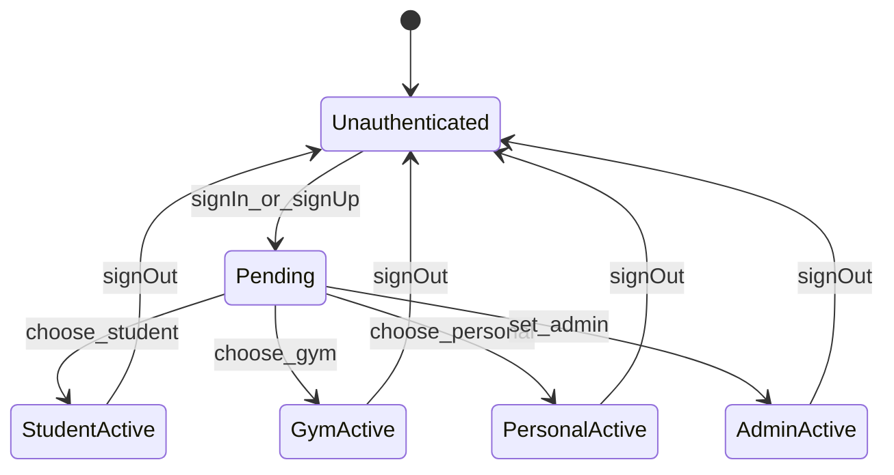

- Estados: `Unauthenticated`, `Pending`, `StudentActive`, `GymActive`, `PersonalActive`, `AdminActive`.
- Quem dispara: usuário, callback OAuth e admin em mudança de role.
- Efeito: cria sessão, define redirect padrão e ativa bootstrap do domínio correto.

### Student subscription

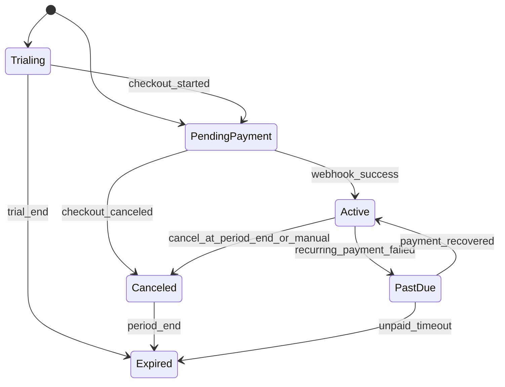

- Estados observados em runtime: `pending_payment`, `trialing`, `active`, `past_due`, `canceled`, `expired`.
- Quem dispara: aluno, trial inicial, webhook de pagamento, cron de billing, cancelamento.
- Efeito: libera ou revoga features premium, altera origem de acesso e recarrega `payments`.
- Validacao adicional: a UX expoe tiers `PREMIUM` e `PRO`, mas o checkout/backend atual do aluno ainda consolida a cobranca em fluxo premium com billing `monthly|annual`.

### Gym subscription

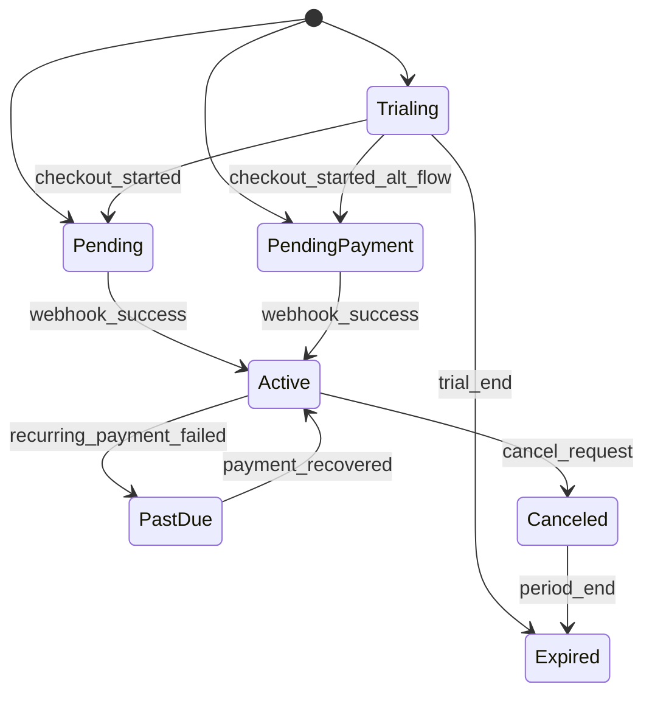

- Estados observados em runtime: `trialing`, `pending`, `pending_payment`, `active`, `past_due`, `canceled`, `expired`.
- Quem dispara: gym, trial inicial, webhook AbacatePay, cron de billing.
- Efeito: muda plano da academia, preços efetivos, descontos e alcance de enterprise.
- Validacao adicional: o beneficio enterprise sincronizado para alunos hoje promove assinatura `premium`, embora a tabela comercial ainda descreva Basic gratuito.

### Personal subscription

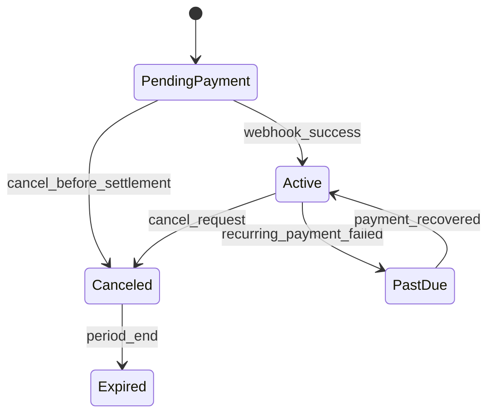

- Estados observados em runtime: `pending_payment`, `active`, `canceled`; a UI e os contratos tambem reconhecem `past_due`, `expired` e `trialing`.
- Quem dispara: personal, webhook, cron e cancelamento manual.
- Efeito: libera recursos premium do personal e descontos por afiliação.

### Gym membership

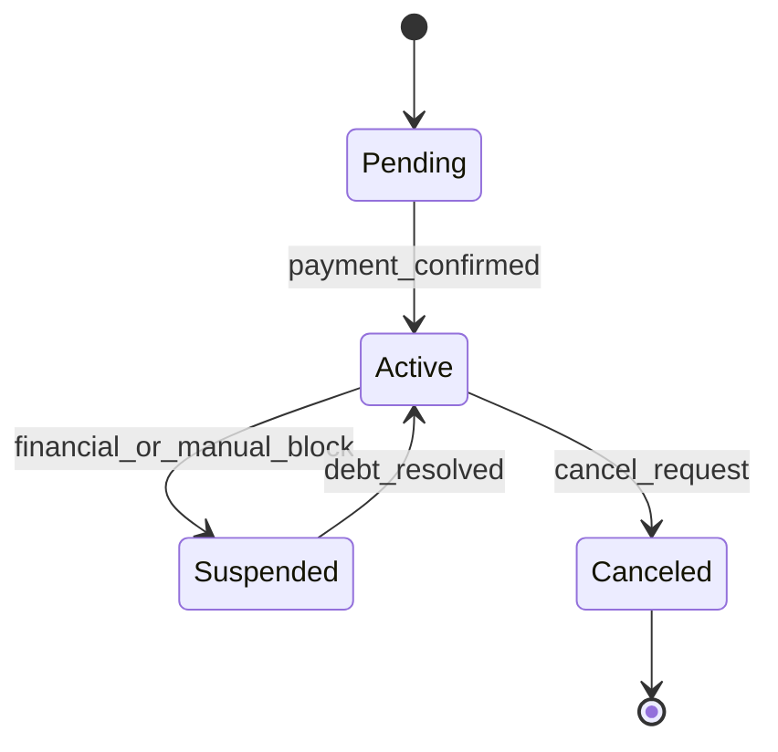

- Estados reais no schema: `active`, `suspended`, `canceled`, `pending`.
- Quem dispara: student, gym, confirmação de pagamento.
- Efeito: controla elegibilidade, cobrança recorrente e acesso físico.

### Personal student payment

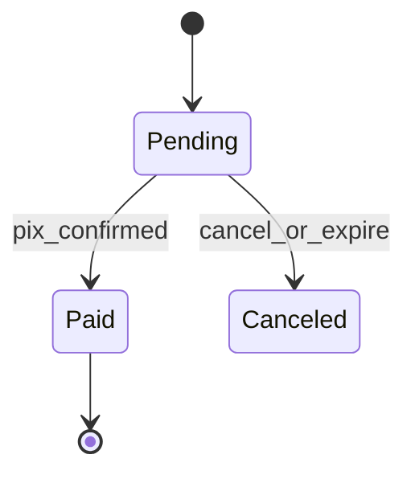

- Estados reais no schema: `pending`, `paid`, `canceled`.
- Quem dispara: student, personal, webhook de pagamento.
- Efeito: cria ou mantém `StudentPersonalAssignment`.

### Payment / PIX

```mermaid
stateDiagram-v2
  [*] --> Pending
  Pending --> Paid: webhook_success
  Pending --> Overdue: due_date_passed
  Pending --> Canceled: cancel_request
  Overdue --> Paid: late_payment
```

- Estados observados no schema de `Payment`: `pending`, `paid`, `overdue`, `canceled`.
- Quem dispara: student, gym e webhook AbacatePay.
- Efeito: liquida membership, day pass, cobrança de personal ou assinatura.

### Boost campaign

```mermaid
stateDiagram-v2
  [*] --> PendingPayment
  PendingPayment --> Active: payment_confirmed
  Active --> Expired: ends_at
  PendingPayment --> Canceled: owner_cancel
  Active --> Canceled: owner_cancel
```

- Estados reais no schema: `pending_payment`, `active`, `expired`, `canceled`.
- Quem dispara: gym/personal owner, pagamento PIX e relógio do sistema.
- Efeito: expõe ou remove campanha do discovery público.

### Access authorization

```mermaid
stateDiagram-v2
  [*] --> Requested
  Requested --> Allowed: eligible_or_grace
  Requested --> Denied: blocked_or_inactive
  Requested --> Error: evaluation_failure
```

- Estados operacionais: request recebida, decisão `allowed`, `denied` ou `error`.
- Campos centrais: `outcome`, `authorizationStatus`, `financialStatus`, `reasonCode`.
- Efeito: libera ou bloqueia passagem no device e gera trilha de auditoria.

### Presence session

```mermaid
stateDiagram-v2
  [*] --> Open
  Open --> Closed: exit_event
  Open --> ManuallyClosed: manual_reconcile
  Open --> Anomalous: inconsistent_events
```

- Estados reais no schema: `open`, `closed`, `manually_closed`, `anomalous`.
- Quem dispara: eventos de entrada/saída, reconciliação manual e heurística de inconsistência.
- Efeito: alimenta presença na gym e histórico operacional.

### Student-personal assignment

```mermaid
stateDiagram-v2
  [*] --> Active
  Active --> Removed: cancel_or_unassign
```

- Estados reais no schema: `active`, `removed`.
- Quem dispara: gym, personal, student ou cancelamento financeiro.
- Efeito: muda quem pode operar treino/nutrição do aluno.

### Referral / withdraw

```mermaid
stateDiagram-v2
  [*] --> ReferralPending
  ReferralPending --> ReferralConverted: first_paid_conversion
  ReferralConverted --> ReferralPaid: withdraw_settled
  [*] --> WithdrawPending
  WithdrawPending --> WithdrawComplete: pix_sent
  WithdrawPending --> WithdrawFailed: provider_failure
```

- Estados reais: `Referral.status = PENDING | CONVERTED | PAID`; `StudentWithdraw.status = pending | complete | failed`.
- Quem dispara: primeira conversão paga, pedido de saque e confirmação do provider.
- Efeito: transforma indicação em saldo realizável e depois em saque.

---

## 17. Cross-role Interactions

```mermaid
flowchart LR
  STUDENT["Student"] -->|"compra membership / day pass"| GYM["Gym"]
  STUDENT -->|"assina plano"| PERSONAL["Personal"]
  GYM -->|"atribui personal"| PERSONAL
  GYM -->|"opera aluno"| STUDENT
  PERSONAL -->|"prescreve treino e nutrição"| STUDENT
  DEVICE["Access device"] -->|"envia evento ou pede autorização"| GYM
  GYM -->|"autoriza entrada"| STUDENT
  GYM -->|"autoriza entrada"| PERSONAL
  ADMIN["Admin"] -->|"observa e altera roles"| STUDENT
  ADMIN -->|"observa e altera roles"| GYM
  ADMIN -->|"observa e altera roles"| PERSONAL
```

| Interação | Ator inicial | Ator impactado | Trigger | Entidade criada/alterada | Tela onde aparece | Job assíncrono / integração |
| --- | --- | --- | --- | --- | --- | --- |
| Student ↔ Gym | `STUDENT` | `GYM` | compra de membership, day pass, check-in | `GymMembership`, `DayPass`, `Payment`, `CheckIn`, `PresenceSession` | `student/gyms`, `student/payments`, `gym/students`, `gym/catracas` | AbacatePay, devices de acesso |
| Student ↔ Personal | `STUDENT` | `PERSONAL` | assinatura de plano do personal | `PersonalStudentPayment`, `StudentPersonalAssignment` | `student/personals`, `student/payments`, `personal/students`, `personal/financial` | AbacatePay |
| Gym ↔ Personal | `GYM` | `PERSONAL` | afiliação e atribuição de aluno | `GymPersonalAffiliation`, `StudentPersonalAssignment` | `gym/students`, `personal/gyms`, `personal/students` | nenhuma obrigatória |
| Admin ↔ todos | `ADMIN` | qualquer role final | mudança de role, leitura de observabilidade, navegação herdada | `User.role`, `TelemetryEvent` | `/admin/observability`, superfícies herdadas | nenhuma obrigatória |
| Device ↔ Gym ↔ Student/Personal | device externo | `GYM`, `STUDENT`, `PERSONAL` | evento bruto, heartbeat ou pedido de autorização | `AccessRawEvent`, `AccessEvent`, `AccessAuthorizationAttempt`, `PresenceSession` | `gym/catracas`, `personal/gyms/access` | `access-event-queue`, bridge/device |
| Referral ↔ pagamento ↔ saldo | `STUDENT` referrer | novo usuário e saldo do referrer | primeira compra paga do indicado e saque | `Referral`, `StudentWithdraw` | `student/payments` | AbacatePay withdraw |

---

## 18. Gates, Precondicoes e Bloqueios

| Domínio | Gate | Regra observada no código | Impacto se não cumprir | Onde é imposto |
| --- | --- | --- | --- | --- |
| auth | sessão válida | quase toda superfície protegida exige sessão | redirect para auth / resposta 401 | guards do App Router e middlewares `require*` |
| role | role compatível | `/student`, `/gym`, `/personal`, `/admin` têm acesso segregado | tela inacessível ou rota negada | `route-access.ts`, `role.ts`, `auth.middleware.ts` |
| onboarding | role `PENDING` precisa escolher tipo | sem role final, não entra nos dashboards corretos | redirect para `/auth/register/user-type` | helpers de rota e fluxos de onboarding |
| student bootstrap | registro de aluno precisa existir | sem `studentId` válido não há bootstrap nem features do aluno | erro de autorização / vazio funcional | `requireStudent` e handlers do aluno |
| gym context | gym ativa precisa existir | várias rotas usam `gymContext.gymId` | `401`, dados vazios ou sem contexto | `createSafeHandler`, `/api/gyms/set-active` |
| personal context | personal precisa existir | sem perfil do personal não há students/financial | erro funcional | bootstrap e rotas `/api/personals*` |
| subscription | assinatura premium pode ser exigida para IA/boost | sem plano ou trial adequado, recurso pode ser reduzido | UX limitada ou bloqueio de contratação | handlers de assinatura e feature flags |
| affiliation | personal precisa de afiliação para certas operações em gym | sem afiliação, perde acesso contextual à gym | sem access overview e sem desconto | `/api/personals/affiliations`, guards de rotas de gym contextual |
| membership | aluno precisa de membership/day pass/estado financeiro válido para acesso | entrada pode ser negada | `denied` em autorização e ausência de presença | access service e authorization attempts |
| referral | referral só monetiza após conversão paga | saldo não pode ser sacado antes | referral fica `PENDING` ou `CONVERTED` | serviços de referral e withdraw |
| trial | trial expira por data | recurso pago sai do estado premium ao expirar | downgrade funcional | workflows de billing e handlers de assinatura |
| feature flag | `personalEnabled` e outros flags impactam rotas | algumas rotas/personas podem ficar indisponíveis | resposta de feature desabilitada ou UX oculta | handlers e release flags nos logs |
| observability | leitura admin-only | ingestão é aberta, leitura analítica é restrita | sem acesso ao dashboard administrativo | `/api/admin/observability/*` |

---

## 19. Inputs, Outputs, Side Effects e Background Processing

### Inputs, outputs e side effects por feature

| Feature | Input do usuário / evento | Output síncrono | Persistência | Cache / UI atualizada | Evento / side effect | Integração ou fila |
| --- | --- | --- | --- | --- | --- | --- |
| auth | login, OAuth callback, logout | sessão iniciada ou encerrada | `Session`, `Account`, `User` | refresh de `auth:*` e viewer | redirect para superfície correta | Google OAuth, `email-queue` em boas-vindas |
| onboarding | formulário por role | confirmação de criação do perfil | `Student`, `Gym`, `Personal` e perfis | bootstrap inicial do domínio | define `activeGymId` quando aplicável | nenhuma obrigatória |
| assinatura do aluno | escolher plano, trial, cancelar, pagar | PIX/estado da assinatura | `Subscription`, `SubscriptionPayment`, `Referral` | atualiza `payments` e bootstrap do aluno | libera/revoga premium | AbacatePay |
| assinatura da gym | escolher plano, aplicar referral, cancelar | PIX/estado da assinatura | `GymSubscription`, `SubscriptionPayment` | atualiza `financial/subscription` | muda preços e alcance enterprise | AbacatePay |
| assinatura do personal | assinar, pagar, cancelar | PIX/estado da assinatura | `PersonalSubscription` | atualiza `personal/financial` | muda descontos e acesso premium | AbacatePay |
| membership/day pass | aderir, trocar plano, cancelar, pagar | cobrança e vínculo | `GymMembership`, `DayPass`, `Payment` | atualiza `student/gyms`, `student/payments`, `gym/students` | altera elegibilidade de acesso | AbacatePay |
| plano do personal | student assina plano do personal | cobrança criada / status pago depois | `PersonalStudentPayment`, `StudentPersonalAssignment` | atualiza `student/payments`, `personal/financial`, `personal/students` | cria vínculo operacional | AbacatePay |
| treino biblioteca | ativar template | resposta `202` com `jobId` | cópia/ativação de `WeeklyPlan` | atualiza `learn` após processamento | job de ativação | `plan-operation-queue` |
| nutrição biblioteca | ativar template | resposta `202` com `jobId` | cópia/ativação de `NutritionPlan` | atualiza `diet` após processamento | job de ativação | `plan-operation-queue` |
| IA treino/nutrição | prompt do usuário | resposta síncrona ou stream | telemetria e possíveis sugestões | chat e modais atualizados | consumo de IA | DeepSeek |
| boost campaign | criar campanha e pagar PIX | campanha criada / QR ou brCode | `BoostCampaign` | discovery público e financial/ads | impressões e cliques posteriores | AbacatePay |
| access control | evento do device, manual event, reconcile | aceito / denied / feed atualizado | `AccessRawEvent`, `AccessEvent`, `PresenceSession`, `AccessAuthorizationAttempt` | `catracas` e access overview | autorização física e presença | `access-event-queue`, devices |
| referral withdraw | configurar chave PIX e sacar | pedido de saque | `StudentWithdraw`, `PaymentMethod` | saldo/referral no payments | muda referral para pago após settlement | AbacatePay withdraw |
| role change | admin altera role | novo papel persistido | `User.role` | próximo acesso muda redirect e superfície | pode abrir outro onboarding | nenhuma |

### Background processing orientado a ações e eventos

| Ação do usuário ou evento externo | Queue | Worker | Payload principal | Resultado esperado | Entidades afetadas |
| --- | --- | --- | --- | --- | --- |
| webhook de pagamento AbacatePay | `webhook-queue` | `webhook.worker.ts` | `event`, `data` | confirmar cobrança e atualizar estados financeiros | `Payment`, `Subscription`, `GymSubscription`, `PersonalStudentPayment`, `Referral` |
| envio de welcome email | `email-queue` | `email.worker.ts` | `to`, `name` | disparar e-mail de boas-vindas | sem persistência principal; telemetria indireta |
| envio de reset password | `email-queue` | `email.worker.ts` | `to`, `name`, `code` | entregar e-mail de recuperação | `Verification` / fluxo de login |
| evento bruto de acesso físico | `access-event-queue` | `access.worker.ts` | `rawEventId` | normalizar evento, deduplicar e abrir/fechar presença | `AccessRawEvent`, `AccessEvent`, `PresenceSession` |
| ativação de treino da biblioteca | `plan-operation-queue` | `plan-operations.worker.ts` | `studentId`, `libraryPlanId` | copiar template para plano ativo | `WeeklyPlan`, `Workout` |
| ativação de nutrição da biblioteca | `plan-operation-queue` | `plan-operations.worker.ts` | `studentId`, `libraryPlanId` | copiar template para plano alimentar ativo | `NutritionPlan`, `NutritionPlanMeal`, `NutritionPlanFoodItem` |
| week reset recorrente | cron interno | `apps/cron` + workflow | execução agendada | resetar override semanal | progresso/plano semanal do aluno |
| billing recorrente | cron interno | `apps/cron` + workflow | execução agendada | cobrar assinaturas e avançar períodos | `Subscription`, `GymSubscription`, `SubscriptionPayment` |

---

<a id="mobile-parity-e-divergencia"></a>
## 20. Mobile Parity e Divergencia

| Área funcional | Compartilhado com web | Mobile-specific | Divergência / gap visível hoje | Entidades e APIs de suporte |
| --- | --- | --- | --- | --- |
| auth e sessão | login, sessão, role e bootstrap central | uso de `expo-secure-store` para credenciais/tokens | web tem fluxo App Router mais explícito | `Session`, `User`, `/api/auth/*` |
| dados do aluno | progresso, treinos, nutrição, payments, discovery | consumo via Expo/React Native | web tem superfícies mais completas e telas já mapeadas | `Student*`, `/api/students/*`, `/api/workouts/*`, `/api/nutrition/*` |
| notificações | mesma identidade de usuário | push e registro de instalação | web não precisa de `MobileInstallation` | `MobileInstallation`, `/api/mobile/installations/*`, `/api/mobile/notifications/test` |
| localização | discovery de gyms/personals e campanhas | acesso nativo a location | mobile tende a ter vantagem de contexto geográfico contínuo | geolocalização + `/api/boost-campaigns/nearby` |
| acesso físico | APIs centrais de access podem ser compartilhadas | potencial uso móvel como credencial futura | o repo atual mostra mais foco web + device ingestion | `Access*`, `/api/integrations/access-*` |
| analytics e observability | mesma ingestão de telemetria | sinais de device/mobile | painel admin atual é web-first | `TelemetryEvent`, `/api/observability/events` |
| navegação | mesmas regras de role e domínio | `expo-router` em vez de App Router | catálogo de telas do web está mais explícito que o do mobile | regras de role e contratos compartilhados |

Leitura operacional:

- O mobile ja existe como runtime real, mas hoje funciona majoritariamente como mobile companion web-first.
- A tela de entrada redireciona para `/web`, e a experiencia central abre `WebView` com `config.webUrl`.
- A paridade mais clara está em auth, dados do aluno, discovery e telemetria.
- O web ainda parece a superfície mais completa para `GYM`, `PERSONAL` e `ADMIN`.
- Push, secure storage e location são os três sinais mais fortes de divergência funcional pró-mobile.

---

## 21. Indices Finais e Criterios de Aceite

### Indice por role

- `PENDING`: escolha de role, onboarding, recuperação e transição para conta final.
- `STUDENT`: treino, nutrição, discovery, memberships, personal plans, assinatura própria, referral e social.
- `GYM`: multi-gym, students, payments, plans, coupons, expenses, withdraws, access control, equipment e ads.
- `PERSONAL`: afiliações, carteira de alunos, coaching, membership plans, subscription, financial e ads.
- `ADMIN`: observability, role governance e navegação herdada pelos domínios finais.

### Indice por domínio

- `auth`: sessão, login, OAuth, reset e role governance.
- `students`: bootstrap, perfil, progresso, memberships, personals, payments, referrals e friends.
- `workouts`: weekly plan, library, progress, history, completion e IA.
- `nutrition`: plano ativo, diário, library, activate e IA.
- `gyms`: bootstrap, profile, students, plans, payments, expenses, withdraws, access, equipment e boost.
- `personals`: bootstrap, affiliations, students, plans, payments, expenses, subscription e boost.
- `subscriptions`: assinatura do aluno, da gym e do personal.
- `integrations/access`: ingestão física, autorização e heartbeat.
- `observability`: ingestão aberta e leitura admin.

### Criterios de aceite cobertos neste documento

- Cada role possui capability matrix operacional própria.
- Tabs e subtabs relevantes estão catalogadas em nível de superfície.
- Famílias principais de rota aparecem com método, guard, leitura/mutação e efeito.
- Domínios stateful possuem lifecycle documentado.
- Interações cross-role críticas estão explicitadas.
- Integrações externas mostram ponto de entrada, ponto de saída e efeito.
- Jobs assíncronos estão ligados a ações reais de usuário ou eventos externos.
- Para cada feature crítica, o documento responde quem faz, onde faz, quando pode, o que muda, qual rota toca e qual efeito assíncrono pode existir.
