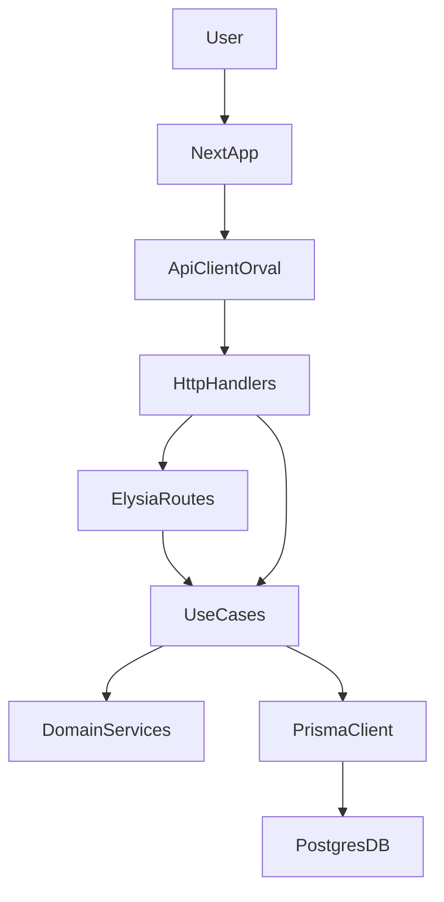

# Plano de refatoração para camada de casos de uso e remoção de offline

## Objetivo

Criar uma **camada explícita de casos de uso** (Application Layer) por domínio (`students`, `workouts`, `nutrition`, `subscriptions`, `gyms`), isolando regras de negócio em serviços/casos de uso e deixando rotas HTTP (Next API + Elysia) e frontend como adaptadores finos **e, em paralelo, remover totalmente a infraestrutura offline-first** (commands, fila IndexedDB, SyncManager, integrações no Service Worker e componentes de UI de sync), **sem quebrar contratos atuais** de API e preservando o modelo de dados no PostgreSQL.

## Visão arquitetural alvo (sem offline)



- **HttpHandlers**: handlers em `[lib/api/handlers](lib/api/handlers)` + rotas Elysia em `[server/routes](server/routes)` + rotas Next API em `[app/api](app/api)`, sem regra de negócio.
- **UseCases**: camada de aplicação em `[lib/use-cases](lib/use-cases)` por domínio, com contratos bem definidos de entrada/saída.
- **DomainServices**: serviços de domínio em `[lib/domain](lib/domain)`, concentrando cálculos, invariantes e políticas.
- **Offline**: removido (nenhuma dependência em `[lib/offline](lib/offline)`, hooks offline ou Service Worker para dados).

## Inventário do que será removido (offline)

Sem mexer em contratos HTTP nem no schema Prisma, a parte **offline** será descontinuada em etapas controladas:

- Código central offline:
  - `[lib/offline/command-pattern.ts](lib/offline/command-pattern.ts)`
  - `[lib/offline/offline-queue.ts](lib/offline/offline-queue.ts)`
  - `[lib/offline/sync-manager.ts](lib/offline/sync-manager.ts)`
  - `[lib/offline/pending-actions.ts](lib/offline/pending-actions.ts)`
  - `[lib/offline/command-logger.ts](lib/offline/command-logger.ts)`
  - `[lib/offline/command-migrations.ts](lib/offline/command-migrations.ts)`
  - `[lib/offline/indexeddb-storage.ts](lib/offline/indexeddb-storage.ts)`
- Integrações no frontend:
  - Hooks: `[hooks/use-offline-action.ts](hooks/use-offline-action.ts)`, `[hooks/use-service-worker-sync.ts](hooks/use-service-worker-sync.ts)`, `[hooks/use-pwa-update.ts](hooks/use-pwa-update.ts)`, `[hooks/use-reminder-notifications.ts](hooks/use-reminder-notifications.ts)` e quaisquer outros que falem diretamente com `lib/offline`.
  - Stores: campos/slices de `sync` em `[stores/student-unified-store.ts](stores/student-unified-store.ts)`, `[stores/gym-unified-store.ts](stores/gym-unified-store.ts)` e correlatos (ex.: listas de comandos pendentes).
  - UI: componentes que exibem estado “pendente de sincronização”, contadores de fila, banners de “offline” relacionados a comandos.
- Service Worker / PWA:
  - Ajustes em `[public/sw.js](public/sw.js)` ou arquivos equivalentes para remover:
    - Manipulação de mensagens de sync (`SYNC_NOW`) e integração com a fila offline.
    - Qualquer uso de Background Sync específico para `offline-queue`.

O comportamento alvo passa a ser **100% online**: qualquer ação de escrita vai direto para a API via `apiClient` ou TanStack Query, com erro imediato em caso de falha de rede.

## Estrutura de pastas proposta (incremental)

- `[lib/use-cases/students](lib/use-cases/students)`
  - `get-student-profile.ts`
  - `update-student-profile.ts`
  - `get-student-progress.ts`
  - `update-student-progress.ts`
  - `add-weight.ts`
  - `get-weight-history.ts`
  - `get-all-student-data.ts`
- `[lib/use-cases/workouts](lib/use-cases/workouts)`
  - `start-workout.ts`, `update-workout-progress.ts`, `complete-workout.ts`
  - `create/update/delete-unit.ts`, `create/update/delete-workout.ts`
  - `add/update/delete-workout-exercise.ts`
- `[lib/use-cases/nutrition](lib/use-cases/nutrition)`
  - `log-daily-nutrition.ts`, `update-meal.ts`, `add-food-item.ts`, `complete-meal.ts`
  - `get-daily-nutrition-summary.ts`, `get-food-database.ts`
- `[lib/use-cases/subscriptions](lib/use-cases/subscriptions)`
  - `create-student-subscription.ts`, `cancel-student-subscription.ts`, `update-subscription-status.ts`
  - `create-gym-subscription.ts`, `cancel-gym-subscription.ts`, `update-gym-subscription-status.ts`
  - `register-payment.ts`, `update-payment-status.ts`, `create-gym-withdraw.ts`
- `[lib/use-cases/gyms](lib/use-cases/gyms)`
  - `create-gym.ts`, `update-gym-profile.ts`
  - `enroll-student.ts`, `update-membership-status.ts`, `create-day-pass.ts`, `register-checkin.ts`, `register-checkout.ts`
  - `create-equipment.ts`, `update-equipment.ts`, `add-maintenance-record.ts`
  - `create-membership-plan.ts`, `update-membership-plan.ts`, `delete-membership-plan.ts`
- `[lib/domain/students](lib/domain/students)`
  - `services/progress-service.ts` (cálculo de streaks, níveis, xp)
  - `services/profile-service.ts` (metabolismo, metas calóricas, etc.)
- `[lib/domain/workouts](lib/domain/workouts)`
  - `services/workout-metrics-service.ts` (volume, completion%, PRs)
- `[lib/domain/nutrition](lib/domain/nutrition)`
  - `services/macros-service.ts` (cálculo de macros vs metas)
- `[lib/domain/subscriptions](lib/domain/subscriptions)`
  - `services/subscription-policy-service.ts` (status, períodos, trial, OWN vs GYM_ENTERPRISE)
  - `services/billing-sync-service.ts` (regras de integração com AbacatePay)
- `[lib/domain/gyms](lib/domain/gyms)`
  - `services/gym-stats-service.ts` (atualização de GymStats/GymProfile)

## Padrão de caso de uso (como implementar)

Cada caso de uso segue um padrão simples e repetível, independente de framework:

- **Contrato de dependências** (injeção via composição, não via framework):

```ts
// Exemplo conceitual
export interface StudentsUseCaseDeps {
  prisma: import("@prisma/client").PrismaClient;
  // gateways externos opcionais: emailService, eventBus, paymentGateway...
}
```

- **Tipos de entrada/saída** autocontidos, sem depender de Next/Elysia/HTTP:

```ts
export interface UpdateStudentProgressInput {
  studentId: string;
  userId: string;
  xpDelta: number;
  // outros campos relevantes
}

export interface UpdateStudentProgressOutput {
  progress: StudentProgressDTO; // DTO definido em lib/types
}

export async function updateStudentProgress(
  deps: StudentsUseCaseDeps,
  input: UpdateStudentProgressInput,
): Promise<UpdateStudentProgressOutput> {
  // 1) carregar agregado (Student + StudentProgress) via prisma
  // 2) aplicar regras em DomainServices (ex.: calcular XP, streaks, níveis)
  // 3) persistir alterações em uma transação
  // 4) mapear entidades para DTOs e retornar
}
```

- **Handlers HTTP** (Next/Elysia) apenas:
  - Validam entrada com Zod (`[lib/api/schemas](lib/api/schemas)`).
  - Carregam contexto de auth (`studentId`, `userId`, `role`) via macros/plugins.
  - Montam `deps` (ex.: `prisma`, gateways) e chamam o caso de uso.
  - Convertem resultado em resposta HTTP (status + body), sem aplicar regra de negócio.

## Estratégia incremental por domínio (depois de remover offline)

### 1. Domínio `students` (primeira etapa)

- **Mapear pontos de entrada**:
  - Rotas Elysia: `[server/routes/students.ts](server/routes/students.ts)`.
  - Handlers HTTP: `[lib/api/handlers/students.ts](lib/api/handlers/students.ts)` (e equivalentes em server/handlers).
  - Uso no frontend: hooks (`[hooks/use-student.ts](hooks/use-student.ts)`, `[hooks/use-student-initializer.ts](hooks/use-student-initializer.ts)`), stores (`[stores/student-unified-store.ts](stores/student-unified-store.ts)`, slices em `[stores/student/slices](stores/student/slices)`), antes integrados com comandos offline (`CommandType.UPDATE_PROGRESS`, `UPDATE_PROFILE`, `ADD_WEIGHT`).
- **Extrair casos de uso principais** em `[lib/use-cases/students](lib/use-cases/students)`:
  - `get-student-profile`, `update-student-profile`.
  - `get-student-progress`, `update-student-progress`.
  - `add-weight`, `get-weight-history`, `get-all-student-data`.
- **Mover regras de negócio** hoje presentes nos handlers/rotas para esses arquivos, mantendo:
  - Invariantes de domínio (como cálculo de xp, streak, níveis) em `services/progress-service.ts`.
  - Cálculos de perfil/metabolismo em `services/profile-service.ts`.
- **Adaptar rotas/handlers** para usar os casos de uso:
  - `studentsRoutes` (Elysia) passa a chamar apenas funções de `lib/use-cases/students`.
  - Handlers Next API (se existirem para students) fazem o mesmo.
  - **Ajustar o frontend** para chamar diretamente os handlers HTTP (via `apiClient` / TanStack Query) em vez de criar commands offline:
    - Remover uso de `use-offline-action` e helpers relacionados.
    - Onde houver UI “pendente de sync”, simplificar para estados de loading/erro padrão.

### 2. Domínio `workouts`

- **Mapear pontos de entrada**:
  - Rotas: `[server/routes/workouts.ts](server/routes/workouts.ts)`, `[server/routes/exercises.ts](server/routes/exercises.ts)`.
  - Handlers HTTP: `[lib/api/handlers/workouts.ts](lib/api/handlers/workouts.ts)`.
  - Antigos offline commands: `COMPLETE_WORKOUT`, `CREATE/UPDATE/DELETE_UNIT`, `CREATE/UPDATE/DELETE_WORKOUT`, `ADD/UPDATE/DELETE_WORKOUT_EXERCISE` (serão substituídos por chamadas HTTP diretas).
- **Casos de uso principais** em `[lib/use-cases/workouts](lib/use-cases/workouts)`:
  - `start-workout`, `update-workout-progress`, `complete-workout`.
  - `create/update/delete-unit`, `create/update/delete-workout`, `add/update/delete-workout-exercise`.
- **Domínio** em `[lib/domain/workouts/services/workout-metrics-service.ts](lib/domain/workouts/services/workout-metrics-service.ts)`:
  - Cálculo de `totalVolume`, `completionPercentage`, XP ganho, PR updates.
- **Adaptação de rotas/handlers** semelhante ao domínio students:
  - Rotas Elysia e handlers Next passam a chamar apenas os casos de uso.
  - Frontend passa a chamar apenas handlers HTTP síncronos (sem fila offline) para criar/atualizar/completar workouts.

### 3. Domínio `nutrition`

- **Mapear pontos de entrada**:
  - Rotas: `[server/routes/nutrition.ts](server/routes/nutrition.ts)`, `[server/routes/foods.ts](server/routes/foods.ts)`.
  - Handlers: `[lib/api/handlers/nutrition.ts](lib/api/handlers/nutrition.ts)`, `[lib/api/handlers/foods.ts](lib/api/handlers/foods.ts)`.
  - Antigos offline commands: `UPDATE_NUTRITION` e correlatos (serão substituídos por chamadas HTTP diretas).
- **Casos de uso principais** em `[lib/use-cases/nutrition](lib/use-cases/nutrition)`:
  - `log-daily-nutrition`, `update-meal`, `add-food-item`, `complete-meal`.
  - `get-daily-nutrition-summary`, `get-food-database`.
- **Domínio** em `[lib/domain/nutrition/services/macros-service.ts](lib/domain/nutrition/services/macros-service.ts)`:
  - Cálculo de macros consumidos vs metas (`DailyNutrition` + `NutritionMeal` + `NutritionFoodItem` vs alvos em `StudentProfile`).
  - Regras de `NutritionChatUsage` (limites diários, resets, etc.).

### 4. Domínio `subscriptions` (alunos + academias + financeiro)

- **Mapear pontos de entrada**:
  - Rotas: `[server/routes/subscriptions.ts](server/routes/subscriptions.ts)`, `[server/routes/gym-subscriptions.ts](server/routes/gym-subscriptions.ts)`, `[server/routes/payments.ts](server/routes/payments.ts)`, `[server/routes/payment-methods.ts](server/routes/payment-methods.ts)`.
  - Handlers: `[lib/api/handlers/subscriptions.ts](lib/api/handlers/subscriptions.ts)`, `[lib/api/handlers/payments.ts](lib/api/handlers/payments.ts)`, `[lib/api/handlers/payment-methods.ts](lib/api/handlers/payment-methods.ts)`.
- **Casos de uso principais** em `[lib/use-cases/subscriptions](lib/use-cases/subscriptions)`:
  - `create-student-subscription`, `cancel-student-subscription`, `update-subscription-status`.
  - `create-gym-subscription`, `cancel-gym-subscription`, `update-gym-subscription-status`.
  - `register-payment`, `update-payment-status`, `create-gym-withdraw`.
- **Domínio** em `[lib/domain/subscriptions](lib/domain/subscriptions)`:
  - `subscription-policy-service.ts`: lógica de status (active/canceled/expired/past_due/trialing), períodos, trial, `SubscriptionSource` (OWN vs GYM_ENTERPRISE), `ownPeriodEndBackup`.
  - `billing-sync-service.ts`: integração com AbacatePay usando campos `abacatePayBillingId`, `abacatePayCustomerId`, `withdrawId`, `abacateId`.
- **Cuidados**:
  - Manter compatibilidade estrita com registros financeiros já existentes (não alterar comportamento de cobrança sem migração de dados).

### 5. Domínio `gyms`

- **Mapear pontos de entrada**:
  - Rotas: `[server/routes/gyms.ts](server/routes/gyms.ts)`, `[server/routes/memberships.ts](server/routes/memberships.ts)`, `[server/routes/equipment.ts](server/routes/equipment.ts)` (se existir), `[server/routes/checkins.ts](server/routes/checkins.ts)` (se existir).
  - Handlers: `lib/api/handlers` correspondentes.
- **Casos de uso principais** em `[lib/use-cases/gyms](lib/use-cases/gyms)`:
  - `create-gym`, `update-gym-profile`.
  - `enroll-student`, `update-membership-status`, `create-day-pass`, `register-checkin`, `register-checkout`.
  - `create-equipment`, `update-equipment`, `add-maintenance-record`.
  - `create-membership-plan`, `update-membership-plan`, `delete-membership-plan`.
- **Domínio** em `[lib/domain/gyms/services/gym-stats-service.ts](lib/domain/gyms/services/gym-stats-service.ts)`:
  - Atualização de `GymStats` (checkins hoje, semana, mês, retenção, crescimento).
  - Atualização de `GymProfile` (level, xp, ranking, metas mensais).

## Riscos e mitigação

- **Risco: quebra de contratos HTTP (APIs consumidas pelo frontend e por clientes externos)**
  - **Mitigação**: não alterar URLs, métodos nem shapes de payload/resposta durante o refactor; mudanças futuras devem vir com versionamento de API e atualização de Orval/OpenAPI.
- **Risco: remoção de offline impactar UX de usuários com conexão ruim**
  - **Mitigação**: garantir feedback claro de erro/retry no frontend (toasts, estados de loading/erro consistentes) e, se necessário, implementar retries simples no cliente para operações críticas (ex.: idempotentes).
- **Risco: refactor grande demais em uma única etapa**
  - **Mitigação**: executar por domínio e por PR, com escopos bem definidos (ver seção de roadmap por PR) e testes básicos focados em regressão de comportamento.

## Roadmap sugerido por PR

### PR 1 – Remoção da infraestrutura offline

- **Back/frontend infra**:
  - Remover ou isolar completamente `[lib/offline](lib/offline)` (`command-pattern`, `offline-queue`, `sync-manager`, `pending-actions`, `command-logger`, `command-migrations`, `indexeddb-storage`).
  - Atualizar `[public/sw.js](public/sw.js)` para eliminar integração com fila offline e mensagens de sync (`SYNC_NOW`), mantendo apenas cache básico de assets se desejado.
- **Frontend**:
  - Remover hooks diretamente dependentes de offline: `use-offline-action`, `use-service-worker-sync`, `use-pwa-update`, `use-reminder-notifications` (ou deixá-los apenas com comportamento online simples).
  - Limpar referências a comandos pendentes e estados de sync em `student-unified-store`, `gym-unified-store` e demais stores.
  - Simplificar componentes de UI que exibem “pendente de sincronização” para estados padrão (loading/erro).
- **Verificações**:
  - Build e lint sem referências a `lib/offline`.
  - Fluxos principais de aluno e academia funcionando online (sem suporte offline).

### PR 2 – Foundation: padrão de casos de uso (students simples)

- Criar estrutura base de `lib/use-cases/students` e `lib/domain/students`.
- Implementar 1–2 casos de uso relativamente simples, por exemplo:
  - `get-student-profile`.
  - `get-student-progress`.
- Adaptar:
  - Uma rota Elysia em `server/routes/students.ts` para usar os novos casos de uso.
  - Um handler Next/API (se houver para o mesmo fluxo) em `lib/api/handlers/students.ts` para reutilizar o mesmo caso de uso.
- Validar padrão de deps (`StudentsUseCaseDeps`), DTOs e mapeamento de erros.

### PR 3 – Students completo

- Migrar todos os endpoints de `students` (profile, progress, weight, all-data, friends, day-passes, personal-records) para casos de uso em `lib/use-cases/students`.
- Extrair lógicas de:
  - Progresso, XP, streak, níveis → `lib/domain/students/services/progress-service.ts`.
  - Perfil e metabolismo → `lib/domain/students/services/profile-service.ts`.
- Atualizar handlers Elysia/Next para chamarem apenas os casos de uso.
- Ajustar hooks/stores do frontend para depender apenas dos handlers HTTP (já online) e dos novos DTOs, se necessário.

### PR 4 – Workouts

- Criar casos de uso em `lib/use-cases/workouts`:
  - `start-workout`, `update-workout-progress`, `complete-workout`.
  - CRUD de units e workouts (`create/update/delete-unit`, `create/update/delete-workout`, `add/update/delete-workout-exercise`).
- Extrair cálculos para `lib/domain/workouts/services/workout-metrics-service.ts` (volume, completion%, XP, PRs).
- Adaptar rotas Elysia (`workouts`, `exercises`) e handlers HTTP correspondentes para usar os casos de uso.
- Ajustar o frontend (hooks de execução de treino, organisms de workout) para confiar apenas nas respostas online, sem qualquer referência a fila offline.

### PR 5 – Nutrition

- Criar casos de uso em `lib/use-cases/nutrition`:
  - `log-daily-nutrition`, `update-meal`, `add-food-item`, `complete-meal`.
  - `get-daily-nutrition-summary`, `get-food-database`.
- Mover regras de cálculo de macros e metas para `lib/domain/nutrition/services/macros-service.ts`.
- Atualizar rotas/handlers de `nutrition` e `foods` para chamar apenas os casos de uso.
- Revisar hooks/stores/organisms de nutrição no frontend para usarem apenas chamadas HTTP síncronas.

### PR 6 – Subscriptions

- Criar casos de uso em `lib/use-cases/subscriptions`:
  - `create-student-subscription`, `cancel-student-subscription`, `update-subscription-status`.
  - `create-gym-subscription`, `cancel-gym-subscription`, `update-gym-subscription-status`.
  - `register-payment`, `update-payment-status`, `create-gym-withdraw`.
- Consolidar regras em `lib/domain/subscriptions`:
  - `subscription-policy-service.ts` para status/periodicidade/trial/OWN vs GYM_ENTERPRISE.
  - `billing-sync-service.ts` para integração com AbacatePay (usando campos já existentes no Prisma).
- Adaptar rotas/handlers (`subscriptions`, `gym-subscriptions`, `payments`, `payment-methods`) para usar os casos de uso.

### PR 7 – Gyms

- Criar casos de uso em `lib/use-cases/gyms`:
  - `create-gym`, `update-gym-profile`.
  - `enroll-student`, `update-membership-status`, `create-day-pass`, `register-checkin`, `register-checkout`.
  - `create-equipment`, `update-equipment`, `add-maintenance-record`.
  - `create-membership-plan`, `update-membership-plan`, `delete-membership-plan`.
- Extrair regras de stats/gamificação para `lib/domain/gyms/services/gym-stats-service.ts`.
- Atualizar rotas/handlers de `gyms`, `memberships`, `equipment`, `checkins` (quando existirem) para usar casos de uso.

### PR 8 – Consolidação, documentação e testes

- Criar testes automatizados para os principais casos de uso (students, workouts, nutrition, subscriptions, gyms).
- Revisar docs em `[docs/04-domain](docs/04-domain)` e `[docs/03-backend](docs/03-backend)` para refletir a nova arquitetura de casos de uso.
- Atualizar quaisquer documentos que mencionem offline-first para explicar que a aplicação agora é 100% online.
